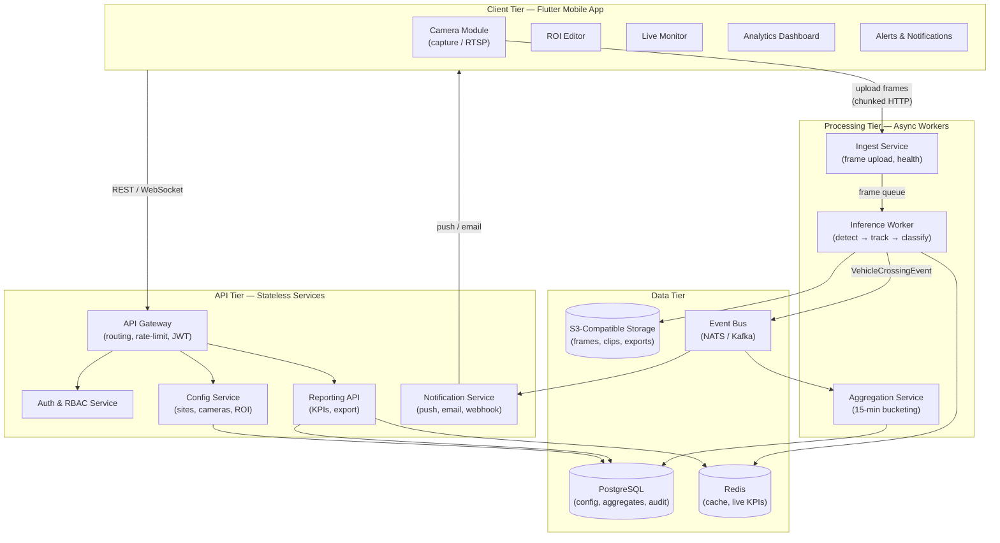
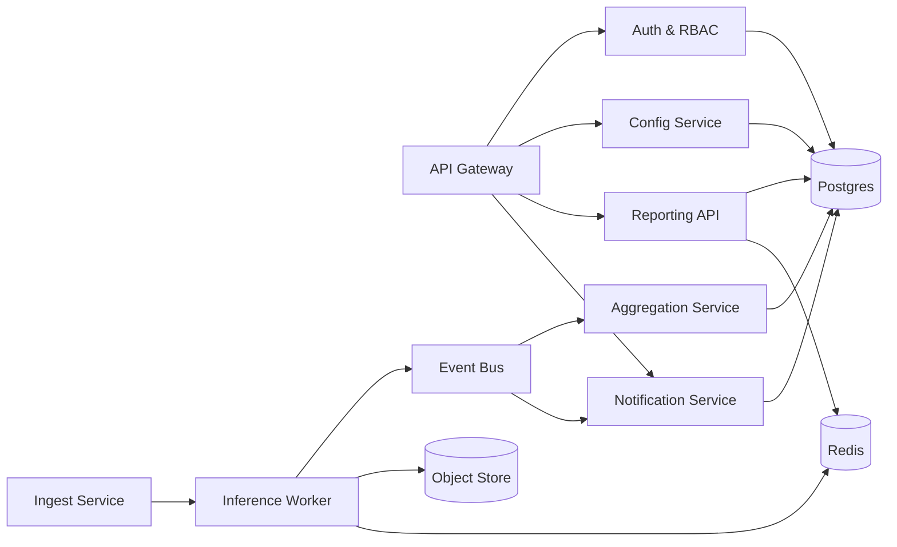
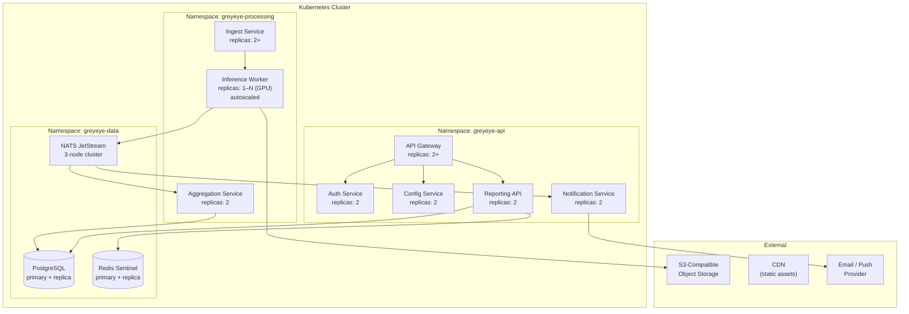
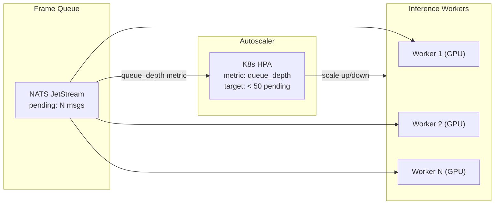

# GreyEye Traffic Analysis AI — System Architecture

## 1 Introduction

This document describes the high-level system architecture of GreyEye, including the component topology, communication patterns, deployment strategy, monorepo layout, and scaling approach. It serves as the authoritative reference for how the system's modules are organized, how they interact, and how the platform grows from an MVP (10 cameras) to production scale (100+ cameras).

**Traceability:** NFR-1, NFR-2, NFR-3, NFR-5, NFR-9, NFR-10

---

## 2 High-Level Architecture

GreyEye follows a **layered, event-driven architecture** with four logical tiers: Client, API, Processing, and Data. The mobile client communicates with backend services through a single API gateway. Video frames flow through an asynchronous inference pipeline, and crossing events are published to an event bus for downstream aggregation and alerting.



### 2.1 Tier Responsibilities

| Tier | Responsibility | Key Quality Attribute |
|------|---------------|----------------------|
| **Client** | Video capture, ROI editing, live monitoring, analytics display, alert management | Responsiveness (NFR-1, NFR-7) |
| **API** | Authentication, authorization, configuration CRUD, KPI queries, report export | Availability (NFR-5), security (SEC-1–3) |
| **Processing** | Frame ingestion, AI inference (detection → tracking → classification), event aggregation | Throughput (NFR-3), latency (NFR-2) |
| **Data** | Persistent storage (relational, object, time-series), caching, event routing | Durability (DM-1, DM-8), retention (DM-3, DM-5) |

---

## 3 Modular Decomposition

Each module is an independently deployable service with a well-defined interface. The sections below describe each module's purpose, inputs/outputs, and SRS traceability.

### 3.1 API Gateway

| Aspect | Detail |
|--------|--------|
| **Purpose** | Single entry point for all client-facing HTTP/WebSocket traffic |
| **Responsibilities** | TLS termination, JWT validation, request routing, rate limiting, request/response logging |
| **Technology** | Nginx / Envoy / Traefik (reverse proxy) + custom middleware |
| **Traceability** | SEC-4, SEC-11, NFR-5 |

### 3.2 Auth & RBAC Service

| Aspect | Detail |
|--------|--------|
| **Purpose** | Identity management, authentication, and role-based authorization |
| **Responsibilities** | OAuth2/OIDC token issuance, user registration/invite, role assignment, permission checks, session management |
| **Interfaces** | `POST /v1/auth/login`, `POST /v1/auth/register`, `POST /v1/auth/refresh`, `GET /v1/users/me` |
| **Traceability** | FR-1.1, FR-1.2, FR-1.3, FR-1.4, SEC-1, SEC-2, SEC-3 |

### 3.3 Config Service

| Aspect | Detail |
|--------|--------|
| **Purpose** | CRUD and versioning for sites, cameras, counting lines, and ROI presets |
| **Responsibilities** | Site management (name, address, geofence), camera registration (smartphone / RTSP), ROI preset storage, configuration versioning with rollback |
| **Interfaces** | `POST /v1/sites`, `POST /v1/cameras`, `PUT /v1/cameras/{id}/roi`, `GET /v1/sites/{id}/config` |
| **Traceability** | FR-2.1, FR-2.2, FR-2.3, FR-2.4, FR-3.1, FR-3.2, FR-3.3, FR-4.4 |

### 3.4 Ingest Service

| Aspect | Detail |
|--------|--------|
| **Purpose** | Receives video frames/chunks from mobile clients and external cameras, queues them for inference |
| **Responsibilities** | Chunked upload handling, frame extraction, health heartbeat monitoring, backpressure management, offline upload reconciliation |
| **Interfaces** | `POST /v1/ingest/frames` (chunked), `POST /v1/ingest/health` (heartbeat) |
| **Traceability** | FR-3.4, FR-3.5, NFR-6 |

### 3.5 Inference Worker

| Aspect | Detail |
|--------|--------|
| **Purpose** | Runs the AI pipeline: detection → tracking → classification → line crossing → event emission |
| **Responsibilities** | YOLO-based vehicle detection, ByteTrack/OC-SORT multi-object tracking, 12-class classification with temporal smoothing, counting-line intersection check, deduplication, `VehicleCrossingEvent` publication |
| **Scaling Unit** | GPU-attached pod; scales horizontally via queue depth |
| **Traceability** | FR-5.1–FR-5.6, NFR-2, NFR-3 |

### 3.6 Aggregation Service

| Aspect | Detail |
|--------|--------|
| **Purpose** | Consumes crossing events and computes 15-minute bucket aggregates |
| **Responsibilities** | Bucket assignment (`floor(ts_utc, 15min)`), per-class counting, KPI derivation (flow rate, class distribution), aggregate persistence |
| **Interfaces** | Subscribes to `VehicleCrossingEvent` from event bus; writes to `agg_vehicle_counts_15m` table |
| **Traceability** | FR-6.1, FR-6.2, DM-2, DM-7 |

### 3.7 Reporting API

| Aspect | Detail |
|--------|--------|
| **Purpose** | Serves analytics queries, historical charts, and report exports |
| **Responsibilities** | Time-range KPI queries, class breakdown, CSV/JSON/PDF export, shareable read-only links |
| **Interfaces** | `GET /v1/analytics/15m`, `GET /v1/analytics/kpi`, `POST /v1/reports/export`, `POST /v1/reports/share` |
| **Traceability** | FR-8.1, FR-8.2, FR-8.3, FR-8.4 |

### 3.8 Notification Service

| Aspect | Detail |
|--------|--------|
| **Purpose** | Evaluates alert rules against live events and delivers notifications |
| **Responsibilities** | Rule evaluation (congestion, speed drop, offline camera, heavy-vehicle share), multi-channel delivery (in-app push, email, webhook), alert lifecycle (acknowledge, assign, close) |
| **Interfaces** | Subscribes to event bus; `POST /v1/alerts/rules`, `GET /v1/alerts/history` |
| **Traceability** | FR-7.1, FR-7.2, FR-7.3, FR-7.4 |

### 3.9 Module Dependency Map

The following diagram shows inter-service dependencies. Arrows point from consumer to provider.



---

## 4 Communication Patterns

GreyEye uses three communication styles, each chosen for specific interaction requirements.

| Pattern | Use Case | Protocol | Rationale |
|---------|----------|----------|-----------|
| **Synchronous REST** | Client ↔ API Gateway (config CRUD, analytics queries, auth) | HTTPS (JSON) | Simple request/response for CRUD and queries; well-supported by Flutter HTTP clients |
| **WebSocket** | Live KPI tile updates, real-time count overlays | WSS | Sub-second push updates to the mobile client (NFR-1: ≤ 2 s refresh) |
| **Async Event Bus** | Inference Worker → Aggregator, Inference Worker → Notification Service | NATS JetStream or Kafka | Decouples producers from consumers; enables replay, backpressure, and independent scaling (NFR-6) |

### 4.1 Event Schema

All crossing events share a common envelope:

```json
{
  "event_type": "VehicleCrossingEvent",
  "version": "1.0",
  "timestamp_utc": "2026-03-09T14:07:32.451Z",
  "camera_id": "cam_abc123",
  "line_id": "line_01",
  "track_id": "trk_00042",
  "crossing_seq": 1,
  "class12": 2,
  "confidence": 0.91,
  "direction": "inbound",
  "model_version": "v2.3.1",
  "frame_index": 4217
}
```

The dedup key is `{camera_id}:{line_id}:{track_id}:{crossing_seq}`, ensuring exactly-once counting even under retries or reprocessing (DM-6).

---

## 5 Deployment Topology

### 5.1 Container Architecture

Every backend component is packaged as a Docker container with a standardized health-check endpoint (`GET /healthz`). Containers are orchestrated by Kubernetes (K8s) with Helm charts for configuration management. (NFR-9)



### 5.2 Environment Stages

| Stage | Purpose | Infrastructure | GPU |
|-------|---------|---------------|-----|
| **Local Dev** | Developer workstation | Docker Compose, CPU-only inference | None (CPU fallback) |
| **CI/CD** | Automated testing and build | GitHub Actions / GitLab CI runners | None |
| **Staging** | Integration and load testing | Single-node K8s (k3s) or managed K8s | 1× GPU node (optional) |
| **Production** | Live traffic analysis | Managed K8s (EKS / GKE / AKS), multi-AZ | GPU node pool (autoscaled) |

### 5.3 CI/CD Pipeline (NFR-9)

```mermaid
graph LR
    Commit["Git Push"] --> Lint["Lint & Format"]
    Lint --> UnitTest["Unit Tests"]
    UnitTest --> Build["Docker Build"]
    Build --> IntTest["Integration Tests<br/>(docker-compose)"]
    IntTest --> Push["Push to Registry"]
    Push --> DeployStg["Deploy → Staging"]
    DeployStg --> SmokeTest["Smoke Tests"]
    SmokeTest --> Approve["Manual Approval"]
    Approve --> DeployProd["Deploy → Production<br/>(rolling update)"]
```



All deployments use **rolling updates** with readiness probes to maintain zero-downtime releases. Canary deployments are used for inference model updates to validate accuracy before full rollout (FR-9.1, FR-9.2).

---

## 6 Monorepo Layout

The project uses a **monorepo** structure to share contracts, types, and tooling across the mobile app, backend services, ML pipeline, and infrastructure configuration.

```
greyeye/
├── apps/
│   └── mobile_flutter/              # Flutter mobile application
│       ├── lib/
│       │   ├── core/                # Theme, routing, DI, constants
│       │   ├── features/            # Feature modules (auth, sites, camera, roi, monitor, analytics, alerts)
│       │   ├── shared/              # Shared widgets, utils, models
│       │   └── main.dart
│       ├── test/
│       ├── pubspec.yaml
│       └── analysis_options.yaml
│
├── services/
│   ├── api_gateway/                 # Reverse proxy configuration (Nginx/Envoy)
│   ├── auth_service/                # FastAPI — authentication & RBAC
│   ├── config_service/              # FastAPI — site/camera/ROI CRUD
│   ├── ingest_service/              # FastAPI — frame upload & health
│   ├── inference_worker/            # Python — AI pipeline worker
│   ├── aggregator/                  # FastAPI — 15-min bucket computation
│   ├── reporting_api/               # FastAPI — analytics & export
│   └── notification_service/        # FastAPI — alerts & delivery
│
├── libs/
│   ├── shared_contracts/            # Pydantic models, enums (VehicleClass12), event schemas
│   ├── db_models/                   # SQLAlchemy / Alembic models and migrations
│   └── test_utils/                  # Shared test fixtures, factories
│
├── ml/
│   ├── training/                    # Training scripts, data loaders, augmentation
│   ├── evaluation/                  # Metrics, confusion matrices, benchmark suites
│   ├── export/                      # ONNX / TorchScript export scripts
│   └── data/                        # Dataset converters (AI Hub 091, COCO, custom)
│
├── infra/
│   ├── docker/                      # Dockerfiles for each service
│   ├── helm/                        # Helm charts for K8s deployment
│   ├── terraform/                   # Cloud infrastructure (optional)
│   └── docker-compose.yml           # Local development stack
│
├── supabase/
│   ├── migrations/                  # Versioned SQL migrations
│   ├── seed.sql                     # Development seed data
│   └── config.toml                  # Supabase project configuration
│
├── docs/                            # Design documents (this document set)
│
├── .github/
│   └── workflows/                   # CI/CD pipeline definitions
│
├── pyproject.toml                   # Python workspace (uv / poetry)
├── Makefile                         # Common dev commands
└── README.md
```

### 6.1 Shared Contracts

The `libs/shared_contracts/` package is the single source of truth for data types shared across services:

- **`VehicleClass12`** enum — the 12-class taxonomy used by inference, aggregation, reporting, and the mobile app
- **`VehicleCrossingEvent`** Pydantic model — the event schema published to the event bus
- **API request/response models** — shared between services and used for OpenAPI schema generation
- **Error codes** — standardized error taxonomy

This prevents drift between services and enables automated contract testing.

### 6.2 Dependency Management

| Layer | Tool | Rationale |
|-------|------|-----------|
| Python services | `uv` (or `poetry`) with workspace mode | Shared dependencies, lockfile, fast resolution |
| Flutter app | `pub` with `pubspec.yaml` | Standard Dart/Flutter package management |
| Infrastructure | Helm + Docker Compose | Declarative, version-controlled deployment |
| Database | Alembic (or Supabase CLI migrations) | Versioned, reversible schema changes |

---

## 7 Scaling Strategy

### 7.1 Scaling Dimensions

GreyEye must scale along three axes as camera count grows from MVP (10 cameras) to production (100+ cameras). (NFR-3)

| Axis | MVP (10 cameras) | Scale Target (100+ cameras) | Mechanism |
|------|------------------|-----------------------------|-----------|
| **Inference throughput** | 1–2 GPU workers | 10+ GPU workers | Horizontal pod autoscaler (HPA) on queue depth |
| **API request rate** | 2 replicas per service | 4–8 replicas per service | HPA on CPU / request latency |
| **Data volume** | Single Postgres instance | Primary + read replicas, time-partitioned tables | Read replicas for analytics; partitioning for write throughput |

### 7.2 Inference Worker Autoscaling

The inference worker is the primary scaling bottleneck. Each worker processes frames from a shared queue (NATS JetStream or Redis Streams). Autoscaling is driven by **queue depth** (pending messages) rather than CPU, since GPU utilization is the true constraint.



**Scaling parameters:**

| Parameter | Value | Rationale |
|-----------|-------|-----------|
| Min replicas | 1 | Always-on for low-traffic periods |
| Max replicas | N (configurable) | Bounded by GPU node pool capacity |
| Scale-up threshold | Queue depth > 50 messages | Prevents latency spikes (NFR-2: ≤ 1.5 s) |
| Scale-down cooldown | 5 minutes | Avoids thrashing during bursty traffic |
| Frames per worker | ~10 FPS per camera | 1 worker handles ~1–2 cameras at 10 FPS |

### 7.3 API Tier Scaling

All API services are **stateless** — session state lives in Redis, persistent state in Postgres. This allows straightforward horizontal scaling via Kubernetes HPA based on CPU utilization or request latency percentiles.

| Service | Min Replicas | Scale Metric | Target |
|---------|-------------|--------------|--------|
| API Gateway | 2 | CPU utilization | < 70% |
| Auth Service | 2 | Request latency (p95) | < 200 ms |
| Config Service | 2 | CPU utilization | < 70% |
| Reporting API | 2 | Request latency (p95) | < 500 ms |
| Notification Service | 2 | Queue depth | < 100 pending |

### 7.4 Database Scaling

| Strategy | When Applied | Benefit |
|----------|-------------|---------|
| **Read replicas** | Analytics queries exceed primary capacity | Offload read-heavy reporting workload |
| **Time-based partitioning** | `vehicle_crossings` table exceeds ~100M rows | Efficient range queries and partition pruning |
| **Connection pooling** (PgBouncer) | Connection count exceeds Postgres limits | Multiplexes application connections |
| **Continuous aggregates** (TimescaleDB option) | Real-time aggregate refresh needed | Materialized views auto-refreshed on insert |
| **Redis caching** | Live KPI tiles, frequently accessed configs | Sub-millisecond reads for hot data (NFR-1) |

### 7.5 Event Bus Scaling

NATS JetStream (primary choice) or Kafka provides:

- **Partitioned streams** — one partition per camera for ordered processing
- **Consumer groups** — multiple inference workers consume from the same stream without duplication
- **Replay** — reprocess historical events for aggregate recomputation (DM-7)
- **Backpressure** — slow consumers don't block producers; messages buffer in the stream (NFR-6)

---

## 8 Observability (NFR-10)

### 8.1 Metrics

All services expose Prometheus-compatible metrics at `/metrics`. Key metrics include:

| Category | Metric | Alert Threshold |
|----------|--------|----------------|
| **Inference** | `inference_latency_seconds` (histogram) | p95 > 1.5 s (NFR-2) |
| **Inference** | `inference_queue_depth` (gauge) | > 100 pending |
| **Inference** | `gpu_utilization_percent` (gauge) | > 90% sustained |
| **API** | `http_request_duration_seconds` (histogram) | p95 > 500 ms |
| **API** | `http_requests_total` (counter) | 5xx rate > 1% |
| **Aggregation** | `bucket_lag_seconds` (gauge) | > 60 s behind real-time |
| **Database** | `pg_connections_active` (gauge) | > 80% of max |
| **Event Bus** | `nats_consumer_pending` (gauge) | > 200 messages |
| **Uptime** | `service_up` (gauge) | Any service down > 30 s |

### 8.2 Logging

Structured JSON logs with correlation IDs (`request_id`, `camera_id`, `track_id`) for end-to-end tracing. Log aggregation via Loki or ELK stack.

### 8.3 Tracing

Distributed tracing with OpenTelemetry spans across the full request lifecycle: frame upload → inference → event publish → aggregation → KPI query. Traces are exported to Jaeger or Tempo.

### 8.4 Dashboards

Grafana dashboards organized by concern:

| Dashboard | Contents |
|-----------|----------|
| **System Overview** | Service health, uptime SLA tracking (NFR-5: ≥ 99.5%), error rates |
| **Inference Pipeline** | GPU utilization, inference latency, queue depth, throughput (frames/sec) |
| **Traffic Analytics** | Live crossing counts, class distribution, per-camera status |
| **Database** | Connection pool usage, query latency, replication lag, table sizes |
| **Alerts** | Active alerts, alert delivery latency, notification failures |

---

## 9 Availability and Resilience (NFR-5)

### 9.1 Availability Target

The backend API targets **≥ 99.5% availability** (measured monthly), allowing a maximum of ~3.6 hours of downtime per month.

### 9.2 Resilience Patterns

| Pattern | Application |
|---------|------------|
| **Health checks** | Every service exposes `/healthz` (liveness) and `/readyz` (readiness); K8s restarts unhealthy pods automatically |
| **Circuit breaker** | API Gateway trips circuit on downstream 5xx spikes; returns degraded response instead of cascading failure |
| **Retry with backoff** | Ingest Service retries failed inference submissions with exponential backoff and jitter |
| **Graceful degradation** | If inference workers are overloaded, the system queues frames and processes them with increased latency rather than dropping them |
| **Multi-AZ deployment** | Production K8s nodes span multiple availability zones; database primary and replica in separate AZs |
| **Event replay** | If the aggregation service goes down, it replays unprocessed events from the event bus on recovery (DM-7) |

### 9.3 Failure Modes and Mitigations

| Failure | Impact | Mitigation |
|---------|--------|------------|
| Inference worker crash | Frames queue up; latency increases | K8s restarts pod; HPA scales up additional workers |
| Database primary failure | Write operations fail | Automatic failover to replica (< 30 s); connection pool retries |
| Event bus partition loss | Events delayed | NATS JetStream replication (R=3); consumers reconnect to healthy nodes |
| Network partition (mobile) | Frame upload interrupted | Client-side retry with resume; offline queue (FR-3.5) |
| Object storage unavailable | Frame/clip storage fails | Retry with backoff; local buffer on inference worker |

---

## 10 Cross-Cutting Concerns

### 10.1 Configuration Management

All runtime configuration is managed through environment variables and Kubernetes ConfigMaps/Secrets. Sensitive values (database credentials, API keys, SMTP passwords) are stored in a secrets manager (Vault or K8s Secrets with encryption at rest). No secrets are hardcoded in source or container images. (SEC-6)

### 10.2 Feature Flags (NFR-11)

A lightweight feature flag system (environment-variable based for MVP, migrating to a service like LaunchDarkly or Unleash at scale) controls:

- Model version rollout (canary % of traffic to new model)
- UI experiments (A/B testing new dashboard layouts)
- Gradual feature enablement (new alert types, export formats)

### 10.3 Internationalization

The mobile app supports Korean and English (UI-4). Backend error messages and notification templates are localized using message catalogs keyed by locale.

---

## 11 Architecture Decision Records

Key architectural decisions are documented as ADRs in `docs/adr/`. The following decisions are foundational to this architecture:

| ADR | Decision | Rationale |
|-----|----------|-----------|
| ADR-001 | **Event-driven architecture** for crossing events | Decouples inference from aggregation; enables replay, independent scaling, and future consumers |
| ADR-002 | **NATS JetStream** as primary event bus | Lightweight, low-latency, built-in persistence; simpler operations than Kafka for MVP scale |
| ADR-003 | **Queue-based inference scaling** | GPU workers scale on queue depth, not CPU; matches the bursty nature of video frame processing |
| ADR-004 | **Monorepo with shared contracts** | Single source of truth for types/schemas; atomic cross-service changes; unified CI/CD |
| ADR-005 | **FastAPI for backend services** | Async Python, auto-generated OpenAPI docs, Pydantic validation, strong ML ecosystem integration |
| ADR-006 | **PostgreSQL as primary database** | Mature, RLS support, extensible (TimescaleDB for time-series), strong ecosystem |

---

## 12 Summary

GreyEye's architecture is designed around three principles:

1. **Event-driven decoupling** — The inference pipeline publishes crossing events to a bus, allowing aggregation, alerting, and future consumers to evolve independently.
2. **Horizontal scalability** — Every component is stateless or uses shared state (Postgres, Redis, event bus), enabling straightforward scaling from 10 to 100+ cameras by adding pods.
3. **Operational transparency** — Prometheus metrics, structured logging, distributed tracing, and Grafana dashboards provide full visibility into system health and performance.

The monorepo structure with shared contracts ensures type safety across service boundaries, while the CI/CD pipeline enforces quality gates from commit to production deployment.
