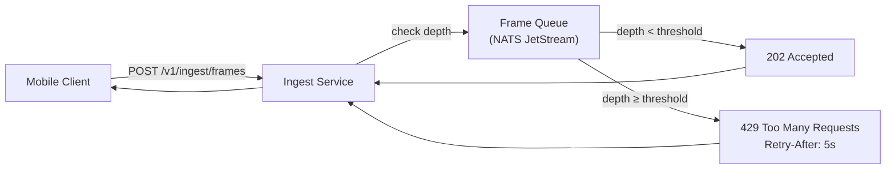
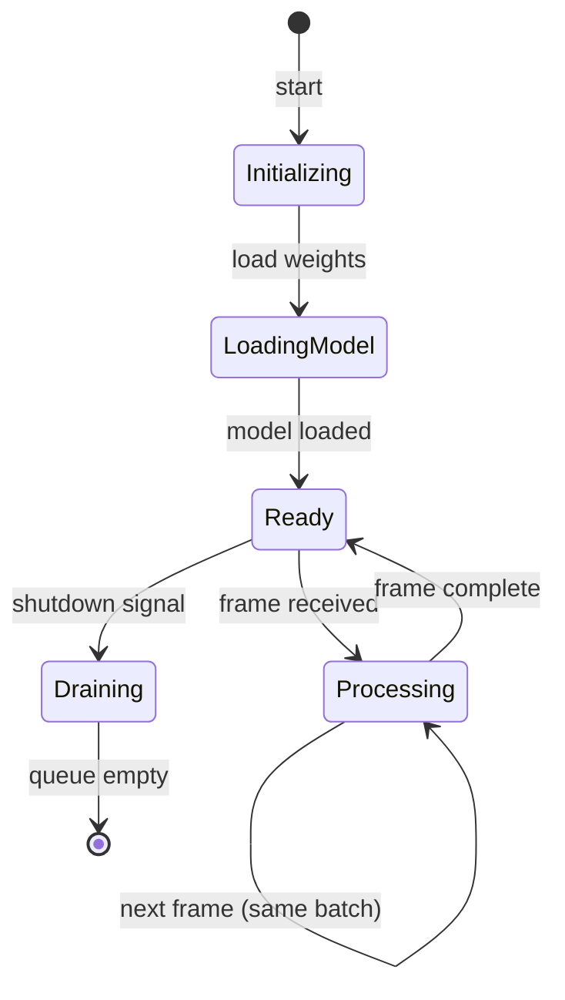
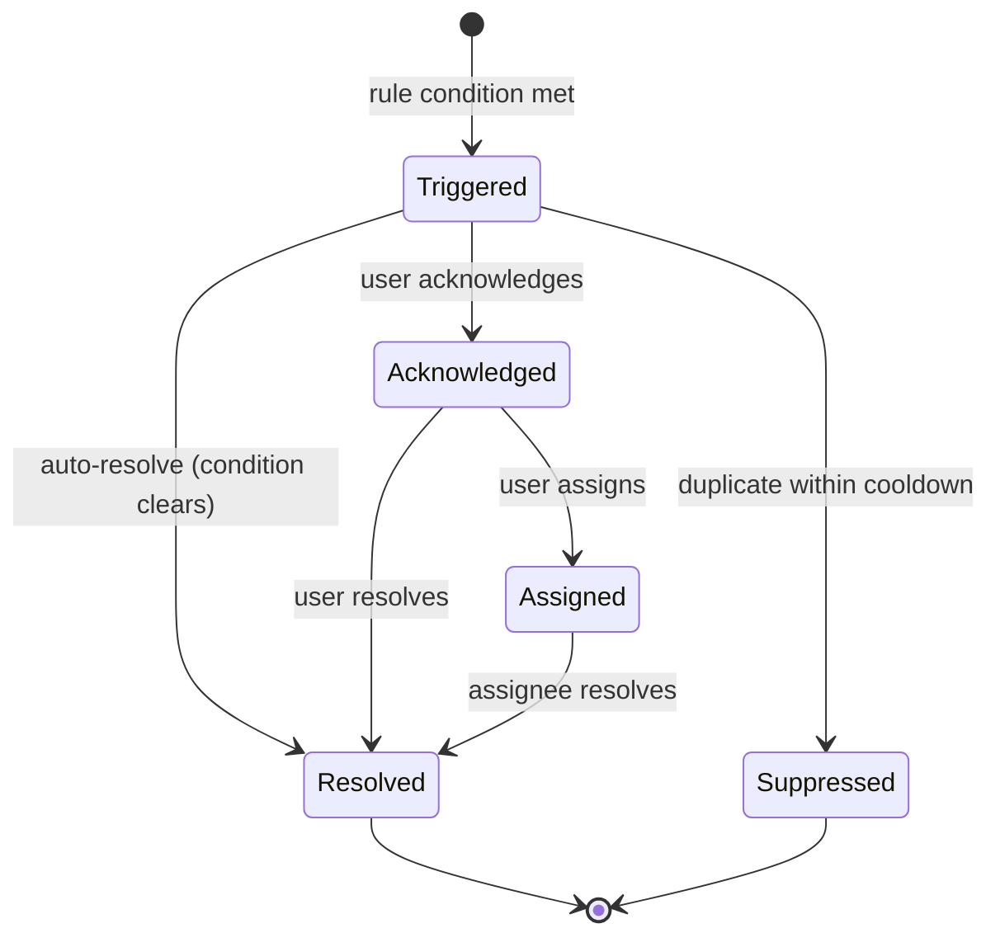
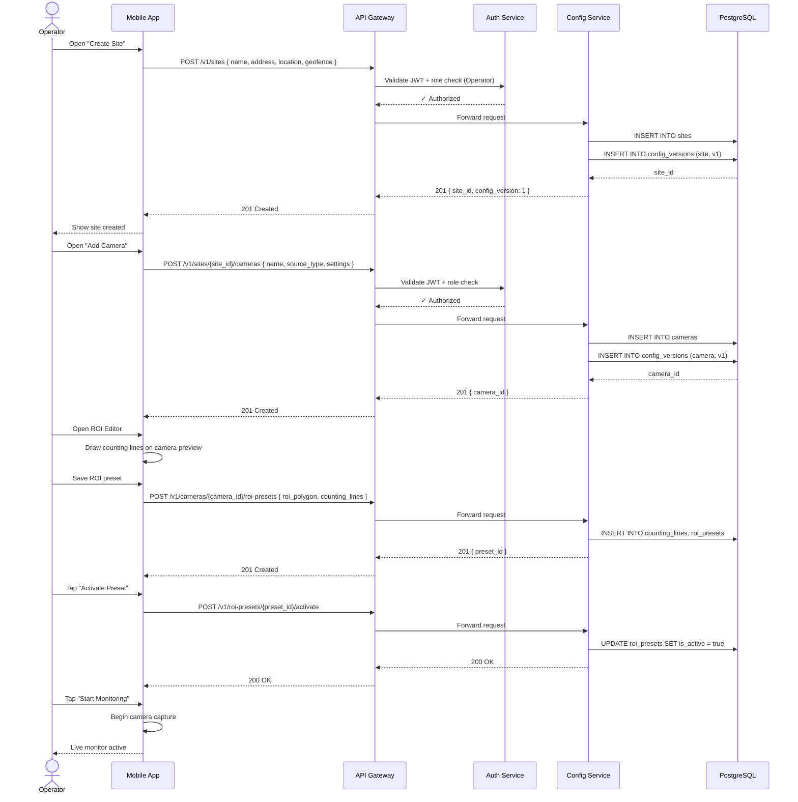
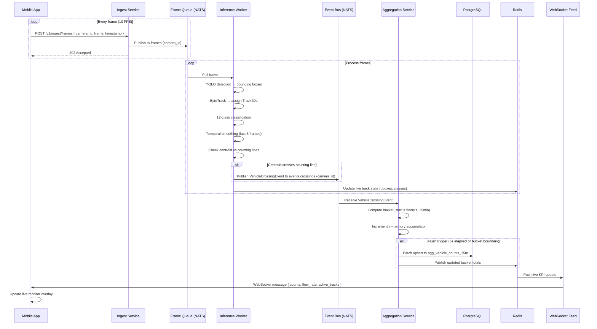
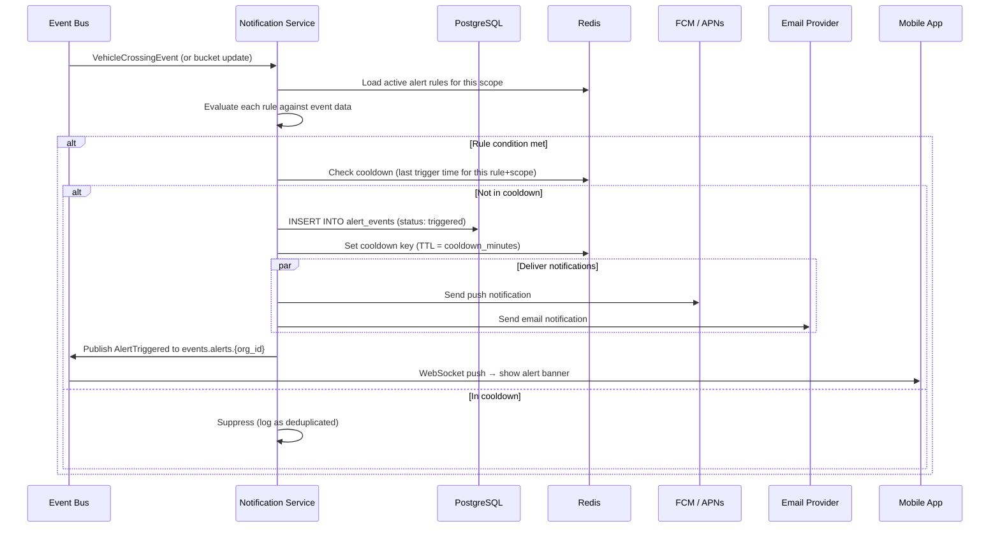
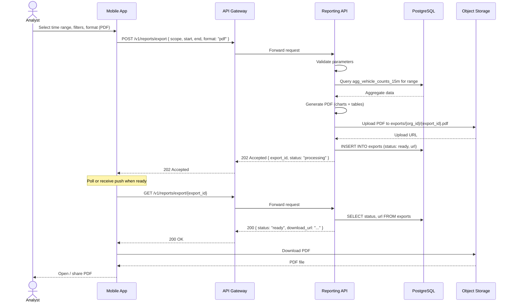
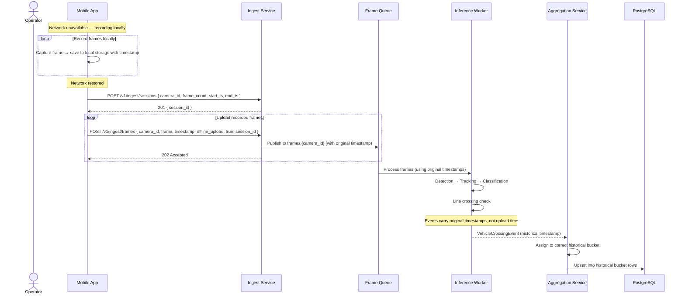

# GreyEye Traffic Analysis AI — Software Design

## 1 Introduction

This document details the backend software design of GreyEye: service responsibilities, API contracts, event schemas, data-flow logic, error handling, and key interaction sequences. It bridges the high-level architecture (01-system-architecture.md) and the database schema (04-database-design.md), providing the specification that developers need to implement each service.

**Traceability:** FR-1 through FR-8, NFR-4, NFR-6, NFR-11

---

## 2 Backend Service Descriptions

Each service is a FastAPI application (except the API Gateway, which is a reverse-proxy configuration) packaged as a Docker container. Services communicate via REST (client-facing), async event bus (crossing events), and direct internal HTTP where needed. All services share types from `libs/shared_contracts/`.

### 2.1 API Gateway

| Aspect | Detail |
|--------|--------|
| **Purpose** | Single entry point for all external HTTP and WebSocket traffic |
| **Technology** | Nginx or Envoy with custom Lua/WASM middleware |
| **Responsibilities** | TLS termination, JWT validation (delegates to Auth Service for token introspection), request routing to downstream services, rate limiting (token-bucket per client IP and per user), request/response logging, CORS policy enforcement |
| **Health endpoint** | `GET /healthz` — returns `200` if the proxy and at least one upstream per service group are reachable |
| **Traceability** | SEC-4, SEC-11, NFR-5 |

**Rate-limit configuration:**

| Scope | Limit | Window | Burst |
|-------|-------|--------|-------|
| Per IP (unauthenticated) | 60 requests | 1 minute | 10 |
| Per user (authenticated) | 300 requests | 1 minute | 50 |
| Frame upload (per camera) | 15 requests | 1 second | 5 |

---

### 2.2 Auth & RBAC Service

| Aspect | Detail |
|--------|--------|
| **Purpose** | Identity management, authentication, and role-based authorization |
| **Technology** | FastAPI + Supabase Auth (or custom OAuth2/OIDC provider) |
| **Traceability** | FR-1.1, FR-1.2, FR-1.3, FR-1.4, SEC-1, SEC-2, SEC-3 |

**Responsibilities:**

1. **User registration and invite** — Email/password or SSO (Google, Microsoft). Admin users can invite new members to an organization via email. (FR-1.1)
2. **Multi-tenant isolation** — Every user belongs to exactly one organization. All downstream queries are scoped by `org_id`. (FR-1.2)
3. **RBAC enforcement** — Four roles with hierarchical permissions. Role checks are enforced at the API Gateway (coarse) and within each service (fine-grained). (FR-1.3)
4. **Token management** — Short-lived access tokens (15 min), long-lived refresh tokens (7 days). Refresh rotation with reuse detection.
5. **Audit logging** — All permission changes (role grant, revoke, org membership changes) are written to the `audit_logs` table. (FR-1.4)
6. **Step-up authentication** — Destructive admin actions (delete site, change roles, export data) require re-authentication within the last 5 minutes. (SEC-3)

**RBAC Permission Matrix:**

| Resource / Action | Admin | Operator | Analyst | Viewer |
|-------------------|:-----:|:--------:|:-------:|:------:|
| Manage organization | ✅ | — | — | — |
| Invite / remove users | ✅ | — | — | — |
| Assign roles | ✅ | — | — | — |
| Create / edit / delete site | ✅ | ✅ | — | — |
| Create / edit / delete camera | ✅ | ✅ | — | — |
| Edit ROI / counting lines | ✅ | ✅ | — | — |
| Start / stop monitoring | ✅ | ✅ | — | — |
| View live monitor | ✅ | ✅ | ✅ | ✅ |
| View analytics / KPIs | ✅ | ✅ | ✅ | ✅ |
| Export reports | ✅ | ✅ | ✅ | — |
| Create / edit alert rules | ✅ | ✅ | — | — |
| Acknowledge / close alerts | ✅ | ✅ | ✅ | — |
| View alert history | ✅ | ✅ | ✅ | ✅ |
| Model rollback | ✅ | — | — | — |
| View audit logs | ✅ | — | — | — |
| Configure retention / privacy | ✅ | — | — | — |

---

### 2.3 Config Service

| Aspect | Detail |
|--------|--------|
| **Purpose** | CRUD and versioning for sites, cameras, counting lines, and ROI presets |
| **Technology** | FastAPI + SQLAlchemy + Alembic |
| **Traceability** | FR-2.1, FR-2.2, FR-2.3, FR-2.4, FR-3.1, FR-3.2, FR-3.3, FR-3.4, FR-4.4, FR-4.5 |

**Responsibilities:**

1. **Site management** — Create, update, archive sites with name, address, GPS coordinates, and optional geofence polygon (GeoJSON). (FR-2.1, FR-2.2)
2. **Camera registration** — Register smartphone cameras (device-linked) or external RTSP/ONVIF streams. Store per-camera settings: target FPS, resolution, night-mode flag, classification mode (full 12-class / coarse-only / disabled). (FR-3.1, FR-3.2, FR-3.3, FR-4.5)
3. **ROI preset management** — Store multiple named presets per camera, each containing the ROI polygon, counting lines (with direction vectors), and optional lane polylines. (FR-4.4)
4. **Configuration versioning** — Every mutation creates a new config version. Previous versions are retained for rollback. The active version is marked with `is_active = true`. (FR-2.4)
5. **Camera health tracking** — Receives heartbeat updates from the Ingest Service and exposes camera status (online, degraded, offline) via the API. (FR-3.4)
6. **Analysis zones** — A site can have multiple analysis zones, each with its own set of cameras and counting lines. (FR-2.3)

**Configuration Version Model:**

```python
class ConfigVersion(BaseModel):
    version_id: UUID
    entity_type: Literal["site", "camera", "roi_preset"]
    entity_id: UUID
    version_number: int
    config_snapshot: dict  # full JSON snapshot of the entity at this version
    is_active: bool
    created_by: UUID
    created_at: datetime
    rollback_from: Optional[UUID] = None  # if this version was created by a rollback
```

---

### 2.4 Ingest Service

| Aspect | Detail |
|--------|--------|
| **Purpose** | Receives video frames and chunks from clients, queues them for inference |
| **Technology** | FastAPI with streaming request body support |
| **Traceability** | FR-3.4, FR-3.5, NFR-4, NFR-6 |

**Responsibilities:**

1. **Frame upload** — Accepts individual frames (JPEG) or video chunks (H.264 segments) via chunked HTTP POST. Each upload includes `camera_id`, `timestamp`, and `frame_index`. Frames are written to the inference queue (NATS JetStream subject: `frames.{camera_id}`).
2. **Health heartbeat** — Cameras send periodic heartbeats. The Ingest Service updates the camera's `last_seen_at` timestamp in Redis and marks cameras as offline if no heartbeat arrives within 2× the expected interval. (FR-3.4)
3. **Backpressure management** — When the inference queue exceeds a configurable depth threshold, the service responds with `HTTP 429` and a `Retry-After` header, signaling the client to reduce frame rate. (NFR-6)
4. **Offline upload reconciliation** — Supports record-and-upload mode: the client records video locally and uploads it later with original timestamps. The service tags these frames as `offline_upload = true` for correct temporal ordering. (FR-3.5)
5. **Auto-reconnect support** — Clients that disconnect mid-upload can resume using a session token. The service tracks upload progress per session and accepts continuation uploads. (NFR-4)

**Backpressure flow:**



---

### 2.5 Inference Worker

| Aspect | Detail |
|--------|--------|
| **Purpose** | Runs the AI pipeline: detection → tracking → classification → line crossing → event emission |
| **Technology** | Python worker (not FastAPI — pull-based consumer from NATS) with PyTorch/ONNX Runtime |
| **Traceability** | FR-5.1, FR-5.2, FR-5.3, FR-5.4, FR-5.5, FR-5.6, NFR-2, NFR-3 |

**Responsibilities:**

1. **Frame consumption** — Pulls frames from the NATS JetStream subject `frames.{camera_id}`. Each worker handles one or more camera streams concurrently.
2. **Detection** — Runs YOLO-based detector to produce bounding boxes with confidence scores. (FR-5.1)
3. **Tracking** — Applies ByteTrack or OC-SORT to assign persistent Track IDs across frames. Maintains per-camera track state in memory. (FR-5.2)
4. **Classification** — Feeds detected vehicle crops through the 12-class classification head. Outputs probability distribution over `VehicleClass12`. (FR-5.3)
5. **Temporal smoothing** — Applies majority voting over the last N frames (configurable, default N=5) of each track to produce a stable class label. (FR-5.4)
6. **Track attributes** — Computes per-track metadata: dwell time, trajectory polyline, occlusion flag, average speed estimate. (FR-5.5)
7. **Line crossing detection** — Tests each track's centroid against configured counting lines. When a centroid crosses a line in the configured direction, emits a `VehicleCrossingEvent`. Uses the dedup key `{camera_id}:{line_id}:{track_id}:{crossing_seq}` to prevent double-counting. (FR-5.6)
8. **Event publication** — Publishes `VehicleCrossingEvent` to the event bus subject `events.crossings.{camera_id}`.
9. **Live state broadcast** — Pushes current bounding boxes, track IDs, and class labels to Redis for the Live Monitor WebSocket feed.

**Worker lifecycle:**



---

### 2.6 Aggregation Service

| Aspect | Detail |
|--------|--------|
| **Purpose** | Consumes crossing events and computes 15-minute bucket aggregates |
| **Technology** | FastAPI + NATS consumer |
| **Traceability** | FR-6.1, FR-6.2, DM-2, DM-7 |

**Responsibilities:**

1. **Event consumption** — Subscribes to `events.crossings.*` on the event bus. Processes events in order per camera partition.
2. **Bucket assignment** — Assigns each event to a 15-minute bucket: `bucket_start = floor(timestamp_utc, 15 min)`. See [Section 5](#5-fifteen-minute-bucketing-logic) for the full algorithm.
3. **Per-class counting** — Increments the count for the event's `class12` value within the assigned bucket. Maintains in-memory accumulators that are flushed to Postgres periodically (every 5 seconds or on bucket boundary).
4. **KPI derivation** — Computes derived KPIs per bucket: total count, flow rate (vehicles/hour), class distribution percentages, heavy-vehicle ratio.
5. **Idempotent upsert** — Uses the dedup key to ensure that replayed events do not produce duplicate counts. The `agg_vehicle_counts_15m` table uses an `ON CONFLICT` upsert strategy.
6. **Aggregate recomputation** — Supports a recompute command that replays all events for a given camera and time range to rebuild aggregates from scratch. (DM-7)
7. **Live KPI push** — After each flush, publishes updated bucket totals to Redis for the WebSocket live-feed.

---

### 2.7 Reporting API

| Aspect | Detail |
|--------|--------|
| **Purpose** | Serves analytics queries, historical charts, and report exports |
| **Technology** | FastAPI + SQLAlchemy (read-only queries against Postgres read replica) |
| **Traceability** | FR-6.2, FR-8.1, FR-8.2, FR-8.3, FR-8.4 |

**Responsibilities:**

1. **Time-range KPI queries** — Returns 15-minute bucket data for a specified camera, site, or organization within a date/time range. Supports grouping by class, direction, and camera. (FR-6.2, FR-8.2)
2. **Live KPI tiles** — Serves current-bucket data from Redis cache for sub-second response times. Supports WebSocket subscription for real-time push updates. (FR-8.1)
3. **Report export** — Generates CSV, JSON, or PDF exports of analytics data for a specified scope and time range. PDF reports include charts rendered server-side. (FR-8.3)
4. **Shareable links** — Creates time-limited, read-only report links with an embedded access token. Recipients can view the report without authentication. Links expire after a configurable TTL (default: 7 days). (FR-8.4)
5. **Comparison queries** — Supports side-by-side comparison of two time ranges (e.g., this week vs. last week) for trend analysis.
6. **Pagination and streaming** — Large result sets are paginated (cursor-based). CSV exports stream rows to avoid memory pressure.

---

### 2.8 Notification Service

| Aspect | Detail |
|--------|--------|
| **Purpose** | Evaluates alert rules against live events and delivers notifications |
| **Technology** | FastAPI + NATS consumer + push/email integrations |
| **Traceability** | FR-7.1, FR-7.2, FR-7.3, FR-7.4 |

**Responsibilities:**

1. **Alert rule management** — CRUD for alert rules. Each rule specifies a condition type, threshold, scope (site/camera/line), and delivery channels. (FR-7.1)
2. **Rule evaluation** — Subscribes to crossing events and aggregated bucket updates. Evaluates rules in real-time against incoming data. Supported condition types:

| Condition Type | Trigger | Example |
|---------------|---------|---------|
| `congestion` | Count exceeds threshold within a time window | > 200 vehicles in 15 min |
| `speed_drop` | Average speed drops below threshold | Avg speed < 20 km/h |
| `stopped_vehicle` | Track dwell time exceeds threshold | Vehicle stopped > 60 s |
| `heavy_vehicle_share` | Heavy-vehicle percentage exceeds threshold | Classes 5–12 > 30% of total |
| `camera_offline` | No heartbeat for configured duration | No heartbeat for > 120 s |
| `count_anomaly` | Count deviates significantly from historical baseline | > 2σ from 4-week average |

3. **Alert delivery** — Sends notifications through configured channels: in-app push (FCM/APNs), email (SMTP/SendGrid), webhook (HTTP POST). Implements retry with exponential backoff for failed deliveries. (FR-7.2)
4. **Alert lifecycle** — Alerts progress through states: `triggered` → `acknowledged` → `assigned` → `resolved`. Users can acknowledge, assign to a team member, and close alerts. (FR-7.3)
5. **Alert history** — All alert events (trigger, acknowledge, assign, resolve) are persisted for reporting and audit. (FR-7.4)
6. **Deduplication** — Suppresses duplicate alerts for the same rule and scope within a configurable cooldown window (default: 15 minutes).

**Alert state machine:**



---

## 3 API Contract Reference

All endpoints are served through the API Gateway under the base path `/v1/`. Request and response bodies use JSON. Authentication is via Bearer token (JWT) in the `Authorization` header unless otherwise noted. All timestamps are ISO 8601 in UTC.

### 3.1 Auth Endpoints

| Method | Path | Description | Auth | Traceability |
|--------|------|-------------|------|-------------|
| `POST` | `/v1/auth/register` | Register a new user (email + password) | None | FR-1.1 |
| `POST` | `/v1/auth/login` | Authenticate and receive token pair | None | FR-1.1 |
| `POST` | `/v1/auth/refresh` | Refresh access token | Refresh token | FR-1.1 |
| `POST` | `/v1/auth/logout` | Revoke refresh token | Bearer | FR-1.1 |
| `POST` | `/v1/auth/invite` | Invite user to organization (Admin only) | Bearer | FR-1.1 |
| `GET` | `/v1/users/me` | Get current user profile and role | Bearer | FR-1.3 |
| `PATCH` | `/v1/users/{user_id}/role` | Update user role (Admin only, step-up auth) | Bearer | FR-1.3 |

**Example — Login:**

```json
// POST /v1/auth/login
// Request
{
  "email": "operator@example.com",
  "password": "••••••••"
}

// Response 200
{
  "access_token": "eyJhbGciOiJSUzI1NiIs...",
  "refresh_token": "dGhpcyBpcyBhIHJlZnJl...",
  "token_type": "Bearer",
  "expires_in": 900,
  "user": {
    "id": "usr_abc123",
    "email": "operator@example.com",
    "name": "Kim Operator",
    "org_id": "org_xyz789",
    "role": "operator"
  }
}
```

---

### 3.2 Site & Camera Endpoints

| Method | Path | Description | Auth | Traceability |
|--------|------|-------------|------|-------------|
| `POST` | `/v1/sites` | Create a new site | Bearer (Admin, Operator) | FR-2.1 |
| `GET` | `/v1/sites` | List sites for current org | Bearer | FR-2.1 |
| `GET` | `/v1/sites/{site_id}` | Get site details | Bearer | FR-2.1 |
| `PATCH` | `/v1/sites/{site_id}` | Update site (creates new config version) | Bearer (Admin, Operator) | FR-2.1, FR-2.4 |
| `DELETE` | `/v1/sites/{site_id}` | Archive site (soft delete, step-up auth) | Bearer (Admin) | FR-2.1 |
| `POST` | `/v1/sites/{site_id}/cameras` | Register a camera to a site | Bearer (Admin, Operator) | FR-3.1, FR-3.2 |
| `GET` | `/v1/sites/{site_id}/cameras` | List cameras for a site | Bearer | FR-3.1 |
| `PATCH` | `/v1/cameras/{camera_id}` | Update camera settings | Bearer (Admin, Operator) | FR-3.3 |
| `DELETE` | `/v1/cameras/{camera_id}` | Remove camera (soft delete) | Bearer (Admin, Operator) | FR-3.1 |
| `GET` | `/v1/cameras/{camera_id}/status` | Get camera health status | Bearer | FR-3.4 |

**Example — Create Site:**

```json
// POST /v1/sites
// Request
{
  "name": "강남역 교차로",
  "address": "서울특별시 강남구 강남대로 396",
  "location": {
    "latitude": 37.4979,
    "longitude": 127.0276
  },
  "geofence": {
    "type": "Polygon",
    "coordinates": [[[127.0270, 37.4975], [127.0282, 37.4975], [127.0282, 37.4983], [127.0270, 37.4983], [127.0270, 37.4975]]]
  },
  "timezone": "Asia/Seoul"
}

// Response 201
{
  "id": "site_a1b2c3",
  "name": "강남역 교차로",
  "address": "서울특별시 강남구 강남대로 396",
  "location": { "latitude": 37.4979, "longitude": 127.0276 },
  "geofence": { "type": "Polygon", "coordinates": [...] },
  "timezone": "Asia/Seoul",
  "org_id": "org_xyz789",
  "config_version": 1,
  "status": "active",
  "created_at": "2026-03-09T10:00:00Z",
  "created_by": "usr_abc123"
}
```

**Example — Register Camera:**

```json
// POST /v1/sites/site_a1b2c3/cameras
// Request
{
  "name": "남측 진입로 카메라",
  "source_type": "smartphone",
  "settings": {
    "target_fps": 10,
    "resolution": "1920x1080",
    "night_mode": false,
    "classification_mode": "full_12class"
  }
}

// Response 201
{
  "id": "cam_d4e5f6",
  "site_id": "site_a1b2c3",
  "name": "남측 진입로 카메라",
  "source_type": "smartphone",
  "settings": {
    "target_fps": 10,
    "resolution": "1920x1080",
    "night_mode": false,
    "classification_mode": "full_12class"
  },
  "status": "offline",
  "config_version": 1,
  "created_at": "2026-03-09T10:05:00Z"
}
```

---

### 3.3 ROI & Counting Line Endpoints

| Method | Path | Description | Auth | Traceability |
|--------|------|-------------|------|-------------|
| `POST` | `/v1/cameras/{camera_id}/roi-presets` | Create a new ROI preset | Bearer (Admin, Operator) | FR-4.4 |
| `GET` | `/v1/cameras/{camera_id}/roi-presets` | List ROI presets for a camera | Bearer | FR-4.4 |
| `GET` | `/v1/roi-presets/{preset_id}` | Get ROI preset details | Bearer | FR-4.4 |
| `PUT` | `/v1/roi-presets/{preset_id}` | Update ROI preset (creates new version) | Bearer (Admin, Operator) | FR-4.4, FR-2.4 |
| `POST` | `/v1/roi-presets/{preset_id}/activate` | Set preset as active for its camera | Bearer (Admin, Operator) | FR-4.4 |
| `DELETE` | `/v1/roi-presets/{preset_id}` | Delete ROI preset | Bearer (Admin, Operator) | FR-4.4 |

**Example — Create ROI Preset:**

```json
// POST /v1/cameras/cam_d4e5f6/roi-presets
// Request
{
  "name": "평일 기본",
  "roi_polygon": {
    "type": "Polygon",
    "coordinates": [[[0.1, 0.2], [0.9, 0.2], [0.9, 0.95], [0.1, 0.95], [0.1, 0.2]]]
  },
  "counting_lines": [
    {
      "name": "남북 통행선",
      "start": { "x": 0.2, "y": 0.5 },
      "end": { "x": 0.8, "y": 0.5 },
      "direction": "inbound",
      "direction_vector": { "dx": 0.0, "dy": -1.0 }
    },
    {
      "name": "북남 통행선",
      "start": { "x": 0.2, "y": 0.6 },
      "end": { "x": 0.8, "y": 0.6 },
      "direction": "outbound",
      "direction_vector": { "dx": 0.0, "dy": 1.0 }
    }
  ],
  "lane_polylines": [
    {
      "name": "1차로",
      "points": [{ "x": 0.3, "y": 0.2 }, { "x": 0.3, "y": 0.95 }]
    }
  ]
}

// Response 201
{
  "id": "roi_g7h8i9",
  "camera_id": "cam_d4e5f6",
  "name": "평일 기본",
  "roi_polygon": { ... },
  "counting_lines": [ ... ],
  "lane_polylines": [ ... ],
  "is_active": false,
  "version": 1,
  "created_at": "2026-03-09T10:10:00Z"
}
```

ROI coordinates use **normalized values** (0.0–1.0) relative to the camera frame dimensions, making presets resolution-independent.

---

### 3.4 Ingest Endpoints

| Method | Path | Description | Auth | Traceability |
|--------|------|-------------|------|-------------|
| `POST` | `/v1/ingest/frames` | Upload frame(s) for inference | Bearer | FR-3.1, FR-3.5 |
| `POST` | `/v1/ingest/chunks` | Upload video chunk (H.264 segment) | Bearer | FR-3.1 |
| `POST` | `/v1/ingest/heartbeat` | Camera health heartbeat | Bearer | FR-3.4 |
| `POST` | `/v1/ingest/sessions` | Create upload session (for resume support) | Bearer | NFR-4 |
| `PATCH` | `/v1/ingest/sessions/{session_id}` | Resume upload session | Bearer | NFR-4 |

**Example — Frame Upload:**

```http
POST /v1/ingest/frames HTTP/1.1
Authorization: Bearer eyJhbGci...
Content-Type: multipart/form-data; boundary=----boundary

------boundary
Content-Disposition: form-data; name="metadata"
Content-Type: application/json

{
  "camera_id": "cam_d4e5f6",
  "frame_index": 4217,
  "timestamp_utc": "2026-03-09T14:07:32.000Z",
  "offline_upload": false
}
------boundary
Content-Disposition: form-data; name="frame"; filename="frame_4217.jpg"
Content-Type: image/jpeg

<binary JPEG data>
------boundary--
```

**Response:**

```json
// 202 Accepted (normal)
{
  "status": "queued",
  "queue_position": 12,
  "estimated_latency_ms": 800
}

// 429 Too Many Requests (backpressure)
{
  "error": "queue_full",
  "message": "Inference queue is at capacity. Reduce frame rate.",
  "retry_after_seconds": 5
}
```

---

### 3.5 Analytics & Reporting Endpoints

| Method | Path | Description | Auth | Traceability |
|--------|------|-------------|------|-------------|
| `GET` | `/v1/analytics/15m` | Query 15-min bucket aggregates | Bearer | FR-6.1, FR-6.2 |
| `GET` | `/v1/analytics/kpi` | Query derived KPIs (flow rate, class distribution) | Bearer | FR-6.1 |
| `GET` | `/v1/analytics/live` | Get current (in-progress) bucket data from cache | Bearer | FR-8.1 |
| `WS` | `/v1/analytics/live/ws` | WebSocket for real-time KPI push | Bearer | FR-8.1, NFR-1 |
| `GET` | `/v1/analytics/compare` | Compare two time ranges | Bearer | FR-8.2 |
| `POST` | `/v1/reports/export` | Generate export (CSV, JSON, PDF) | Bearer (Admin, Operator, Analyst) | FR-8.3 |
| `GET` | `/v1/reports/export/{export_id}` | Download generated export file | Bearer | FR-8.3 |
| `POST` | `/v1/reports/share` | Create shareable read-only link | Bearer (Admin, Operator, Analyst) | FR-8.4 |
| `GET` | `/v1/reports/shared/{token}` | Access shared report (no auth required) | None (token in URL) | FR-8.4 |

**Example — Query 15-min Buckets:**

```json
// GET /v1/analytics/15m?camera_id=cam_d4e5f6&start=2026-03-09T08:00:00Z&end=2026-03-09T12:00:00Z&group_by=class12

// Response 200
{
  "camera_id": "cam_d4e5f6",
  "start": "2026-03-09T08:00:00Z",
  "end": "2026-03-09T12:00:00Z",
  "buckets": [
    {
      "bucket_start": "2026-03-09T08:00:00Z",
      "bucket_end": "2026-03-09T08:15:00Z",
      "total_count": 87,
      "by_class": {
        "1": 52,
        "2": 8,
        "3": 12,
        "4": 9,
        "5": 3,
        "8": 2,
        "10": 1
      },
      "by_direction": {
        "inbound": 45,
        "outbound": 42
      }
    },
    {
      "bucket_start": "2026-03-09T08:15:00Z",
      "bucket_end": "2026-03-09T08:30:00Z",
      "total_count": 93,
      "by_class": { ... },
      "by_direction": { ... }
    }
  ],
  "pagination": {
    "cursor": "eyJidWNrZXRfc3RhcnQi...",
    "has_more": true
  }
}
```

**Example — WebSocket Live Feed:**

```json
// Connect: WS /v1/analytics/live/ws?camera_id=cam_d4e5f6

// Server push (every ≤ 2 seconds)
{
  "type": "live_kpi_update",
  "camera_id": "cam_d4e5f6",
  "current_bucket": "2026-03-09T14:00:00Z",
  "elapsed_seconds": 452,
  "counts": {
    "total": 34,
    "by_class": { "1": 20, "2": 3, "3": 5, "4": 4, "10": 2 },
    "by_direction": { "inbound": 18, "outbound": 16 }
  },
  "active_tracks": 7,
  "flow_rate_per_hour": 271
}
```

---

### 3.6 Alert Endpoints

| Method | Path | Description | Auth | Traceability |
|--------|------|-------------|------|-------------|
| `POST` | `/v1/alerts/rules` | Create alert rule | Bearer (Admin, Operator) | FR-7.1 |
| `GET` | `/v1/alerts/rules` | List alert rules for current scope | Bearer | FR-7.1 |
| `PATCH` | `/v1/alerts/rules/{rule_id}` | Update alert rule | Bearer (Admin, Operator) | FR-7.1 |
| `DELETE` | `/v1/alerts/rules/{rule_id}` | Delete alert rule | Bearer (Admin, Operator) | FR-7.1 |
| `GET` | `/v1/alerts` | List active and recent alerts | Bearer | FR-7.4 |
| `POST` | `/v1/alerts/{alert_id}/acknowledge` | Acknowledge an alert | Bearer (Admin, Operator, Analyst) | FR-7.3 |
| `POST` | `/v1/alerts/{alert_id}/assign` | Assign alert to a user | Bearer (Admin, Operator) | FR-7.3 |
| `POST` | `/v1/alerts/{alert_id}/resolve` | Resolve an alert | Bearer (Admin, Operator, Analyst) | FR-7.3 |
| `GET` | `/v1/alerts/history` | Query alert history with filters | Bearer | FR-7.4 |

**Example — Create Alert Rule:**

```json
// POST /v1/alerts/rules
// Request
{
  "name": "강남역 혼잡 경보",
  "scope": {
    "site_id": "site_a1b2c3",
    "camera_id": "cam_d4e5f6"
  },
  "condition": {
    "type": "congestion",
    "threshold": 200,
    "window_minutes": 15
  },
  "severity": "warning",
  "channels": ["push", "email"],
  "recipients": ["usr_abc123"],
  "cooldown_minutes": 15,
  "enabled": true
}

// Response 201
{
  "id": "rule_j1k2l3",
  "name": "강남역 혼잡 경보",
  "scope": { ... },
  "condition": { ... },
  "severity": "warning",
  "channels": ["push", "email"],
  "recipients": ["usr_abc123"],
  "cooldown_minutes": 15,
  "enabled": true,
  "created_at": "2026-03-09T10:30:00Z"
}
```

---

### 3.7 Audit Log Endpoints

| Method | Path | Description | Auth | Traceability |
|--------|------|-------------|------|-------------|
| `GET` | `/v1/audit-logs` | Query audit logs (Admin only) | Bearer (Admin) | FR-1.4, SEC-17 |
| `POST` | `/v1/audit-logs/export` | Export audit logs for compliance | Bearer (Admin) | SEC-18 |

---

### 3.8 Common Response Patterns

**Error response envelope:**

```json
{
  "error": {
    "code": "VALIDATION_ERROR",
    "message": "Human-readable error description",
    "details": [
      {
        "field": "settings.target_fps",
        "message": "Must be between 1 and 30"
      }
    ],
    "request_id": "req_m4n5o6",
    "timestamp": "2026-03-09T14:07:32.451Z"
  }
}
```

**Standard error codes:**

| HTTP Status | Error Code | Description |
|-------------|-----------|-------------|
| 400 | `VALIDATION_ERROR` | Request body fails schema validation |
| 401 | `UNAUTHORIZED` | Missing or expired token |
| 403 | `FORBIDDEN` | Insufficient role/permissions |
| 404 | `NOT_FOUND` | Resource does not exist or is not accessible |
| 409 | `CONFLICT` | Duplicate resource or version conflict |
| 422 | `UNPROCESSABLE_ENTITY` | Semantically invalid (e.g., ROI polygon self-intersects) |
| 429 | `RATE_LIMITED` | Rate limit exceeded |
| 500 | `INTERNAL_ERROR` | Unexpected server error |
| 503 | `SERVICE_UNAVAILABLE` | Downstream dependency unreachable |

**Pagination (cursor-based):**

All list endpoints support cursor-based pagination:

```
GET /v1/sites?limit=20&cursor=eyJpZCI6InNpdGVfYTFi...
```

Response includes:

```json
{
  "data": [ ... ],
  "pagination": {
    "cursor": "eyJpZCI6InNpdGVfYjJj...",
    "has_more": true,
    "total_count": 47
  }
}
```

---

## 4 Event Schema

### 4.1 VehicleCrossingEvent

The `VehicleCrossingEvent` is the atomic unit of counting truth. It is published to the event bus by the Inference Worker whenever a tracked vehicle's centroid crosses a counting line.

**Schema (Pydantic model from `libs/shared_contracts/`):**

```python
class VehicleCrossingEvent(BaseModel):
    event_type: Literal["VehicleCrossingEvent"] = "VehicleCrossingEvent"
    version: str = "1.0"
    event_id: UUID = Field(default_factory=uuid4)
    timestamp_utc: datetime
    camera_id: str
    line_id: str
    track_id: str
    crossing_seq: int = Field(ge=1, description="Sequence number for multi-line crossings by the same track")
    class12: VehicleClass12
    confidence: float = Field(ge=0.0, le=1.0)
    direction: Literal["inbound", "outbound"]
    model_version: str
    frame_index: int
    speed_estimate_kmh: Optional[float] = None
    bbox: Optional[BoundingBox] = None
    org_id: str
    site_id: str

    @property
    def dedup_key(self) -> str:
        return f"{self.camera_id}:{self.line_id}:{self.track_id}:{self.crossing_seq}"

    @property
    def bucket_start(self) -> datetime:
        ts = self.timestamp_utc
        minute_floor = ts.minute - (ts.minute % 15)
        return ts.replace(minute=minute_floor, second=0, microsecond=0)
```

**Wire format (JSON on event bus):**

```json
{
  "event_type": "VehicleCrossingEvent",
  "version": "1.0",
  "event_id": "f47ac10b-58cc-4372-a567-0e02b2c3d479",
  "timestamp_utc": "2026-03-09T14:07:32.451Z",
  "camera_id": "cam_d4e5f6",
  "line_id": "line_01",
  "track_id": "trk_00042",
  "crossing_seq": 1,
  "class12": 2,
  "confidence": 0.91,
  "direction": "inbound",
  "model_version": "v2.3.1",
  "frame_index": 4217,
  "speed_estimate_kmh": 42.5,
  "bbox": { "x": 0.32, "y": 0.41, "w": 0.12, "h": 0.08 },
  "org_id": "org_xyz789",
  "site_id": "site_a1b2c3"
}
```

**Dedup key:** `{camera_id}:{line_id}:{track_id}:{crossing_seq}` — ensures exactly-once counting even under event replay or network retries. (DM-6)

### 4.2 Event Bus Subjects

Events are published to NATS JetStream subjects organized by type and camera:

| Subject Pattern | Publisher | Subscribers | Description |
|----------------|-----------|-------------|-------------|
| `events.crossings.{camera_id}` | Inference Worker | Aggregation Service, Notification Service | Vehicle crossing events |
| `events.tracks.{camera_id}` | Inference Worker | Live Monitor (via Redis) | Track start/end/update events |
| `events.health.{camera_id}` | Ingest Service | Config Service, Notification Service | Camera health status changes |
| `events.alerts.{org_id}` | Notification Service | Mobile App (via WebSocket) | Alert trigger/resolve events |
| `commands.recompute` | Reporting API | Aggregation Service | Aggregate recomputation requests |

### 4.3 Supplementary Event Types

```python
class TrackEvent(BaseModel):
    event_type: Literal["TrackStarted", "TrackUpdated", "TrackEnded"]
    timestamp_utc: datetime
    camera_id: str
    track_id: str
    class12: Optional[VehicleClass12] = None
    confidence: Optional[float] = None
    bbox: BoundingBox
    centroid: Point2D
    frame_index: int

class CameraHealthEvent(BaseModel):
    event_type: Literal["CameraHealthEvent"]
    timestamp_utc: datetime
    camera_id: str
    status: Literal["online", "degraded", "offline"]
    fps_actual: Optional[float] = None
    last_frame_index: Optional[int] = None
    reason: Optional[str] = None

class AlertEvent(BaseModel):
    event_type: Literal["AlertTriggered", "AlertAcknowledged", "AlertResolved"]
    timestamp_utc: datetime
    alert_id: UUID
    rule_id: UUID
    org_id: str
    severity: Literal["info", "warning", "critical"]
    message: str
    scope: dict
```

---

## 5 Fifteen-Minute Bucketing Logic

The 15-minute bucket is the primary aggregation window for all traffic analytics in GreyEye. This section specifies the bucketing algorithm, edge cases, and consistency guarantees. (FR-6.1, FR-6.2, DM-2, DM-7)

### 5.1 Bucket Assignment Algorithm

```python
from datetime import datetime, timezone

BUCKET_DURATION_MINUTES = 15

def compute_bucket_start(timestamp_utc: datetime) -> datetime:
    """Assign a UTC timestamp to its 15-minute bucket.

    Buckets are aligned to the hour: :00, :15, :30, :45.
    The bucket_start is inclusive, bucket_end is exclusive.

    Examples:
        10:00:00 → bucket 10:00
        10:07:32 → bucket 10:00
        10:14:59 → bucket 10:00
        10:15:00 → bucket 10:15
        10:44:59 → bucket 10:30
        10:45:00 → bucket 10:45
        23:59:59 → bucket 23:45
    """
    minute_floor = timestamp_utc.minute - (timestamp_utc.minute % BUCKET_DURATION_MINUTES)
    return timestamp_utc.replace(minute=minute_floor, second=0, microsecond=0)
```

### 5.2 Bucket Boundaries

| Property | Value |
|----------|-------|
| Duration | 15 minutes (900 seconds) |
| Alignment | Hour-aligned: `:00`, `:15`, `:30`, `:45` |
| Timezone | Always UTC internally; converted to site timezone for display |
| Boundary rule | `bucket_start` is inclusive, `bucket_end` is exclusive |
| Buckets per hour | 4 |
| Buckets per day | 96 |

### 5.3 Aggregation Data Structure

Each bucket accumulates counts per class, direction, and counting line:

```python
class BucketAggregate(BaseModel):
    camera_id: str
    line_id: str
    bucket_start: datetime
    class12: VehicleClass12
    direction: Literal["inbound", "outbound"]
    count: int = 0
    sum_confidence: float = 0.0
    sum_speed_kmh: float = 0.0
    min_speed_kmh: Optional[float] = None
    max_speed_kmh: Optional[float] = None
    last_updated_at: datetime
```

**Database upsert (idempotent):**

```sql
INSERT INTO agg_vehicle_counts_15m (
    camera_id, line_id, bucket_start, class12, direction,
    count, sum_confidence, sum_speed_kmh, min_speed_kmh, max_speed_kmh,
    last_updated_at
)
VALUES ($1, $2, $3, $4, $5, $6, $7, $8, $9, $10, NOW())
ON CONFLICT (camera_id, line_id, bucket_start, class12, direction)
DO UPDATE SET
    count = agg_vehicle_counts_15m.count + EXCLUDED.count,
    sum_confidence = agg_vehicle_counts_15m.sum_confidence + EXCLUDED.sum_confidence,
    sum_speed_kmh = agg_vehicle_counts_15m.sum_speed_kmh + EXCLUDED.sum_speed_kmh,
    min_speed_kmh = LEAST(agg_vehicle_counts_15m.min_speed_kmh, EXCLUDED.min_speed_kmh),
    max_speed_kmh = GREATEST(agg_vehicle_counts_15m.max_speed_kmh, EXCLUDED.max_speed_kmh),
    last_updated_at = NOW();
```

### 5.4 In-Memory Accumulator

The Aggregation Service maintains an in-memory buffer to batch database writes:

1. **Receive event** → compute `bucket_start` → increment in-memory counter for `(camera_id, line_id, bucket_start, class12, direction)`.
2. **Flush trigger** — flush to Postgres when any of:
   - 5 seconds have elapsed since last flush
   - A bucket boundary is crossed (current time moves to a new 15-min window)
   - The in-memory buffer exceeds 1,000 entries
3. **On flush** — execute batch upsert, then publish updated totals to Redis for the live WebSocket feed.
4. **On shutdown** — flush all pending accumulators before exiting.

### 5.5 Late-Arriving Events

Events may arrive out of order (e.g., offline uploads, network delays). The system handles late arrivals as follows:

| Scenario | Handling |
|----------|----------|
| Event arrives within current bucket | Normal accumulation |
| Event arrives for a past bucket (< 1 hour old) | Upsert into the correct historical bucket; update Redis cache |
| Event arrives for a past bucket (≥ 1 hour old) | Upsert into the correct historical bucket; no live cache update |
| Event arrives for a future timestamp | Reject with error (clock skew protection); log warning |

### 5.6 Aggregate Recomputation (DM-7)

Aggregates can be rebuilt from the source-of-truth `vehicle_crossings` table:

```sql
-- Recompute aggregates for a camera and time range
DELETE FROM agg_vehicle_counts_15m
WHERE camera_id = $1
  AND bucket_start BETWEEN $2 AND $3;

INSERT INTO agg_vehicle_counts_15m (
    camera_id, line_id, bucket_start, class12, direction,
    count, sum_confidence, sum_speed_kmh, min_speed_kmh, max_speed_kmh,
    last_updated_at
)
SELECT
    camera_id,
    line_id,
    date_trunc('hour', timestamp_utc)
        + INTERVAL '15 minutes' * FLOOR(EXTRACT(MINUTE FROM timestamp_utc) / 15),
    class12,
    direction,
    COUNT(*),
    SUM(confidence),
    SUM(speed_estimate_kmh),
    MIN(speed_estimate_kmh),
    MAX(speed_estimate_kmh),
    NOW()
FROM vehicle_crossings
WHERE camera_id = $1
  AND timestamp_utc BETWEEN $2 AND $3
GROUP BY camera_id, line_id,
    date_trunc('hour', timestamp_utc)
        + INTERVAL '15 minutes' * FLOOR(EXTRACT(MINUTE FROM timestamp_utc) / 15),
    class12, direction;
```

---

## 6 Error Handling and Retry Strategy

### 6.1 Retry Policies

| Service | Failure Type | Strategy | Max Retries | Backoff |
|---------|-------------|----------|-------------|---------|
| Ingest Service | Inference queue publish failure | Retry with exponential backoff | 5 | 100 ms → 1.6 s |
| Inference Worker | Model inference error (OOM, timeout) | Skip frame, log error, continue | 0 | — |
| Inference Worker | Event bus publish failure | Retry with backoff, buffer locally | 10 | 200 ms → 3.2 s |
| Aggregation Service | Database write failure | Retry with backoff, hold in-memory | 5 | 500 ms → 8 s |
| Notification Service | Push/email delivery failure | Retry with backoff | 3 | 1 s → 4 s |
| Reporting API | Database query timeout | Return 503, client retries | 0 | — |

### 6.2 Dead Letter Queue

Events that exhaust all retry attempts are routed to a dead-letter subject (`events.dlq.{original_subject}`) for manual inspection and replay. The DLQ is monitored via Prometheus metrics (`dlq_messages_total` counter) with alerts on non-zero values.

### 6.3 Circuit Breaker

The API Gateway implements a circuit breaker for each downstream service:

| State | Behavior |
|-------|----------|
| **Closed** | Requests pass through normally |
| **Open** | Requests immediately return `503 Service Unavailable` with a `Retry-After` header |
| **Half-open** | A limited number of probe requests are forwarded; if they succeed, the circuit closes |

**Thresholds:**

- Open circuit after 5 consecutive failures or > 50% error rate in a 30-second window
- Half-open after 15 seconds
- Close after 3 consecutive successes in half-open state

### 6.4 Graceful Degradation (NFR-4, NFR-6)

| Scenario | Degraded Behavior |
|----------|-------------------|
| Inference workers overloaded | Frames queue up; client receives `429` with `Retry-After`; no data loss |
| Database primary unavailable | Read queries served from replica; writes buffered in event bus |
| Redis unavailable | Live KPI tiles show stale data; analytics queries fall back to Postgres |
| Event bus unavailable | Inference Worker buffers events locally (up to 10,000); flushes on reconnect |
| Notification delivery failure | Alerts stored in DB; delivery retried; user sees alert in-app on next open |

---

## 7 Sequence Diagrams

### 7.1 Site and Camera Setup Flow

This sequence shows the complete setup flow from site creation through camera registration, ROI configuration, and monitoring activation.



### 7.2 Runtime Counting Flow

This sequence shows the real-time data flow from frame capture through inference, event publication, aggregation, and live display.



### 7.3 Alert Evaluation and Delivery Flow



### 7.4 Report Export Flow



### 7.5 Offline Upload and Reconciliation Flow



---

## 8 Feature Flags (NFR-11)

Feature flags control gradual rollout of new capabilities without redeployment.

### 8.1 Flag Categories

| Category | Example Flags | Scope |
|----------|--------------|-------|
| **Model rollout** | `inference.model_version_canary`, `inference.canary_percentage` | Per camera or global |
| **Classification** | `classification.enable_12class`, `classification.fallback_mode` | Per camera |
| **UI experiments** | `ui.new_dashboard_layout`, `ui.chart_library` | Per user or per org |
| **Feature gates** | `alerts.enable_anomaly_detection`, `export.enable_pdf` | Per org |
| **Operational** | `ingest.max_queue_depth`, `aggregator.flush_interval_seconds` | Global |

### 8.2 Implementation Strategy

**MVP:** Environment variables and ConfigMap entries, read at service startup and refreshable via `SIGHUP` or a `/v1/admin/reload-config` endpoint.

**Scale:** Migration to a feature-flag service (LaunchDarkly, Unleash, or Flagsmith) with:
- Real-time flag evaluation without restart
- Percentage-based rollout (e.g., 10% of cameras use new model)
- User/org targeting for A/B tests
- Audit trail of flag changes

---

## 9 Cross-Service Concerns

### 9.1 Request Correlation

Every request entering the API Gateway is assigned a unique `X-Request-ID` header (UUID v4). This ID propagates through all downstream service calls and event publications, enabling end-to-end tracing from mobile client to database write.

```
Mobile App → API Gateway → Config Service → PostgreSQL
                ↓
         X-Request-ID: req_m4n5o6
```

All log entries include `request_id`, `camera_id`, and `org_id` for filtering and correlation.

### 9.2 Health Check Contract

Every service exposes two health endpoints:

| Endpoint | Purpose | Response |
|----------|---------|----------|
| `GET /healthz` | **Liveness** — is the process running? | `200 {"status": "ok"}` or `503` |
| `GET /readyz` | **Readiness** — can the service handle traffic? | `200 {"status": "ready"}` or `503 {"status": "not_ready", "reason": "..."}` |

Readiness checks verify downstream dependencies (database connection, event bus connection, model loaded).

### 9.3 API Versioning

All endpoints are prefixed with `/v1/`. When breaking changes are introduced, a new version prefix (`/v2/`) is added while the previous version remains available for a deprecation period (minimum 6 months). Non-breaking changes (new optional fields, new endpoints) are added to the current version.

### 9.4 Idempotency

State-changing operations that may be retried (frame upload, event publication, alert creation) support idempotency via:

- **Frame upload:** Dedup by `(camera_id, frame_index)` — re-uploading the same frame is a no-op.
- **Crossing events:** Dedup by `{camera_id}:{line_id}:{track_id}:{crossing_seq}` — replayed events do not increment counts.
- **Alert triggers:** Dedup by `(rule_id, scope, cooldown_window)` — duplicate triggers within the cooldown are suppressed.
- **Export requests:** Dedup by `(org_id, scope_hash, format, time_range)` within a 5-minute window — returns the existing export instead of creating a duplicate.

---

## 10 Summary

The GreyEye backend is composed of eight services that collaborate through synchronous REST APIs (client-facing), WebSocket connections (live data), and an asynchronous event bus (crossing events). Key design principles:

1. **Event sourcing** — `vehicle_crossings` is the source of truth; aggregates are derived and recomputable (DM-7).
2. **Exactly-once counting** — Dedup keys at every stage (inference, aggregation, alerting) prevent double-counting.
3. **Graceful degradation** — Backpressure, circuit breakers, and local buffering ensure the system degrades smoothly under load rather than failing catastrophically (NFR-4, NFR-6).
4. **15-minute bucketing** — Hour-aligned buckets with idempotent upserts support both real-time display and historical analysis (FR-6.1).
5. **Role-based access** — Four-role RBAC with RLS enforcement ensures multi-tenant data isolation (FR-1.3, SEC-2).
