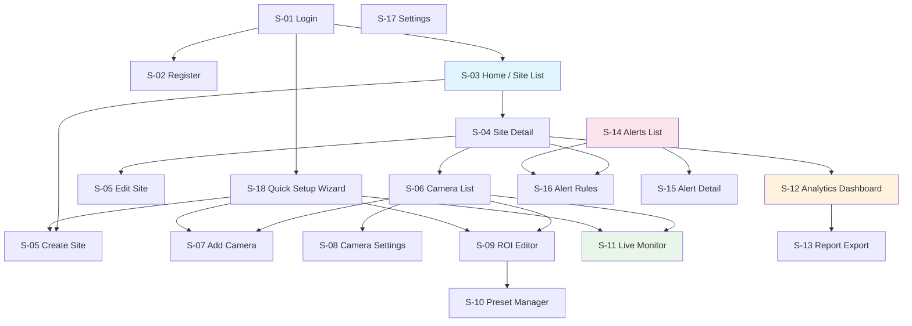
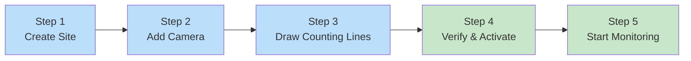
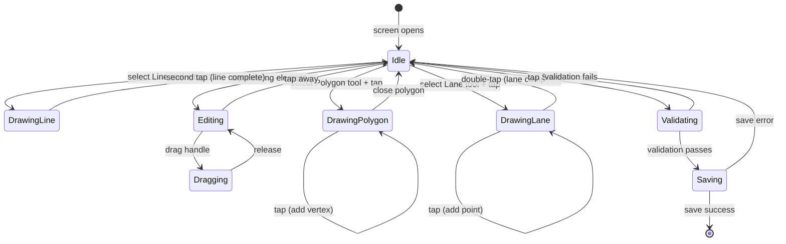
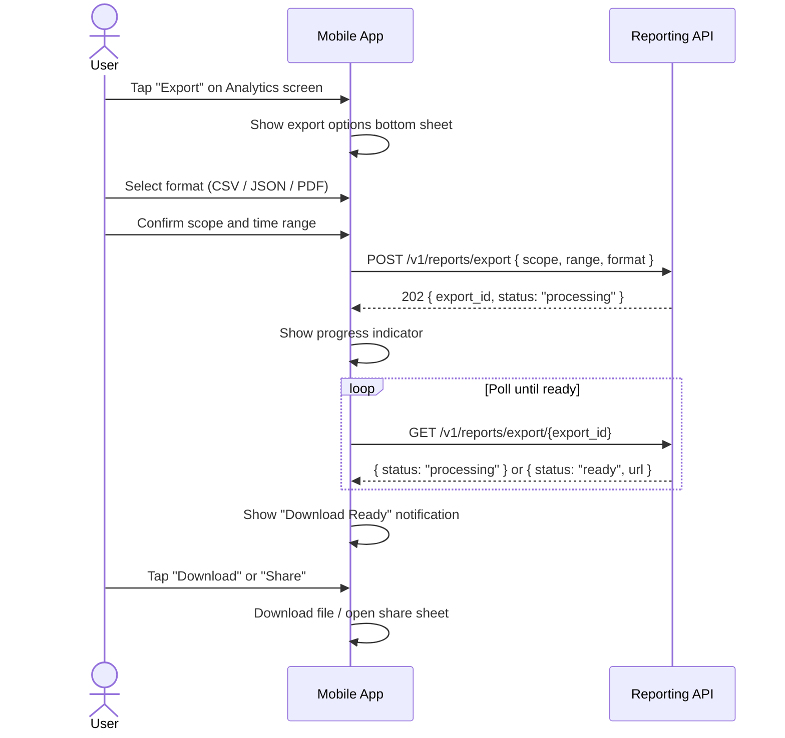

# GreyEye Traffic Analysis AI — Mobile UI Design

## 1 Introduction

This document specifies the mobile application's user interface design for GreyEye: screen inventory, navigation architecture, interaction flows, and UX patterns. The app is built with **Flutter** using **Riverpod** for state management and **GoRouter** for declarative navigation. It targets both iOS and Android with a single codebase.

**Traceability:** FR-2.1, FR-2.2, FR-3.1–FR-3.4, FR-4.1–FR-4.3, FR-6.2, FR-6.3, FR-7.3, FR-8.1–FR-8.3, NFR-1, NFR-7, NFR-8, NFR-12, UI-1–UI-4

---

## 2 Design Principles

| Principle | Description | SRS Reference |
|-----------|-------------|---------------|
| **3-tap rule** | Every critical action (start monitoring, view live counts, export report) is reachable within 3 taps from Home | UI-1, NFR-7 |
| **Setup under 10 minutes** | A first-time user can create a site, register a camera, draw counting lines, and start monitoring in ≤ 10 minutes | NFR-7 |
| **Always-visible status** | Camera health, connection state, and live count indicators are persistently visible during monitoring | UI-2 |
| **Graceful errors** | Every error state includes a human-readable message, the likely cause, and a recovery action | NFR-8 |
| **Platform parity** | The app runs on the latest major iOS and Android releases with graceful degradation on older versions | NFR-12 |
| **Bilingual** | Full Korean and English localization with runtime language switching | UI-4 |
| **Accessibility** | Dynamic type scaling, screen reader labels, minimum 4.5:1 contrast ratio | UI-3 |

---

## 3 Technology Stack

| Layer | Technology | Purpose |
|-------|-----------|---------|
| Framework | Flutter 3.x | Cross-platform UI |
| State management | Riverpod 2.x | Reactive, testable state with code generation |
| Navigation | GoRouter | Declarative, deep-linkable routing |
| HTTP client | Dio | Interceptors for auth tokens, retry, logging |
| WebSocket | `web_socket_channel` | Live KPI push from backend |
| Camera | `camera` package + platform channels | Smartphone video capture |
| Maps | `google_maps_flutter` / `flutter_map` | Site geofence drawing |
| Charts | `fl_chart` | Time-series bar charts, pie charts, line charts |
| Localization | `flutter_localizations` + ARB files | Korean / English i18n |
| Secure storage | `flutter_secure_storage` | JWT tokens in Keychain / Keystore |
| Local DB | `drift` (SQLite) | Offline queue, cached config |

---

## 4 Screen Inventory

The app is organized into feature modules following the monorepo layout at `apps/mobile_flutter/lib/features/`. Each module contains its screens, widgets, controllers (Riverpod providers), and models.

### 4.1 Screen Map

| # | Screen | Module | Description | SRS Trace |
|---|--------|--------|-------------|-----------|
| S-01 | Login | `auth` | Email/password or SSO sign-in | FR-1.1 |
| S-02 | Registration | `auth` | New user registration with org invite code | FR-1.1 |
| S-03 | Home / Site List | `sites` | Dashboard of all sites with status tiles | FR-8.1, UI-1 |
| S-04 | Site Detail | `sites` | Single site overview: cameras, live stats, map | FR-2.1, FR-8.1 |
| S-05 | Create / Edit Site | `sites` | Site name, address, map location, geofence polygon | FR-2.1, FR-2.2 |
| S-06 | Camera List | `camera` | Cameras for a site with health indicators | FR-3.4, UI-2 |
| S-07 | Add Camera | `camera` | Register smartphone or RTSP camera | FR-3.1, FR-3.2 |
| S-08 | Camera Settings | `camera` | FPS, resolution, night mode, classification mode | FR-3.3, FR-4.5 |
| S-09 | ROI Editor | `roi` | Draw/edit ROI polygon, counting lines, lane polylines | FR-4.1, FR-4.2, FR-4.3 |
| S-10 | ROI Preset Manager | `roi` | List, activate, duplicate, delete presets | FR-4.4 |
| S-11 | Live Monitor | `monitor` | Real-time camera feed with bounding boxes and count overlay | FR-8.1, NFR-1, UI-2 |
| S-12 | Analytics Dashboard | `analytics` | Time-series charts, class breakdown, KPI tiles | FR-6.2, FR-6.3, FR-8.2 |
| S-13 | Report Export | `analytics` | Select scope, time range, format; download or share | FR-8.3 |
| S-14 | Alerts List | `alerts` | Active and recent alerts with severity badges | FR-7.3, FR-7.4 |
| S-15 | Alert Detail | `alerts` | Alert info, acknowledge/assign/resolve actions | FR-7.3 |
| S-16 | Alert Rules | `alerts` | Create/edit alert rules (congestion, speed, offline, etc.) | FR-7.1 |
| S-17 | Settings | `settings` | Profile, language, retention, notification preferences | UI-4 |
| S-18 | Quick Setup Wizard | `onboarding` | Guided first-time flow: site → camera → ROI → start | NFR-7 |

### 4.2 Feature Module Structure

```
features/
├── auth/
│   ├── screens/          # LoginScreen, RegisterScreen
│   ├── widgets/          # SocialLoginButton, PasswordField
│   ├── providers/        # authProvider, userProvider
│   └── models/           # UserModel, AuthState
├── sites/
│   ├── screens/          # HomeScreen, SiteDetailScreen, CreateSiteScreen
│   ├── widgets/          # SiteTile, GeofenceMap, StatusBadge
│   ├── providers/        # sitesProvider, siteDetailProvider
│   └── models/           # SiteModel
├── camera/
│   ├── screens/          # CameraListScreen, AddCameraScreen, CameraSettingsScreen
│   ├── widgets/          # CameraHealthIndicator, SourceTypePicker
│   ├── providers/        # camerasProvider, cameraHealthProvider
│   └── models/           # CameraModel, CameraSettings
├── roi/
│   ├── screens/          # ROIEditorScreen, PresetManagerScreen
│   ├── widgets/          # ROICanvas, CountingLineHandle, DirectionArrow, PresetCard
│   ├── providers/        # roiProvider, presetsProvider
│   └── models/           # ROIPreset, CountingLine, LanePolyline
├── monitor/
│   ├── screens/          # LiveMonitorScreen
│   ├── widgets/          # BBoxOverlay, CountOverlay, TrackLabel, BucketProgressBar
│   ├── providers/        # liveStreamProvider, liveKpiProvider
│   └── models/           # LiveFrame, TrackState
├── analytics/
│   ├── screens/          # AnalyticsDashboardScreen, ReportExportScreen
│   ├── widgets/          # TimeSeriesChart, ClassBreakdownPie, KPITile, DateRangePicker
│   ├── providers/        # analyticsProvider, exportProvider
│   └── models/           # BucketData, KPISnapshot
├── alerts/
│   ├── screens/          # AlertsListScreen, AlertDetailScreen, AlertRulesScreen
│   ├── widgets/          # AlertCard, SeverityBadge, RuleConditionForm
│   ├── providers/        # alertsProvider, alertRulesProvider
│   └── models/           # AlertModel, AlertRule
├── settings/
│   ├── screens/          # SettingsScreen
│   ├── widgets/          # LanguagePicker, RetentionSlider
│   └── providers/        # settingsProvider
└── onboarding/
    ├── screens/          # QuickSetupWizardScreen
    ├── widgets/          # StepIndicator, SetupPrompt
    └── providers/        # onboardingProvider
```

---

## 5 Navigation Architecture

### 5.1 Route Definitions

Navigation uses GoRouter with a `ShellRoute` for the bottom navigation bar and nested routes for detail screens. Deep links are supported for all primary screens.

```dart
final router = GoRouter(
  initialLocation: '/home',
  redirect: (context, state) {
    final isLoggedIn = ref.read(authProvider).isAuthenticated;
    if (!isLoggedIn) return '/login';
    return null;
  },
  routes: [
    GoRoute(path: '/login', builder: (_, __) => const LoginScreen()),
    GoRoute(path: '/register', builder: (_, __) => const RegisterScreen()),
    GoRoute(path: '/setup', builder: (_, __) => const QuickSetupWizardScreen()),
    ShellRoute(
      builder: (_, __, child) => AppShell(child: child),
      routes: [
        GoRoute(
          path: '/home',
          builder: (_, __) => const HomeScreen(),
          routes: [
            GoRoute(
              path: 'sites/new',
              builder: (_, __) => const CreateSiteScreen(),
            ),
            GoRoute(
              path: 'sites/:siteId',
              builder: (_, state) => SiteDetailScreen(
                siteId: state.pathParameters['siteId']!,
              ),
              routes: [
                GoRoute(
                  path: 'cameras',
                  builder: (_, state) => CameraListScreen(
                    siteId: state.pathParameters['siteId']!,
                  ),
                ),
                GoRoute(
                  path: 'cameras/new',
                  builder: (_, state) => AddCameraScreen(
                    siteId: state.pathParameters['siteId']!,
                  ),
                ),
                GoRoute(
                  path: 'cameras/:cameraId/roi',
                  builder: (_, state) => ROIEditorScreen(
                    cameraId: state.pathParameters['cameraId']!,
                  ),
                ),
                GoRoute(
                  path: 'cameras/:cameraId/monitor',
                  builder: (_, state) => LiveMonitorScreen(
                    cameraId: state.pathParameters['cameraId']!,
                  ),
                ),
                GoRoute(
                  path: 'analytics',
                  builder: (_, state) => AnalyticsDashboardScreen(
                    siteId: state.pathParameters['siteId']!,
                  ),
                ),
              ],
            ),
          ],
        ),
        GoRoute(
          path: '/alerts',
          builder: (_, __) => const AlertsListScreen(),
          routes: [
            GoRoute(
              path: ':alertId',
              builder: (_, state) => AlertDetailScreen(
                alertId: state.pathParameters['alertId']!,
              ),
            ),
            GoRoute(
              path: 'rules',
              builder: (_, __) => const AlertRulesScreen(),
            ),
          ],
        ),
        GoRoute(
          path: '/settings',
          builder: (_, __) => const SettingsScreen(),
        ),
      ],
    ),
  ],
);
```

### 5.2 Bottom Navigation

The `AppShell` provides a persistent bottom navigation bar with three primary destinations:

| Tab | Icon | Label (EN / KO) | Default Route |
|-----|------|-----------------|---------------|
| Home | `Icons.home_outlined` | Home / 홈 | `/home` |
| Alerts | `Icons.notifications_outlined` | Alerts / 알림 | `/alerts` |
| Settings | `Icons.settings_outlined` | Settings / 설정 | `/settings` |

An unread-alert badge appears on the Alerts tab when there are unacknowledged alerts.

### 5.3 Navigation Flow Diagram



### 5.4 3-Tap Reachability (UI-1)

The following table verifies that every critical action is reachable within 3 taps from the Home screen:

| Critical Action | Tap 1 | Tap 2 | Tap 3 | Total |
|----------------|-------|-------|-------|:-----:|
| View live monitor | Tap site tile | Tap camera | Tap "Monitor" | 3 |
| View analytics | Tap site tile | Tap "Analytics" tab | — | 2 |
| Start monitoring | Tap site tile | Tap camera | Tap "Start" | 3 |
| Create new site | Tap "+" FAB | — | — | 1 |
| Export report | Tap site tile | Tap "Analytics" tab | Tap "Export" | 3 |
| Acknowledge alert | Tap Alerts tab | Tap alert card | Tap "Acknowledge" | 3 |
| View camera health | Tap site tile | Tap "Cameras" tab | — | 2 |

---

## 6 Quick Setup Wizard (NFR-7)

The Quick Setup Wizard guides first-time users through the complete setup flow in a linear, step-by-step process. The goal is to reach a working live monitor in ≤ 10 minutes with ≤ 5 screens.

### 6.1 Wizard Steps



| Step | Screen | Required Input | Time Estimate | Skippable |
|------|--------|---------------|:-------------:|:---------:|
| 1 — Create Site | Simplified `CreateSiteScreen` | Site name, address (auto-detect GPS) | 1 min | No |
| 2 — Add Camera | Simplified `AddCameraScreen` | Source type selection (smartphone default) | 30 sec | No |
| 3 — Draw Counting Lines | Embedded `ROIEditorScreen` | At least one counting line with direction | 3–5 min | No |
| 4 — Verify & Activate | Preview overlay on live feed | Confirm line placement, tap "Activate" | 30 sec | No |
| 5 — Start Monitoring | Transition to `LiveMonitorScreen` | Tap "Start" | 10 sec | No |

**Total estimated time:** 5–7 minutes (within the 10-minute target).

### 6.2 Wizard UX Details

- **Progress indicator:** A horizontal stepper at the top of the screen shows the current step (1 of 5) with completed steps marked with a checkmark.
- **Back navigation:** Users can go back to any previous step without losing entered data. State is preserved in a `WizardStateNotifier` (Riverpod).
- **GPS auto-fill:** Step 1 pre-fills the site address and GPS coordinates from the device's current location. The user can adjust manually.
- **Camera preview:** Steps 2–4 show a live camera preview in the background so the user can position the phone while configuring.
- **Counting line templates:** Step 3 offers preset templates (single line, dual directional, intersection) that the user can place and adjust, reducing drawing time.
- **Validation gates:** Each step validates its input before allowing progression. Validation errors appear inline with recovery guidance (NFR-8).
- **Skip to dashboard:** After completing the wizard, a "Skip to Dashboard" option lets the user explore the app without immediately starting monitoring.

### 6.3 Returning Users

The wizard is shown only on first launch (or when no sites exist). Returning users land directly on the Home screen. The wizard can be re-accessed from Settings → "Setup New Site."

---

## 7 Screen Specifications

### 7.1 S-01 Login Screen

| Aspect | Detail |
|--------|--------|
| **Layout** | Centered card with GreyEye logo, email field, password field, "Sign In" button, SSO buttons (Google, Microsoft), "Register" link |
| **Validation** | Email format check, password minimum length (8 chars), inline error messages |
| **Auth flow** | `POST /v1/auth/login` → store tokens in `flutter_secure_storage` → redirect to Home |
| **Error states** | Invalid credentials → "이메일 또는 비밀번호가 올바르지 않습니다" / "Invalid email or password"; Network error → retry prompt with offline indicator |
| **Biometric** | Optional Face ID / fingerprint unlock for returning users (tokens stored in Keychain/Keystore) |
| **Traceability** | FR-1.1, SEC-7 |

### 7.2 S-03 Home / Site List Screen

| Aspect | Detail |
|--------|--------|
| **Layout** | App bar with org name and user avatar; scrollable list of site tiles; FAB "+" to create site |
| **Site tile** | Card showing: site name, address, camera count, aggregate live count (last 15-min bucket), status indicator (active/idle/offline) |
| **Status colors** | Green = all cameras online and counting; Yellow = degraded (some cameras offline); Red = all cameras offline; Grey = idle (no active monitoring) |
| **Pull-to-refresh** | Refreshes site list and live counts from `GET /v1/sites` and `GET /v1/analytics/live` |
| **Empty state** | Illustration + "No sites yet. Tap + to create your first site." with a prominent CTA button that launches the Quick Setup Wizard |
| **Search** | Search bar filters sites by name or address |
| **Traceability** | FR-2.1, FR-8.1, UI-1 |

### 7.3 S-04 Site Detail Screen

| Aspect | Detail |
|--------|--------|
| **Layout** | Tabbed interface with three tabs: **Overview**, **Cameras**, **Analytics** |
| **Overview tab** | Map with geofence polygon, KPI summary tiles (total count today, active cameras, top vehicle class), recent alerts for this site |
| **Cameras tab** | List of cameras with health status, last-seen timestamp, active preset name, and quick-action buttons (Monitor, ROI, Settings) |
| **Analytics tab** | Embedded `AnalyticsDashboardScreen` scoped to this site |
| **App bar actions** | Edit site (pencil icon), alert rules (bell icon) |
| **Traceability** | FR-2.1, FR-3.4, FR-8.1, UI-2 |

### 7.4 S-05 Create / Edit Site Screen

| Aspect | Detail |
|--------|--------|
| **Layout** | Form with fields: site name (required), address (required, auto-complete), GPS coordinates (auto-filled from map tap or device location), timezone (auto-detected), geofence toggle |
| **Geofence editor** | Interactive map (Google Maps or OpenStreetMap) where the user taps to place polygon vertices. Vertices are draggable. A "Reset" button clears the polygon. Minimum 3 vertices required. |
| **Validation** | Name: 1–100 chars; Address: non-empty; Geofence: valid polygon (no self-intersection, ≥ 3 vertices) (FR-4.3 applied to geofence) |
| **Save** | `POST /v1/sites` (create) or `PATCH /v1/sites/{id}` (edit) → navigates back to Home or Site Detail |
| **Traceability** | FR-2.1, FR-2.2 |

### 7.5 S-07 Add Camera Screen

| Aspect | Detail |
|--------|--------|
| **Layout** | Source type selector (segmented control): **Smartphone** or **RTSP/ONVIF** |
| **Smartphone mode** | Camera name field, resolution picker (1080p default), FPS slider (1–30, default 10), night mode toggle. Shows a live preview from the device camera. |
| **RTSP mode** | Camera name field, RTSP URL input, optional username/password fields, "Test Connection" button that validates the stream |
| **Classification mode** | Dropdown: Full 12-class / Coarse only (Car, Bus, Truck, Trailer) / Disabled |
| **Save** | `POST /v1/sites/{siteId}/cameras` → navigates to ROI Editor for the new camera |
| **Traceability** | FR-3.1, FR-3.2, FR-3.3, FR-4.5 |

### 7.6 S-08 Camera Settings Screen

| Aspect | Detail |
|--------|--------|
| **Layout** | Form with current camera settings pre-filled: name, FPS, resolution, night mode, classification mode |
| **Health section** | Current status badge (online/degraded/offline), last heartbeat timestamp, uptime percentage (last 24 h) |
| **Danger zone** | "Remove Camera" button with confirmation dialog (step-up auth for Admin) |
| **Save** | `PATCH /v1/cameras/{cameraId}` |
| **Traceability** | FR-3.3, FR-3.4 |

---

## 8 ROI Editor (FR-4.1, FR-4.2, FR-4.3)

The ROI Editor is the most interaction-intensive screen in the app. It allows operators to draw and configure the inspecting area directly on a live or frozen camera frame.

### 8.1 Editor Layout

```
┌─────────────────────────────────────────┐
│  ← Back          ROI Editor     [Save]  │  ← App bar
├─────────────────────────────────────────┤
│                                         │
│          ┌───────────────────┐          │
│          │                   │          │
│          │   Camera Preview  │          │
│          │   (live or frozen │          │
│          │    frame)         │          │
│          │                   │          │
│          │  ── Counting ──── │          │  ← Counting line overlay
│          │     Line 1        │          │
│          │                   │          │
│          │  ── Counting ──── │          │
│          │     Line 2        │          │
│          │                   │          │
│          └───────────────────┘          │
│                                         │
├─────────────────────────────────────────┤
│  [📐 Line] [🔷 ROI] [🛣 Lane] [📋 Preset]│  ← Tool bar
├─────────────────────────────────────────┤
│  Line 1: 남북 통행선  ↑ Inbound   [✏️][🗑]│  ← Line list
│  Line 2: 북남 통행선  ↓ Outbound  [✏️][🗑]│
└─────────────────────────────────────────┘
```

### 8.2 Drawing Tools

| Tool | Icon | Behavior |
|------|------|----------|
| **Counting Line** | Line segment icon | Tap two points on the preview to define a line segment. A direction arrow appears perpendicular to the line. Drag the arrow to flip direction. |
| **ROI Polygon** | Polygon icon | Tap to place vertices; close the polygon by tapping near the first vertex. Vertices are draggable. The polygon clips the detection area. |
| **Lane Polyline** | Road icon | Tap to place polyline points defining lane boundaries. Optional — used for lane-level analytics. |
| **Preset Templates** | Clipboard icon | Opens a bottom sheet with pre-built templates: Single Line, Dual Directional, 4-Way Intersection, Highway (3-lane). Placing a template auto-creates lines that the user adjusts. |

### 8.3 Interaction Model

The ROI Editor uses a `CustomPainter`-based canvas layered over the camera preview. All geometry is stored in **normalized coordinates** (0.0–1.0) relative to the frame dimensions, making presets resolution-independent.

**Touch gestures:**

| Gesture | Context | Action |
|---------|---------|--------|
| Single tap | Empty area + Line tool active | Place line endpoint |
| Single tap | Empty area + Polygon tool active | Place polygon vertex |
| Drag | On a line endpoint handle | Move the endpoint |
| Drag | On a polygon vertex handle | Move the vertex |
| Drag | On a direction arrow | Rotate direction (snaps to 8 cardinal directions) |
| Long press | On a line or vertex | Show context menu (edit name, delete, set direction) |
| Pinch | Anywhere | Zoom the camera preview (line handles scale accordingly) |
| Double tap | On a counting line | Open line properties sheet (name, direction, color) |

### 8.4 Validation Rules (FR-4.3)

Before saving, the editor validates the ROI configuration:

| Rule | Error Message (EN) | Error Message (KO) |
|------|-------------------|-------------------|
| At least one counting line required | "Add at least one counting line" | "카운팅 라인을 최소 1개 추가하세요" |
| Counting line must have non-zero length | "Counting line is too short" | "카운팅 라인이 너무 짧습니다" |
| Counting line must be inside ROI polygon (if defined) | "Line extends outside the detection area" | "라인이 감지 영역 밖으로 나갑니다" |
| ROI polygon must not self-intersect | "Detection area polygon is invalid" | "감지 영역 다각형이 유효하지 않습니다" |
| ROI polygon must have ≥ 3 vertices | "Detection area needs at least 3 points" | "감지 영역은 최소 3개의 점이 필요합니다" |
| Direction must be set for each counting line | "Set a direction for each counting line" | "각 카운팅 라인에 방향을 설정하세요" |

Validation errors are displayed as a dismissible banner at the top of the screen with the specific issue highlighted on the canvas (e.g., the offending line turns red).

### 8.5 Preset Management (FR-4.4)

| Action | UX |
|--------|-----|
| **Save as preset** | Tap "Save" → enter preset name → `POST /v1/cameras/{cameraId}/roi-presets` |
| **Load preset** | Tap "Preset" tool → bottom sheet lists saved presets → tap to load → canvas updates |
| **Activate preset** | Toggle "Active" switch on a preset card → `POST /v1/roi-presets/{presetId}/activate` |
| **Duplicate preset** | Long press preset card → "Duplicate" → creates a copy with "(copy)" suffix |
| **Delete preset** | Swipe left on preset card → confirm → `DELETE /v1/roi-presets/{presetId}` |
| **Version history** | Tap "History" on a preset card → shows version list with timestamps and "Restore" buttons |

### 8.6 ROI Editor State Machine



---

## 9 Live Monitor (FR-8.1, NFR-1, UI-2)

The Live Monitor is the operational heart of the app. It displays the camera feed with real-time AI overlays and counting data.

### 9.1 Monitor Layout

```
┌─────────────────────────────────────────┐
│  ← Back     Live Monitor    ⏸ ⚙ 📊    │  ← App bar (pause, settings, analytics)
├─────────────────────────────────────────┤
│                                         │
│  ┌───────────────────────────────────┐  │
│  │                                   │  │
│  │        Camera Feed                │  │
│  │                                   │  │
│  │   ┌──────┐                        │  │
│  │   │ 🚗   │ trk_042               │  │  ← Bounding box + track ID
│  │   │ C01  │ 0.94                   │  │  ← Class label + confidence
│  │   └──────┘                        │  │
│  │                                   │  │
│  │   ════ Counting Line ════         │  │  ← Counting line overlay
│  │           ↑ 방향                   │  │  ← Direction indicator
│  │                                   │  │
│  └───────────────────────────────────┘  │
│                                         │
│  ┌─ Live Counts (current 15-min) ────┐  │
│  │  Total: 87    Flow: 348/hr        │  │
│  │  🚗 52  🚌 8  🚛 12  📦 9  ...    │  │  ← Per-class mini icons
│  │  ▓▓▓▓▓▓▓▓▓▓▓░░░░  7:32 / 15:00  │  │  ← Bucket progress bar
│  └───────────────────────────────────┘  │
│                                         │
│  ┌─ Status Bar ──────────────────────┐  │
│  │  🟢 Online  │  10 FPS  │  v2.3.1 │  │  ← Camera health, FPS, model version
│  └───────────────────────────────────┘  │
└─────────────────────────────────────────┘
```

### 9.2 Overlay Components

| Component | Source | Update Frequency | Implementation |
|-----------|--------|:----------------:|----------------|
| **Bounding boxes** | Redis via WebSocket (`events.tracks`) | Every frame (~100 ms) | `CustomPainter` drawing colored rectangles with class-specific colors |
| **Track labels** | Inference Worker → Redis | Every frame | Text labels positioned above each bounding box: class name, confidence score, track ID |
| **Counting lines** | Active ROI preset (cached locally) | Static | Semi-transparent colored lines drawn on the canvas; flash green when a crossing event occurs |
| **Direction arrows** | Active ROI preset | Static | Arrow icons perpendicular to each counting line |
| **Crossing flash** | WebSocket `VehicleCrossingEvent` | On event | Brief green pulse animation on the counting line at the crossing point |

### 9.3 Live Count Panel

The bottom panel shows real-time aggregated counts for the current 15-minute bucket:

| Element | Data Source | Behavior |
|---------|-------------|----------|
| **Total count** | WebSocket `live_kpi_update` | Increments in real-time as crossings occur |
| **Flow rate** | Derived: `total × (900 / elapsed_seconds)` projected to vehicles/hour | Updates every 2 seconds (NFR-1) |
| **Per-class counts** | `counts.by_class` from WebSocket | Horizontal scrollable row of class icons with counts; classes with zero counts are dimmed |
| **Bucket progress bar** | `elapsed_seconds / 900` | Linear progress bar showing time elapsed in the current 15-minute window; resets at bucket boundary |
| **Direction split** | `counts.by_direction` | Small inbound/outbound indicator below total count |

### 9.4 Status Bar (UI-2)

The status bar is always visible at the bottom of the Live Monitor and shows:

| Indicator | States | Colors |
|-----------|--------|--------|
| Connection status | Online / Degraded / Offline / Reconnecting | 🟢 Green / 🟡 Yellow / 🔴 Red / 🔵 Blue (pulsing) |
| Actual FPS | Numeric display (e.g., "10 FPS") | Green if ≥ 80% of target; Yellow if 50–80%; Red if < 50% |
| Model version | e.g., "v2.3.1" | Neutral; shows ⚠️ if model is outdated |
| Inference latency | e.g., "0.8s" | Green if ≤ 1.0s; Yellow if 1.0–1.5s; Red if > 1.5s (NFR-2) |

### 9.5 Monitor Controls

| Control | Action |
|---------|--------|
| **Pause/Resume** | Pauses frame upload (camera keeps capturing locally for resume); overlay freezes; counts continue from backend |
| **Settings gear** | Opens camera settings bottom sheet (FPS, night mode) without leaving the monitor |
| **Analytics shortcut** | Opens the Analytics Dashboard for this camera in a bottom sheet or navigates to the full screen |
| **Fullscreen** | Double-tap the camera feed to toggle fullscreen (hides count panel and status bar; swipe up to reveal) |
| **Screenshot** | Long-press the camera feed to capture a screenshot with overlays for documentation |

### 9.6 Reconnection Behavior (NFR-4)

When the WebSocket connection drops:

1. Status bar immediately shows "Reconnecting..." with a blue pulsing indicator.
2. The app attempts reconnection with exponential backoff: 1s → 2s → 4s → 8s → 16s → 30s (max).
3. During disconnection, the camera feed continues locally (frames are queued for upload).
4. On reconnection, the app fetches the current bucket state from `GET /v1/analytics/live` to resync counts.
5. If disconnected for > 60 seconds, a banner appears: "Connection lost. Frames are being saved locally and will be uploaded when reconnected." (NFR-8)

---

## 10 Analytics Dashboard (FR-6.2, FR-6.3, FR-8.2)

### 10.1 Dashboard Layout

The Analytics Dashboard provides historical and real-time traffic data visualization. It can be scoped to a single camera, a site (all cameras), or the entire organization.

```
┌─────────────────────────────────────────┐
│  ← Back     Analytics     [Export] [🔗] │  ← App bar (export, share link)
├─────────────────────────────────────────┤
│  Scope: [Site ▾]  Camera: [All ▾]      │  ← Scope selectors
│  Date:  [2026-03-09 ▾]  [08:00–18:00]  │  ← Date and time range picker
├─────────────────────────────────────────┤
│                                         │
│  ┌──────┐ ┌──────┐ ┌──────┐ ┌──────┐  │
│  │ 1,247│ │  348 │ │ 62%  │ │ 14%  │  │
│  │Total │ │/hour │ │ Cars │ │Heavy │  │  ← KPI summary tiles
│  └──────┘ └──────┘ └──────┘ └──────┘  │
│                                         │
│  ┌───────────────────────────────────┐  │
│  │  ▓▓▓▓▓▓▓▓▓▓▓▓▓▓▓▓▓▓▓▓▓▓▓▓▓▓▓▓  │  │
│  │  ▓▓▓▓▓▓▓▓▓▓▓▓▓▓▓▓▓▓▓▓▓▓▓▓▓▓▓▓  │  │
│  │  15-Minute Bucket Bar Chart       │  │  ← Stacked bar chart by class
│  │  (x: time, y: count, color: class)│  │
│  └───────────────────────────────────┘  │
│                                         │
│  ┌─────────────────┐ ┌─────────────┐   │
│  │  Class Breakdown │ │  Direction  │   │
│  │  (Pie Chart)     │ │  Split      │   │  ← Secondary charts
│  │                  │ │  In: 54%    │   │
│  │  🚗 62%  🚌 6%  │ │  Out: 46%   │   │
│  │  🚛 15%  ...    │ │             │   │
│  └─────────────────┘ └─────────────┘   │
│                                         │
│  ┌───────────────────────────────────┐  │
│  │  Hourly Trend Line Chart          │  │  ← Trend over selected range
│  └───────────────────────────────────┘  │
└─────────────────────────────────────────┘
```

### 10.2 KPI Summary Tiles

| Tile | Metric | Computation | Update |
|------|--------|-------------|--------|
| **Total Count** | Sum of all crossings in the selected range | `SUM(count)` from `agg_vehicle_counts_15m` | On data load + live push |
| **Flow Rate** | Vehicles per hour (averaged over range) | `total / hours_in_range` | On data load |
| **Car Share** | Percentage of Class 1 (passenger car / mini-truck) | `class_1_count / total × 100` | On data load |
| **Heavy Share** | Percentage of Classes 5–12 (heavy vehicles) | `SUM(class_5..12) / total × 100` | On data load |

Tiles are tappable — tapping a tile highlights the corresponding data in the charts below.

### 10.3 Time-Series Bar Chart

- **X-axis:** 15-minute bucket timestamps, formatted in the site's local timezone.
- **Y-axis:** Vehicle count.
- **Bars:** Stacked by vehicle class using the class color palette (see Section 10.6).
- **Interaction:** Tap a bar to show a tooltip with the exact counts per class for that bucket. Pinch to zoom the time axis. Swipe to pan.
- **Data source:** `GET /v1/analytics/15m?camera_id=...&start=...&end=...&group_by=class12`

### 10.4 Class Breakdown Pie Chart

- Donut chart showing the percentage distribution of each vehicle class in the selected range.
- Classes with < 1% share are grouped into "Other."
- Tapping a segment highlights that class in the bar chart above.
- Legend shows class name (bilingual), count, and percentage.

### 10.5 Date and Time Range Picker (FR-6.2)

| Preset | Range |
|--------|-------|
| Today | 00:00 – now |
| Yesterday | Previous day 00:00 – 23:59 |
| Last 7 days | Rolling 7-day window |
| Last 30 days | Rolling 30-day window |
| Custom | User picks start date/time and end date/time via calendar + time pickers |

The picker also supports **comparison mode**: select a second time range to overlay on the same chart for trend analysis (e.g., this Monday vs. last Monday). Comparison data is shown as a semi-transparent overlay with a dashed line.

### 10.6 Vehicle Class Color Palette

A consistent color palette is used across all charts, the live monitor, and the ROI editor:

| Class | Color | Hex |
|:-----:|-------|-----|
| 1 | Blue | `#2196F3` |
| 2 | Orange | `#FF9800` |
| 3 | Green | `#4CAF50` |
| 4 | Teal | `#009688` |
| 5 | Purple | `#9C27B0` |
| 6 | Indigo | `#3F51B5` |
| 7 | Brown | `#795548` |
| 8 | Red | `#F44336` |
| 9 | Pink | `#E91E63` |
| 10 | Amber | `#FFC107` |
| 11 | Cyan | `#00BCD4` |
| 12 | Deep Orange | `#FF5722` |

---

## 11 Report Export (FR-8.3)

### 11.1 Export Flow



### 11.2 Export Options

| Option | Values | Default |
|--------|--------|---------|
| **Format** | CSV, JSON, PDF | CSV |
| **Scope** | Organization, Site, Camera | Current scope from Analytics screen |
| **Time range** | Inherited from Analytics date picker | Current selection |
| **Group by** | 15-min bucket, hourly, daily | 15-min bucket |
| **Include** | Totals, per-class breakdown, direction split, speed stats | All checked |

### 11.3 Shareable Links (FR-8.4)

From the export screen or the Analytics app bar, users can tap the link icon to generate a read-only shareable link (`POST /v1/reports/share`). The link opens a web-based report viewer (no authentication required, time-limited token). The app copies the link to the clipboard and offers to share via the OS share sheet.

---

## 12 Alerts UI (FR-7.3, FR-7.4)

### 12.1 Alerts List Screen (S-14)

| Element | Detail |
|---------|--------|
| **Tabs** | Active / History |
| **Active tab** | Cards sorted by severity (critical → warning → info), then by time. Each card shows: severity badge, alert message, site/camera scope, time since trigger, action buttons (Acknowledge, Assign) |
| **History tab** | Paginated list of resolved alerts with outcome (acknowledged by, resolved by, duration) |
| **Badge** | Unread count badge on the Alerts bottom nav tab |
| **Pull-to-refresh** | Refreshes from `GET /v1/alerts` |

### 12.2 Alert Detail Screen (S-15)

| Section | Content |
|---------|---------|
| **Header** | Severity badge, alert title, trigger time |
| **Context** | Site name, camera name, rule condition that triggered (e.g., "> 200 vehicles in 15 min") |
| **Timeline** | Chronological list of state changes: Triggered → Acknowledged → Assigned → Resolved, with timestamps and actor names |
| **Actions** | Buttons based on current state and user role: "Acknowledge" (Triggered → Acknowledged), "Assign" (opens user picker), "Resolve" (closes the alert) |
| **Quick link** | "View Camera" button navigates to the Live Monitor for the associated camera |

### 12.3 Alert Rules Screen (S-16)

| Element | Detail |
|---------|--------|
| **List** | Cards for each alert rule showing: name, condition summary, scope, enabled/disabled toggle |
| **Create** | FAB "+" opens a form: rule name, scope picker (site/camera), condition type dropdown, threshold input, severity picker, channel selection (push/email/webhook), recipient picker |
| **Condition types** | Congestion, Speed Drop, Stopped Vehicle, Heavy Vehicle Share, Camera Offline, Count Anomaly (see 02-software-design Section 2.8) |
| **Edit/Delete** | Tap card to edit; swipe left to delete with confirmation |
| **Traceability** | FR-7.1 |

---

## 13 Settings Screen (S-17)

| Section | Options |
|---------|---------|
| **Profile** | Display name, email (read-only), organization name, role badge |
| **Language** | Korean / English toggle (runtime switch, persisted to device and user profile) (UI-4) |
| **Notifications** | Push notification toggle, email digest frequency (instant / daily / weekly / off) |
| **Data & Privacy** | Data retention display (set by Admin), "Export My Data" button, "Delete Account" (with step-up auth) |
| **Camera Defaults** | Default FPS, resolution, classification mode for new cameras |
| **About** | App version, build number, model version, open-source licenses, "Setup New Site" shortcut |
| **Sign Out** | Revokes tokens, clears secure storage, returns to Login |

---

## 14 Localization (UI-4)

### 14.1 Implementation

Localization uses Flutter's built-in `flutter_localizations` with ARB (Application Resource Bundle) files:

```
lib/
└── l10n/
    ├── app_en.arb        # English strings
    ├── app_ko.arb        # Korean strings
    └── l10n.yaml         # Generation config
```

### 14.2 String Catalog (Key Examples)

| Key | English | Korean |
|-----|---------|--------|
| `home_title` | Home | 홈 |
| `sites_empty` | No sites yet. Tap + to create your first site. | 아직 사이트가 없습니다. +를 눌러 첫 사이트를 만드세요. |
| `camera_status_online` | Online | 온라인 |
| `camera_status_offline` | Offline | 오프라인 |
| `camera_status_degraded` | Degraded | 성능 저하 |
| `roi_validation_min_line` | Add at least one counting line | 카운팅 라인을 최소 1개 추가하세요 |
| `monitor_reconnecting` | Reconnecting... | 재연결 중... |
| `monitor_frames_queued` | Connection lost. Frames are being saved locally. | 연결이 끊어졌습니다. 프레임이 로컬에 저장됩니다. |
| `analytics_total` | Total | 합계 |
| `analytics_flow_rate` | Flow Rate | 교통량 |
| `analytics_heavy_share` | Heavy Vehicle Share | 대형차 비율 |
| `export_csv` | CSV | CSV |
| `export_pdf` | PDF | PDF |
| `alert_acknowledge` | Acknowledge | 확인 |
| `alert_resolve` | Resolve | 해결 |
| `settings_language` | Language | 언어 |
| `setup_wizard_title` | Quick Setup | 빠른 설정 |
| `vehicle_class_1` | Passenger Car / Mini-truck | 승용차 / 미니트럭 |
| `vehicle_class_2` | Bus | 버스 |
| `vehicle_class_3` | Truck (< 2.5 t) | 1~2.5톤 미만 |

### 14.3 Locale Resolution

1. On first launch, the app detects the device locale (`Platform.localeName`).
2. If the locale is `ko` or `ko_KR`, Korean is selected; otherwise English is the default.
3. The user can override the language in Settings. The preference is stored locally (`SharedPreferences`) and synced to the user profile on the backend.
4. Language changes take effect immediately without app restart (Riverpod locale provider triggers a rebuild).

### 14.4 Number and Date Formatting

| Data Type | English Format | Korean Format |
|-----------|---------------|---------------|
| Date | Mar 9, 2026 | 2026년 3월 9일 |
| Time | 2:07 PM | 오후 2:07 |
| Date + Time | Mar 9, 2026 2:07 PM | 2026년 3월 9일 오후 2:07 |
| Number | 1,247 | 1,247 |
| Percentage | 62% | 62% |
| Duration | 7 min 32 sec | 7분 32초 |

Formatting uses the `intl` package with locale-aware formatters (`DateFormat`, `NumberFormat`).

---

## 15 Accessibility (UI-3)

### 15.1 Requirements

| Requirement | Implementation |
|-------------|---------------|
| **Dynamic type** | All text uses Flutter's `TextTheme` with relative sizing. The app respects the system font size setting and scales up to 200% without layout breakage. |
| **Screen reader** | All interactive elements have `Semantics` labels. The ROI Editor provides audio descriptions of drawn elements ("Counting line 1, inbound direction, from left-center to right-center"). Chart data is accessible as a table via screen reader. |
| **Color contrast** | Minimum 4.5:1 contrast ratio for all text (WCAG AA). Status colors are supplemented with icons/patterns for color-blind users (e.g., offline = red circle + "X" icon). |
| **Touch targets** | Minimum 48×48 dp touch targets for all interactive elements per Material Design guidelines. ROI editor handles are 56×56 dp for precision. |
| **Motion** | Animations respect `MediaQuery.disableAnimations`. Reduced-motion mode disables crossing flash animations and chart transitions. |
| **Focus order** | Logical tab order for keyboard/switch-access navigation on all screens. |

### 15.2 Dark Mode

The app supports system-level dark mode via Flutter's `ThemeData.dark()`. All custom colors, chart palettes, and overlay colors have dark-mode variants defined in the theme. The user can also force light/dark mode in Settings, overriding the system preference.

---

## 16 Offline and Edge Cases

### 16.1 Offline Behavior

| Scenario | Behavior | SRS Reference |
|----------|----------|---------------|
| No network on launch | Show cached site list from local DB (`drift`). Display "Offline" banner. Disable actions that require network. | NFR-4 |
| Network lost during monitoring | Continue camera capture locally. Queue frames in local storage. Show reconnection banner. Auto-resume upload on reconnect. | FR-3.5, NFR-4 |
| Network lost during analytics | Show cached data (last successful fetch). Display "Data may be outdated" indicator. Pull-to-refresh retries. | NFR-8 |
| Slow network | Adaptive frame rate: reduce upload FPS to match available bandwidth. Show "Reduced quality" indicator. | NFR-6 |

### 16.2 Error States (NFR-8)

Every error screen follows a consistent pattern:

```
┌─────────────────────────────────────────┐
│                                         │
│           [Error Illustration]          │
│                                         │
│     Something went wrong                │
│                                         │
│     The server could not be reached.    │  ← Human-readable cause
│     Check your internet connection      │  ← Recovery suggestion
│     and try again.                      │
│                                         │
│          [ Retry ]  [ Go Back ]         │  ← Action buttons
│                                         │
│     Error code: NETWORK_TIMEOUT         │  ← Technical detail (collapsible)
│     Request ID: req_m4n5o6              │
│                                         │
└─────────────────────────────────────────┘
```

### 16.3 Background Behavior

- **Camera capture:** When the app moves to the background during monitoring, a foreground service (Android) or background task (iOS) continues frame capture and upload for up to 10 minutes. A persistent notification shows "GreyEye is recording."
- **WebSocket:** The WebSocket connection is dropped on background. On foreground resume, the app reconnects and resyncs the current bucket state.
- **Notifications:** Push notifications (FCM/APNs) are delivered regardless of app state. Tapping a notification deep-links to the relevant Alert Detail screen.

---

## 17 Responsive Design (NFR-12)

### 17.1 Supported Form Factors

| Form Factor | Breakpoint | Layout Adaptation |
|-------------|-----------|-------------------|
| Phone (portrait) | < 600 dp | Single-column layout, bottom nav, full-screen camera preview |
| Phone (landscape) | < 600 dp height | Camera preview fills width; count panel moves to a side rail |
| Tablet (portrait) | 600–840 dp | Two-column layout on Site Detail (map + cameras side by side) |
| Tablet (landscape) | > 840 dp | Master-detail: site list on left, detail on right; analytics charts expand |

### 17.2 Orientation Handling

- **ROI Editor:** Locked to landscape for maximum drawing area on phones. Tablets allow both orientations.
- **Live Monitor:** Defaults to landscape for camera feed. Portrait mode stacks the feed above the count panel.
- **Analytics:** Defaults to portrait. Charts reflow to full-width in landscape.

---

## 18 Performance Targets

| Metric | Target | Measurement |
|--------|--------|-------------|
| App cold start | ≤ 2 seconds to Home screen | Time from tap to first meaningful paint |
| Screen transition | ≤ 300 ms | GoRouter navigation animation duration |
| Live KPI refresh | ≤ 2 seconds | WebSocket message interval (NFR-1) |
| Camera preview latency | ≤ 100 ms | Time from capture to on-screen display |
| Chart render | ≤ 500 ms | Time to render 96 bars (full day of 15-min buckets) |
| Memory (monitoring) | ≤ 200 MB | Steady-state during live monitoring with overlays |
| Battery drain (monitoring) | ≤ 15% per hour | Camera capture + upload + WebSocket at 10 FPS |

---

## 19 Summary

The GreyEye mobile app delivers a streamlined workflow from site setup through live monitoring to analytics export. Key UX decisions:

1. **Quick Setup Wizard** — First-time users reach a working live monitor in under 10 minutes through a guided 5-step flow (NFR-7).
2. **3-tap reachability** — Every critical action is accessible within 3 taps from the Home screen (UI-1).
3. **Always-visible status** — Camera health, connection state, and live counts are persistently displayed during monitoring (UI-2).
4. **Resolution-independent ROI** — Normalized coordinates ensure counting line presets work across different camera resolutions and device orientations.
5. **Bilingual by default** — Full Korean and English support with runtime switching and locale-aware formatting (UI-4).
6. **Offline resilience** — Local frame queuing, cached data, and automatic reconnection ensure the app remains functional during network interruptions (NFR-4, FR-3.5).
