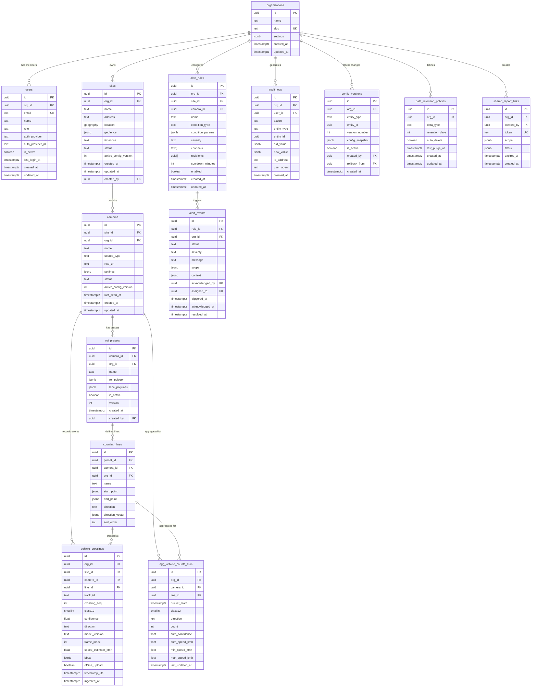

# GreyEye Traffic Analysis AI — Database Design

## 1 Introduction

This document specifies the database schema, storage strategy, and data-management policies for GreyEye. It covers the core relational tables, indexing strategy, row-level security (RLS), data retention, and migration workflow. Two database options are presented — **Supabase (managed Postgres)** and **PostgreSQL + TimescaleDB** — so the team can choose the best fit during implementation.

**Traceability:** FR-1.2, FR-1.4, FR-2.3, FR-2.4, FR-4.4, FR-6.1, FR-7.4, NFR-13, NFR-14, SEC-17, DM-1 through DM-9

---

## 2 Database Option Comparison

The team will select one of two database strategies. Both share the same logical schema; they differ in operational tooling and time-series optimization.

### 2.1 Option A — Supabase (Managed Postgres 15+)

| Aspect | Detail |
|--------|--------|
| **Engine** | PostgreSQL 15+ hosted on Supabase |
| **Auth integration** | Supabase Auth (GoTrue) provides built-in user management, JWT issuance, and RLS integration via `auth.uid()` |
| **Row-Level Security** | Native Postgres RLS with Supabase policy helpers; policies reference `auth.uid()` and `auth.jwt()` claims |
| **Storage** | Supabase Storage (S3-compatible) for frames, clips, and exports |
| **Edge Functions** | Deno-based serverless functions for lightweight webhooks and triggers |
| **Realtime** | Supabase Realtime (Postgres CDC) for live change feeds to the mobile client |
| **Migrations** | Supabase CLI (`supabase db diff`, `supabase db push`) under `supabase/migrations/` |
| **Backups** | Automatic daily backups with point-in-time recovery (PITR) on Pro plan |
| **Best for** | Rapid MVP development; reduced ops burden; built-in auth/storage/realtime |

**Trade-offs:**

- (+) Minimal infrastructure to manage; auth, storage, and realtime are included
- (+) RLS policies integrate directly with Supabase Auth JWTs
- (+) Dashboard UI for schema inspection, logs, and metrics
- (−) No native time-series hypertables; time-series optimization relies on standard Postgres partitioning
- (−) Less control over Postgres extensions and configuration tuning
- (−) Vendor dependency for hosting and auth

### 2.2 Option B — PostgreSQL + TimescaleDB

| Aspect | Detail |
|--------|--------|
| **Engine** | PostgreSQL 15+ with TimescaleDB extension |
| **Time-series** | Hypertables for `vehicle_crossings` with automatic chunk-based partitioning by `timestamp_utc` |
| **Continuous aggregates** | Materialized views that auto-refresh on insert; ideal for `agg_vehicle_counts_15m` |
| **Compression** | Native columnar compression on older chunks (90%+ space savings on time-series data) |
| **Auth** | External OAuth2/OIDC provider (custom Auth Service); RLS policies use `current_setting('app.org_id')` |
| **Migrations** | Alembic (Python) under `libs/db_models/migrations/` |
| **Backups** | pgBackRest or WAL-G with continuous WAL archiving |
| **Best for** | High-volume time-series workloads; advanced query performance; full Postgres control |

**Trade-offs:**

- (+) Hypertables provide transparent time-partitioning with no application changes
- (+) Continuous aggregates eliminate the need for a separate aggregation flush loop for historical data
- (+) Columnar compression dramatically reduces storage for aged data
- (+) Full control over Postgres configuration, extensions, and hosting
- (−) More infrastructure to manage (auth, storage, backups are separate concerns)
- (−) Requires TimescaleDB extension installation and tuning
- (−) No built-in realtime CDC; requires a separate change-data-capture solution (e.g., Debezium, LISTEN/NOTIFY)

### 2.3 Decision Matrix

| Criterion | Supabase | TimescaleDB | Weight |
|-----------|:--------:|:-----------:|:------:|
| Time to MVP | ★★★★★ | ★★★ | High |
| Time-series query performance | ★★★ | ★★★★★ | High |
| Operational complexity | ★★★★★ | ★★★ | Medium |
| Storage efficiency (compression) | ★★★ | ★★★★★ | Medium |
| Auth/RLS integration | ★★★★★ | ★★★ | Medium |
| Scaling flexibility | ★★★ | ★★★★★ | Medium |
| Vendor independence | ★★ | ★★★★★ | Low |
| Continuous aggregates | ★★ | ★★★★★ | Medium |

**Recommendation:** Start with **Option A (Supabase)** for the MVP phase to accelerate development. The schema is designed to be portable — if time-series volume demands it, migrate to **Option B (TimescaleDB)** by converting `vehicle_crossings` to a hypertable and enabling continuous aggregates. The migration path is documented in [Section 10](#10-migration-strategy).

---

## 3 Entity-Relationship Diagram

The following ER diagram shows all core tables and their relationships. Foreign keys enforce referential integrity; RLS policies (Section 7) enforce tenant isolation.



---

## 4 Core Table Definitions

All tables use `uuid` primary keys generated by `gen_random_uuid()`. Timestamps are stored as `timestamptz` in UTC. The `org_id` column on every tenant-scoped table is the RLS anchor.

### 4.1 organizations

Multi-tenant root entity. Every other resource is scoped to an organization. (FR-1.2)

```sql
CREATE TABLE organizations (
    id          UUID PRIMARY KEY DEFAULT gen_random_uuid(),
    name        TEXT NOT NULL,
    slug        TEXT NOT NULL UNIQUE,
    settings    JSONB NOT NULL DEFAULT '{}',
    created_at  TIMESTAMPTZ NOT NULL DEFAULT now(),
    updated_at  TIMESTAMPTZ NOT NULL DEFAULT now()
);

COMMENT ON TABLE organizations IS 'Multi-tenant root entity (FR-1.2)';
```

The `settings` JSONB column stores org-level preferences: default timezone, classification mode, notification preferences, and feature flags.

### 4.2 users

User accounts linked to exactly one organization. Role determines RBAC permissions. (FR-1.1, FR-1.3)

```sql
CREATE TABLE users (
    id               UUID PRIMARY KEY DEFAULT gen_random_uuid(),
    org_id           UUID NOT NULL REFERENCES organizations(id) ON DELETE CASCADE,
    email            TEXT NOT NULL UNIQUE,
    name             TEXT NOT NULL,
    role             TEXT NOT NULL CHECK (role IN ('admin', 'operator', 'analyst', 'viewer')),
    auth_provider    TEXT NOT NULL DEFAULT 'email',
    auth_provider_id TEXT,
    is_active        BOOLEAN NOT NULL DEFAULT true,
    last_login_at    TIMESTAMPTZ,
    created_at       TIMESTAMPTZ NOT NULL DEFAULT now(),
    updated_at       TIMESTAMPTZ NOT NULL DEFAULT now()
);

CREATE INDEX idx_users_org_id ON users(org_id);

COMMENT ON TABLE users IS 'User accounts with RBAC roles (FR-1.1, FR-1.3)';
```

### 4.3 sites

Survey locations with optional geofence polygons. Supports multiple analysis zones per site. (FR-2.1, FR-2.2, FR-2.3)

```sql
CREATE TABLE sites (
    id                    UUID PRIMARY KEY DEFAULT gen_random_uuid(),
    org_id                UUID NOT NULL REFERENCES organizations(id) ON DELETE CASCADE,
    name                  TEXT NOT NULL,
    address               TEXT,
    location              GEOGRAPHY(Point, 4326),
    geofence              JSONB,
    timezone              TEXT NOT NULL DEFAULT 'Asia/Seoul',
    status                TEXT NOT NULL DEFAULT 'active' CHECK (status IN ('active', 'archived')),
    active_config_version INT NOT NULL DEFAULT 1,
    created_at            TIMESTAMPTZ NOT NULL DEFAULT now(),
    updated_at            TIMESTAMPTZ NOT NULL DEFAULT now(),
    created_by            UUID REFERENCES users(id)
);

CREATE INDEX idx_sites_org_id ON sites(org_id);
CREATE INDEX idx_sites_status ON sites(org_id, status);

COMMENT ON TABLE sites IS 'Survey locations with geofence (FR-2.1, FR-2.2, FR-2.3)';
```

### 4.4 cameras

Camera sources (smartphone or RTSP) registered to a site. (FR-3.1, FR-3.2, FR-3.3, FR-3.4)

```sql
CREATE TABLE cameras (
    id                    UUID PRIMARY KEY DEFAULT gen_random_uuid(),
    site_id               UUID NOT NULL REFERENCES sites(id) ON DELETE CASCADE,
    org_id                UUID NOT NULL REFERENCES organizations(id) ON DELETE CASCADE,
    name                  TEXT NOT NULL,
    source_type           TEXT NOT NULL CHECK (source_type IN ('smartphone', 'rtsp', 'onvif')),
    rtsp_url              TEXT,
    settings              JSONB NOT NULL DEFAULT '{
        "target_fps": 10,
        "resolution": "1920x1080",
        "night_mode": false,
        "classification_mode": "full_12class"
    }',
    status                TEXT NOT NULL DEFAULT 'offline'
                          CHECK (status IN ('online', 'degraded', 'offline', 'archived')),
    active_config_version INT NOT NULL DEFAULT 1,
    last_seen_at          TIMESTAMPTZ,
    created_at            TIMESTAMPTZ NOT NULL DEFAULT now(),
    updated_at            TIMESTAMPTZ NOT NULL DEFAULT now()
);

CREATE INDEX idx_cameras_site_id ON cameras(site_id);
CREATE INDEX idx_cameras_org_id ON cameras(org_id);
CREATE INDEX idx_cameras_status ON cameras(org_id, status);

COMMENT ON TABLE cameras IS 'Camera sources per site (FR-3.1, FR-3.2, FR-3.3, FR-3.4)';
```

### 4.5 roi_presets

Named ROI configurations per camera. Multiple presets allow switching between weekday, weekend, or construction layouts. (FR-4.4, FR-2.4)

```sql
CREATE TABLE roi_presets (
    id             UUID PRIMARY KEY DEFAULT gen_random_uuid(),
    camera_id      UUID NOT NULL REFERENCES cameras(id) ON DELETE CASCADE,
    org_id         UUID NOT NULL REFERENCES organizations(id) ON DELETE CASCADE,
    name           TEXT NOT NULL,
    roi_polygon    JSONB NOT NULL,
    lane_polylines JSONB DEFAULT '[]',
    is_active      BOOLEAN NOT NULL DEFAULT false,
    version        INT NOT NULL DEFAULT 1,
    created_at     TIMESTAMPTZ NOT NULL DEFAULT now(),
    created_by     UUID REFERENCES users(id)
);

CREATE INDEX idx_roi_presets_camera_id ON roi_presets(camera_id);
CREATE UNIQUE INDEX idx_roi_presets_active ON roi_presets(camera_id) WHERE is_active = true;

COMMENT ON TABLE roi_presets IS 'ROI configurations per camera (FR-4.4, FR-2.4)';
COMMENT ON INDEX idx_roi_presets_active IS 'Ensures at most one active preset per camera';
```

The partial unique index on `(camera_id) WHERE is_active = true` guarantees that only one preset is active per camera at any time.

### 4.6 counting_lines

Directional line segments within an ROI preset. Crossing detection is evaluated against these lines. (FR-5.6)

```sql
CREATE TABLE counting_lines (
    id               UUID PRIMARY KEY DEFAULT gen_random_uuid(),
    preset_id        UUID NOT NULL REFERENCES roi_presets(id) ON DELETE CASCADE,
    camera_id        UUID NOT NULL REFERENCES cameras(id) ON DELETE CASCADE,
    org_id           UUID NOT NULL REFERENCES organizations(id) ON DELETE CASCADE,
    name             TEXT NOT NULL,
    start_point      JSONB NOT NULL,
    end_point        JSONB NOT NULL,
    direction        TEXT NOT NULL CHECK (direction IN ('inbound', 'outbound', 'bidirectional')),
    direction_vector JSONB NOT NULL,
    sort_order       INT NOT NULL DEFAULT 0
);

CREATE INDEX idx_counting_lines_preset_id ON counting_lines(preset_id);
CREATE INDEX idx_counting_lines_camera_id ON counting_lines(camera_id);

COMMENT ON TABLE counting_lines IS 'Directional counting lines within ROI presets (FR-5.6)';
```

### 4.7 vehicle_crossings (Source of Truth)

The event-sourced crossing records table. This is the **single source of truth** for all traffic counts. Aggregates in `agg_vehicle_counts_15m` are derived from this table and can be recomputed at any time. (DM-6, DM-7)

```sql
CREATE TABLE vehicle_crossings (
    id                 UUID PRIMARY KEY DEFAULT gen_random_uuid(),
    org_id             UUID NOT NULL,
    site_id            UUID NOT NULL,
    camera_id          UUID NOT NULL,
    line_id            UUID NOT NULL,
    track_id           TEXT NOT NULL,
    crossing_seq       INT NOT NULL DEFAULT 1,
    class12            SMALLINT NOT NULL CHECK (class12 BETWEEN 1 AND 12),
    confidence         REAL NOT NULL CHECK (confidence BETWEEN 0.0 AND 1.0),
    direction          TEXT NOT NULL CHECK (direction IN ('inbound', 'outbound')),
    model_version      TEXT NOT NULL,
    frame_index        INT NOT NULL,
    speed_estimate_kmh REAL,
    bbox               JSONB,
    offline_upload     BOOLEAN NOT NULL DEFAULT false,
    timestamp_utc      TIMESTAMPTZ NOT NULL,
    ingested_at        TIMESTAMPTZ NOT NULL DEFAULT now(),

    CONSTRAINT uq_crossing_dedup
        UNIQUE (camera_id, line_id, track_id, crossing_seq)
);

COMMENT ON TABLE vehicle_crossings IS 'Event-sourced crossing records — source of truth (DM-6, DM-7)';
```

The unique constraint on `(camera_id, line_id, track_id, crossing_seq)` enforces exactly-once counting at the database level, complementing the application-level dedup key.

**Partitioning (recommended for production):**

```sql
-- Range-partition by timestamp_utc (monthly partitions)
CREATE TABLE vehicle_crossings (
    -- same columns as above
) PARTITION BY RANGE (timestamp_utc);

-- Create partitions (automated via pg_partman or cron)
CREATE TABLE vehicle_crossings_2026_03
    PARTITION OF vehicle_crossings
    FOR VALUES FROM ('2026-03-01') TO ('2026-04-01');

CREATE TABLE vehicle_crossings_2026_04
    PARTITION OF vehicle_crossings
    FOR VALUES FROM ('2026-04-01') TO ('2026-05-01');
```

**TimescaleDB variant (Option B):**

```sql
-- Convert to hypertable (replaces manual partitioning)
SELECT create_hypertable('vehicle_crossings', 'timestamp_utc',
    chunk_time_interval => INTERVAL '1 day');

-- Enable compression on chunks older than 7 days
ALTER TABLE vehicle_crossings SET (
    timescaledb.compress,
    timescaledb.compress_segmentby = 'camera_id, line_id',
    timescaledb.compress_orderby = 'timestamp_utc DESC'
);

SELECT add_compression_policy('vehicle_crossings', INTERVAL '7 days');
```

### 4.8 agg_vehicle_counts_15m

Pre-computed 15-minute bucket aggregates. Derived from `vehicle_crossings` via the Aggregation Service or TimescaleDB continuous aggregates. (FR-6.1, DM-2, DM-7)

```sql
CREATE TABLE agg_vehicle_counts_15m (
    id              UUID PRIMARY KEY DEFAULT gen_random_uuid(),
    org_id          UUID NOT NULL,
    camera_id       UUID NOT NULL,
    line_id         UUID NOT NULL,
    bucket_start    TIMESTAMPTZ NOT NULL,
    class12         SMALLINT NOT NULL CHECK (class12 BETWEEN 1 AND 12),
    direction       TEXT NOT NULL CHECK (direction IN ('inbound', 'outbound')),
    count           INT NOT NULL DEFAULT 0,
    sum_confidence  REAL NOT NULL DEFAULT 0.0,
    sum_speed_kmh   REAL NOT NULL DEFAULT 0.0,
    min_speed_kmh   REAL,
    max_speed_kmh   REAL,
    last_updated_at TIMESTAMPTZ NOT NULL DEFAULT now(),

    CONSTRAINT uq_agg_bucket
        UNIQUE (camera_id, line_id, bucket_start, class12, direction)
);

COMMENT ON TABLE agg_vehicle_counts_15m IS '15-minute bucket aggregates (FR-6.1, DM-2, DM-7)';
```

**Idempotent upsert (used by the Aggregation Service):**

```sql
INSERT INTO agg_vehicle_counts_15m (
    org_id, camera_id, line_id, bucket_start, class12, direction,
    count, sum_confidence, sum_speed_kmh, min_speed_kmh, max_speed_kmh,
    last_updated_at
)
VALUES ($1, $2, $3, $4, $5, $6, $7, $8, $9, $10, $11, now())
ON CONFLICT (camera_id, line_id, bucket_start, class12, direction)
DO UPDATE SET
    count           = agg_vehicle_counts_15m.count + EXCLUDED.count,
    sum_confidence  = agg_vehicle_counts_15m.sum_confidence + EXCLUDED.sum_confidence,
    sum_speed_kmh   = agg_vehicle_counts_15m.sum_speed_kmh + EXCLUDED.sum_speed_kmh,
    min_speed_kmh   = LEAST(agg_vehicle_counts_15m.min_speed_kmh, EXCLUDED.min_speed_kmh),
    max_speed_kmh   = GREATEST(agg_vehicle_counts_15m.max_speed_kmh, EXCLUDED.max_speed_kmh),
    last_updated_at = now();
```

**TimescaleDB continuous aggregate (Option B):**

```sql
CREATE MATERIALIZED VIEW agg_vehicle_counts_15m_cagg
WITH (timescaledb.continuous) AS
SELECT
    camera_id,
    line_id,
    time_bucket('15 minutes', timestamp_utc) AS bucket_start,
    class12,
    direction,
    COUNT(*)                   AS count,
    SUM(confidence)            AS sum_confidence,
    SUM(speed_estimate_kmh)    AS sum_speed_kmh,
    MIN(speed_estimate_kmh)    AS min_speed_kmh,
    MAX(speed_estimate_kmh)    AS max_speed_kmh
FROM vehicle_crossings
GROUP BY camera_id, line_id, bucket_start, class12, direction;

SELECT add_continuous_aggregate_policy('agg_vehicle_counts_15m_cagg',
    start_offset  => INTERVAL '1 hour',
    end_offset    => INTERVAL '15 minutes',
    schedule_interval => INTERVAL '5 minutes');
```

### 4.9 alert_rules

Configurable alert conditions with multi-channel delivery. (FR-7.1)

```sql
CREATE TABLE alert_rules (
    id               UUID PRIMARY KEY DEFAULT gen_random_uuid(),
    org_id           UUID NOT NULL REFERENCES organizations(id) ON DELETE CASCADE,
    site_id          UUID REFERENCES sites(id) ON DELETE CASCADE,
    camera_id        UUID REFERENCES cameras(id) ON DELETE SET NULL,
    name             TEXT NOT NULL,
    condition_type   TEXT NOT NULL
                     CHECK (condition_type IN (
                         'congestion', 'speed_drop', 'stopped_vehicle',
                         'heavy_vehicle_share', 'camera_offline', 'count_anomaly'
                     )),
    condition_params JSONB NOT NULL,
    severity         TEXT NOT NULL CHECK (severity IN ('info', 'warning', 'critical')),
    channels         TEXT[] NOT NULL DEFAULT '{}',
    recipients       UUID[] NOT NULL DEFAULT '{}',
    cooldown_minutes INT NOT NULL DEFAULT 15,
    enabled          BOOLEAN NOT NULL DEFAULT true,
    created_at       TIMESTAMPTZ NOT NULL DEFAULT now(),
    updated_at       TIMESTAMPTZ NOT NULL DEFAULT now()
);

CREATE INDEX idx_alert_rules_org_id ON alert_rules(org_id);
CREATE INDEX idx_alert_rules_scope ON alert_rules(org_id, site_id, camera_id) WHERE enabled = true;

COMMENT ON TABLE alert_rules IS 'Alert rule definitions (FR-7.1)';
```

### 4.10 alert_events

Alert lifecycle records: triggered → acknowledged → assigned → resolved. (FR-7.3, FR-7.4)

```sql
CREATE TABLE alert_events (
    id              UUID PRIMARY KEY DEFAULT gen_random_uuid(),
    rule_id         UUID NOT NULL REFERENCES alert_rules(id) ON DELETE CASCADE,
    org_id          UUID NOT NULL REFERENCES organizations(id) ON DELETE CASCADE,
    status          TEXT NOT NULL DEFAULT 'triggered'
                    CHECK (status IN ('triggered', 'acknowledged', 'assigned', 'resolved', 'suppressed')),
    severity        TEXT NOT NULL CHECK (severity IN ('info', 'warning', 'critical')),
    message         TEXT NOT NULL,
    scope           JSONB NOT NULL,
    context         JSONB DEFAULT '{}',
    acknowledged_by UUID REFERENCES users(id),
    assigned_to     UUID REFERENCES users(id),
    triggered_at    TIMESTAMPTZ NOT NULL DEFAULT now(),
    acknowledged_at TIMESTAMPTZ,
    resolved_at     TIMESTAMPTZ
);

CREATE INDEX idx_alert_events_org_id ON alert_events(org_id);
CREATE INDEX idx_alert_events_status ON alert_events(org_id, status);
CREATE INDEX idx_alert_events_rule_id ON alert_events(rule_id);
CREATE INDEX idx_alert_events_triggered_at ON alert_events(org_id, triggered_at DESC);

COMMENT ON TABLE alert_events IS 'Alert lifecycle events (FR-7.3, FR-7.4)';
```

### 4.11 config_versions

Immutable snapshots of entity configurations for version history and rollback. (FR-2.4)

```sql
CREATE TABLE config_versions (
    id              UUID PRIMARY KEY DEFAULT gen_random_uuid(),
    org_id          UUID NOT NULL REFERENCES organizations(id) ON DELETE CASCADE,
    entity_type     TEXT NOT NULL CHECK (entity_type IN ('site', 'camera', 'roi_preset')),
    entity_id       UUID NOT NULL,
    version_number  INT NOT NULL,
    config_snapshot JSONB NOT NULL,
    is_active       BOOLEAN NOT NULL DEFAULT true,
    created_by      UUID REFERENCES users(id),
    rollback_from   UUID REFERENCES config_versions(id),
    created_at      TIMESTAMPTZ NOT NULL DEFAULT now(),

    CONSTRAINT uq_config_version UNIQUE (entity_type, entity_id, version_number)
);

CREATE INDEX idx_config_versions_entity ON config_versions(entity_type, entity_id);
CREATE INDEX idx_config_versions_active ON config_versions(entity_type, entity_id)
    WHERE is_active = true;

COMMENT ON TABLE config_versions IS 'Immutable config snapshots for rollback (FR-2.4)';
```

### 4.12 audit_logs

Append-only audit trail for all state-changing operations. Rows are never updated or deleted. (FR-1.4, SEC-17, SEC-18)

```sql
CREATE TABLE audit_logs (
    id          UUID PRIMARY KEY DEFAULT gen_random_uuid(),
    org_id      UUID NOT NULL,
    user_id     UUID,
    action      TEXT NOT NULL,
    entity_type TEXT NOT NULL,
    entity_id   UUID,
    old_value   JSONB,
    new_value   JSONB,
    ip_address  INET,
    user_agent  TEXT,
    created_at  TIMESTAMPTZ NOT NULL DEFAULT now()
);

CREATE INDEX idx_audit_logs_org_id ON audit_logs(org_id, created_at DESC);
CREATE INDEX idx_audit_logs_user_id ON audit_logs(user_id, created_at DESC);
CREATE INDEX idx_audit_logs_entity ON audit_logs(entity_type, entity_id, created_at DESC);

COMMENT ON TABLE audit_logs IS 'Immutable audit trail — append only (FR-1.4, SEC-17)';
```

To enforce immutability at the database level:

```sql
CREATE OR REPLACE FUNCTION prevent_audit_log_mutation()
RETURNS TRIGGER AS $$
BEGIN
    RAISE EXCEPTION 'audit_logs is append-only: UPDATE and DELETE are prohibited';
END;
$$ LANGUAGE plpgsql;

CREATE TRIGGER trg_audit_logs_immutable
    BEFORE UPDATE OR DELETE ON audit_logs
    FOR EACH ROW EXECUTE FUNCTION prevent_audit_log_mutation();
```

### 4.13 data_retention_policies

Per-organization retention configuration for automatic data lifecycle management. (DM-3, DM-5, NFR-13)

```sql
CREATE TABLE data_retention_policies (
    id             UUID PRIMARY KEY DEFAULT gen_random_uuid(),
    org_id         UUID NOT NULL REFERENCES organizations(id) ON DELETE CASCADE,
    data_type      TEXT NOT NULL CHECK (data_type IN (
                       'vehicle_crossings', 'aggregates', 'alert_events',
                       'audit_logs', 'media', 'exports'
                   )),
    retention_days INT NOT NULL CHECK (retention_days > 0),
    auto_delete    BOOLEAN NOT NULL DEFAULT false,
    last_purge_at  TIMESTAMPTZ,
    created_at     TIMESTAMPTZ NOT NULL DEFAULT now(),
    updated_at     TIMESTAMPTZ NOT NULL DEFAULT now(),

    CONSTRAINT uq_retention_policy UNIQUE (org_id, data_type)
);

COMMENT ON TABLE data_retention_policies IS 'Per-org data retention rules (DM-3, DM-5, NFR-13)';
```

### 4.14 shared_report_links

Time-limited, tokenized links for sharing read-only reports without authentication. (FR-8.4)

```sql
CREATE TABLE shared_report_links (
    id         UUID PRIMARY KEY DEFAULT gen_random_uuid(),
    org_id     UUID NOT NULL REFERENCES organizations(id) ON DELETE CASCADE,
    created_by UUID NOT NULL REFERENCES users(id),
    token      TEXT NOT NULL UNIQUE DEFAULT encode(gen_random_bytes(32), 'hex'),
    scope      JSONB NOT NULL,
    filters    JSONB NOT NULL DEFAULT '{}',
    expires_at TIMESTAMPTZ NOT NULL,
    created_at TIMESTAMPTZ NOT NULL DEFAULT now()
);

CREATE INDEX idx_shared_report_links_token ON shared_report_links(token);
CREATE INDEX idx_shared_report_links_expires ON shared_report_links(expires_at);

COMMENT ON TABLE shared_report_links IS 'Tokenized read-only report links (FR-8.4)';
```

---

## 5 Indexes and Query Optimization

### 5.1 vehicle_crossings Indexes

This is the highest-volume table. Indexes are designed for the primary query patterns: time-range analytics, per-camera filtering, and aggregate recomputation.

```sql
-- Primary time-range queries (analytics, recomputation)
CREATE INDEX idx_vc_camera_time
    ON vehicle_crossings(camera_id, timestamp_utc DESC);

-- Org-scoped time-range queries
CREATE INDEX idx_vc_org_time
    ON vehicle_crossings(org_id, timestamp_utc DESC);

-- Site-level aggregation
CREATE INDEX idx_vc_site_time
    ON vehicle_crossings(site_id, timestamp_utc DESC);

-- Class-filtered queries (e.g., heavy vehicle reports)
CREATE INDEX idx_vc_camera_class_time
    ON vehicle_crossings(camera_id, class12, timestamp_utc DESC);

-- Model version tracking (drift monitoring, FR-9.3)
CREATE INDEX idx_vc_model_version
    ON vehicle_crossings(model_version, timestamp_utc DESC);
```

### 5.2 agg_vehicle_counts_15m Indexes

```sql
-- Primary analytics query: camera + time range
CREATE INDEX idx_agg_camera_bucket
    ON agg_vehicle_counts_15m(camera_id, bucket_start DESC);

-- Org-level dashboard queries
CREATE INDEX idx_agg_org_bucket
    ON agg_vehicle_counts_15m(org_id, bucket_start DESC);

-- Class-specific trend analysis
CREATE INDEX idx_agg_camera_class_bucket
    ON agg_vehicle_counts_15m(camera_id, class12, bucket_start DESC);
```

### 5.3 Query Patterns and Index Usage

| Query Pattern | Table | Index Used | Traceability |
|---------------|-------|-----------|--------------|
| 15-min buckets for a camera in a date range | `agg_vehicle_counts_15m` | `idx_agg_camera_bucket` | FR-6.1, FR-6.2 |
| Org-level KPI dashboard | `agg_vehicle_counts_15m` | `idx_agg_org_bucket` | FR-8.1 |
| Heavy vehicle share per camera | `agg_vehicle_counts_15m` | `idx_agg_camera_class_bucket` | FR-7.1 |
| Recompute aggregates for a camera + time range | `vehicle_crossings` | `idx_vc_camera_time` | DM-7 |
| Model drift monitoring | `vehicle_crossings` | `idx_vc_model_version` | FR-9.3 |
| Alert history for an org | `alert_events` | `idx_alert_events_org_id` | FR-7.4 |
| Audit log review | `audit_logs` | `idx_audit_logs_org_id` | FR-1.4, SEC-17 |

### 5.4 Partitioning Strategy

For production deployments with high event volume, `vehicle_crossings` should be partitioned by time:

| Strategy | Partition Key | Interval | Pruning Benefit |
|----------|--------------|----------|-----------------|
| **Supabase (Option A)** | `timestamp_utc` | Monthly (via `pg_partman`) | Range queries skip irrelevant months |
| **TimescaleDB (Option B)** | `timestamp_utc` | Daily (automatic chunks) | Transparent chunk exclusion; compression on aged chunks |

Estimated storage (10 cameras, 10 FPS, ~50 crossings/camera/15min):

| Time Period | Rows (approx.) | Uncompressed Size | Compressed (TimescaleDB) |
|-------------|----------------|-------------------|--------------------------|
| 1 day | ~480K | ~150 MB | ~15 MB |
| 1 month | ~14.4M | ~4.5 GB | ~450 MB |
| 1 year | ~175M | ~55 GB | ~5.5 GB |

---

## 6 Enumeration Types

Shared enumerations are defined as Postgres types for type safety and validation.

```sql
CREATE TYPE vehicle_class_12 AS ENUM (
    'C01_PASSENGER_MINITRUCK',
    'C02_BUS',
    'C03_TRUCK_LT_2_5T',
    'C04_TRUCK_2_5_TO_8_5T',
    'C05_SINGLE_3_AXLE',
    'C06_SINGLE_4_AXLE',
    'C07_SINGLE_5_AXLE',
    'C08_SEMI_4_AXLE',
    'C09_FULL_4_AXLE',
    'C10_SEMI_5_AXLE',
    'C11_FULL_5_AXLE',
    'C12_SEMI_6_AXLE'
);

CREATE TYPE user_role AS ENUM ('admin', 'operator', 'analyst', 'viewer');

CREATE TYPE camera_source_type AS ENUM ('smartphone', 'rtsp', 'onvif');

CREATE TYPE camera_status AS ENUM ('online', 'degraded', 'offline', 'archived');

CREATE TYPE site_status AS ENUM ('active', 'archived');

CREATE TYPE crossing_direction AS ENUM ('inbound', 'outbound');

CREATE TYPE alert_severity AS ENUM ('info', 'warning', 'critical');

CREATE TYPE alert_status AS ENUM ('triggered', 'acknowledged', 'assigned', 'resolved', 'suppressed');

CREATE TYPE alert_condition_type AS ENUM (
    'congestion', 'speed_drop', 'stopped_vehicle',
    'heavy_vehicle_share', 'camera_offline', 'count_anomaly'
);
```

> **Note:** The table DDL in Section 4 uses `TEXT` with `CHECK` constraints for portability between Supabase and TimescaleDB. In production, these can be replaced with the enum types above for stricter type safety. The `class12` column uses `SMALLINT` (1–12) for efficient storage and indexing, with the Python `VehicleClass12` enum handling the mapping at the application layer.

---

## 7 Row-Level Security (RLS)

RLS policies enforce multi-tenant data isolation at the database level. Every query is automatically scoped to the user's organization, preventing cross-tenant data access even if application-level checks are bypassed. (FR-1.2, SEC-2)

### 7.1 RLS Setup — Option A (Supabase)

Supabase provides `auth.uid()` and `auth.jwt()` functions that extract the authenticated user's ID and JWT claims directly in RLS policies.

```sql
-- Enable RLS on all tenant-scoped tables
ALTER TABLE organizations ENABLE ROW LEVEL SECURITY;
ALTER TABLE users ENABLE ROW LEVEL SECURITY;
ALTER TABLE sites ENABLE ROW LEVEL SECURITY;
ALTER TABLE cameras ENABLE ROW LEVEL SECURITY;
ALTER TABLE roi_presets ENABLE ROW LEVEL SECURITY;
ALTER TABLE counting_lines ENABLE ROW LEVEL SECURITY;
ALTER TABLE vehicle_crossings ENABLE ROW LEVEL SECURITY;
ALTER TABLE agg_vehicle_counts_15m ENABLE ROW LEVEL SECURITY;
ALTER TABLE alert_rules ENABLE ROW LEVEL SECURITY;
ALTER TABLE alert_events ENABLE ROW LEVEL SECURITY;
ALTER TABLE config_versions ENABLE ROW LEVEL SECURITY;
ALTER TABLE audit_logs ENABLE ROW LEVEL SECURITY;
ALTER TABLE data_retention_policies ENABLE ROW LEVEL SECURITY;
ALTER TABLE shared_report_links ENABLE ROW LEVEL SECURITY;

-- Helper function: get the current user's org_id from JWT
CREATE OR REPLACE FUNCTION auth.org_id() RETURNS UUID AS $$
    SELECT (auth.jwt() -> 'app_metadata' ->> 'org_id')::UUID;
$$ LANGUAGE sql STABLE;
```

**Example policies (applied to all tenant-scoped tables):**

```sql
-- Organizations: users can only see their own org
CREATE POLICY org_isolation ON organizations
    FOR ALL USING (id = auth.org_id());

-- Sites: scoped to user's org
CREATE POLICY site_org_isolation ON sites
    FOR SELECT USING (org_id = auth.org_id());

CREATE POLICY site_org_insert ON sites
    FOR INSERT WITH CHECK (org_id = auth.org_id());

CREATE POLICY site_org_update ON sites
    FOR UPDATE USING (org_id = auth.org_id())
    WITH CHECK (org_id = auth.org_id());

-- Cameras: scoped to user's org
CREATE POLICY camera_org_isolation ON cameras
    FOR ALL USING (org_id = auth.org_id());

-- Vehicle crossings: scoped to user's org
CREATE POLICY vc_org_isolation ON vehicle_crossings
    FOR SELECT USING (org_id = auth.org_id());

CREATE POLICY vc_org_insert ON vehicle_crossings
    FOR INSERT WITH CHECK (org_id = auth.org_id());

-- Aggregates: scoped to user's org
CREATE POLICY agg_org_isolation ON agg_vehicle_counts_15m
    FOR SELECT USING (org_id = auth.org_id());

-- Audit logs: admin-only read, org-scoped
CREATE POLICY audit_admin_read ON audit_logs
    FOR SELECT USING (
        org_id = auth.org_id()
        AND (auth.jwt() -> 'app_metadata' ->> 'role') = 'admin'
    );

CREATE POLICY audit_insert ON audit_logs
    FOR INSERT WITH CHECK (org_id = auth.org_id());
```

### 7.2 RLS Setup — Option B (Self-Hosted Postgres)

Without Supabase Auth, the application sets session variables before executing queries. RLS policies reference these variables.

```sql
-- Application sets these before each request
SET LOCAL app.current_org_id = 'org_xyz789';
SET LOCAL app.current_user_id = 'usr_abc123';
SET LOCAL app.current_role = 'operator';

-- Helper functions
CREATE OR REPLACE FUNCTION app_org_id() RETURNS UUID AS $$
    SELECT current_setting('app.current_org_id', true)::UUID;
$$ LANGUAGE sql STABLE;

CREATE OR REPLACE FUNCTION app_user_role() RETURNS TEXT AS $$
    SELECT current_setting('app.current_role', true);
$$ LANGUAGE sql STABLE;

-- Policies use app_org_id() instead of auth.org_id()
CREATE POLICY site_org_isolation ON sites
    FOR ALL USING (org_id = app_org_id());

CREATE POLICY audit_admin_read ON audit_logs
    FOR SELECT USING (
        org_id = app_org_id()
        AND app_user_role() = 'admin'
    );
```

### 7.3 Role-Based Write Restrictions

Beyond org-scoping, write operations are restricted by role:

| Table | SELECT | INSERT | UPDATE | DELETE |
|-------|:------:|:------:|:------:|:------:|
| `sites` | All roles | Admin, Operator | Admin, Operator | Admin only |
| `cameras` | All roles | Admin, Operator | Admin, Operator | Admin, Operator |
| `roi_presets` | All roles | Admin, Operator | Admin, Operator | Admin, Operator |
| `alert_rules` | All roles | Admin, Operator | Admin, Operator | Admin, Operator |
| `alert_events` | All roles | System (service role) | Admin, Operator, Analyst | — |
| `audit_logs` | Admin only | System (service role) | — (immutable) | — (immutable) |
| `data_retention_policies` | Admin | Admin | Admin | Admin |

```sql
-- Example: restrict site mutations to admin/operator
CREATE POLICY site_write_roles ON sites
    FOR INSERT WITH CHECK (
        org_id = auth.org_id()
        AND (auth.jwt() -> 'app_metadata' ->> 'role') IN ('admin', 'operator')
    );

CREATE POLICY site_delete_admin ON sites
    FOR DELETE USING (
        org_id = auth.org_id()
        AND (auth.jwt() -> 'app_metadata' ->> 'role') = 'admin'
    );
```

---

## 8 Data Retention and Privacy

### 8.1 Retention Policy Enforcement (DM-3, DM-5, NFR-13)

A scheduled job (pg_cron or external cron) enforces retention policies by deleting data older than the configured threshold:

```sql
-- Purge expired vehicle crossings per org retention policy
DELETE FROM vehicle_crossings vc
USING data_retention_policies drp
WHERE drp.data_type = 'vehicle_crossings'
  AND drp.auto_delete = true
  AND vc.org_id = drp.org_id
  AND vc.timestamp_utc < now() - (drp.retention_days || ' days')::INTERVAL;

-- Update last_purge_at
UPDATE data_retention_policies
SET last_purge_at = now()
WHERE data_type = 'vehicle_crossings'
  AND auto_delete = true;
```

### 8.2 Default Retention Periods

| Data Type | Default Retention | Configurable | Notes |
|-----------|:-----------------:|:------------:|-------|
| `vehicle_crossings` | 90 days | Yes | Raw events; aggregates survive longer |
| `agg_vehicle_counts_15m` | 2 years | Yes | Primary analytics data |
| `alert_events` | 1 year | Yes | Alert history for compliance |
| `audit_logs` | 3 years | No (minimum) | Compliance requirement (SEC-17) |
| Media (frames/clips) | OFF by default | Yes | Privacy by design (NFR-13, SEC-15) |
| Exports | 30 days | Yes | Temporary download files |

### 8.3 Data Export and Deletion (NFR-14)

Organizations can request full data export or deletion at the org or site level:

```sql
-- Export: generate a JSONL dump of all org data
COPY (
    SELECT row_to_json(vc.*)
    FROM vehicle_crossings vc
    WHERE vc.org_id = $1
    ORDER BY vc.timestamp_utc
) TO STDOUT;

-- Deletion: cascade delete all data for an organization
-- Step 1: Delete time-series data (largest tables first)
DELETE FROM vehicle_crossings WHERE org_id = $1;
DELETE FROM agg_vehicle_counts_15m WHERE org_id = $1;

-- Step 2: Delete configuration data (cascades handle children)
DELETE FROM sites WHERE org_id = $1;

-- Step 3: Delete audit trail (retained separately per compliance)
-- Note: audit_logs may need to be retained per legal requirements
-- even after org deletion. Mark as anonymized instead:
UPDATE audit_logs
SET user_id = NULL, ip_address = NULL, user_agent = NULL
WHERE org_id = $1;
```

### 8.4 Privacy by Design (NFR-13, SEC-14, SEC-15)

| Control | Default | Configurable |
|---------|---------|:------------:|
| Raw video frame storage | OFF | Yes (admin) |
| Audio capture | OFF (disabled) | No |
| License plate data | Not collected | — |
| Face data | Not collected | — |
| Speed estimates | Stored (no PII) | — |
| Bounding box coordinates | Stored (no PII) | — |
| Aggregate-only mode | Available | Yes (admin) |

---

## 9 Utility Functions and Triggers

### 9.1 Automatic updated_at Timestamps

```sql
CREATE OR REPLACE FUNCTION update_updated_at_column()
RETURNS TRIGGER AS $$
BEGIN
    NEW.updated_at = now();
    RETURN NEW;
END;
$$ LANGUAGE plpgsql;

-- Apply to all tables with updated_at
CREATE TRIGGER trg_organizations_updated_at
    BEFORE UPDATE ON organizations
    FOR EACH ROW EXECUTE FUNCTION update_updated_at_column();

CREATE TRIGGER trg_users_updated_at
    BEFORE UPDATE ON users
    FOR EACH ROW EXECUTE FUNCTION update_updated_at_column();

CREATE TRIGGER trg_sites_updated_at
    BEFORE UPDATE ON sites
    FOR EACH ROW EXECUTE FUNCTION update_updated_at_column();

CREATE TRIGGER trg_cameras_updated_at
    BEFORE UPDATE ON cameras
    FOR EACH ROW EXECUTE FUNCTION update_updated_at_column();

CREATE TRIGGER trg_alert_rules_updated_at
    BEFORE UPDATE ON alert_rules
    FOR EACH ROW EXECUTE FUNCTION update_updated_at_column();

CREATE TRIGGER trg_data_retention_updated_at
    BEFORE UPDATE ON data_retention_policies
    FOR EACH ROW EXECUTE FUNCTION update_updated_at_column();
```

### 9.2 Bucket Start Computation

A SQL function for consistent 15-minute bucket assignment across queries:

```sql
CREATE OR REPLACE FUNCTION bucket_start_15m(ts TIMESTAMPTZ)
RETURNS TIMESTAMPTZ AS $$
    SELECT date_trunc('hour', ts)
        + INTERVAL '15 minutes' * FLOOR(EXTRACT(MINUTE FROM ts) / 15);
$$ LANGUAGE sql IMMUTABLE PARALLEL SAFE;
```

### 9.3 Enforce Single Active ROI Preset

While the partial unique index prevents multiple active presets, this trigger deactivates the previous preset when a new one is activated:

```sql
CREATE OR REPLACE FUNCTION deactivate_other_roi_presets()
RETURNS TRIGGER AS $$
BEGIN
    IF NEW.is_active = true THEN
        UPDATE roi_presets
        SET is_active = false
        WHERE camera_id = NEW.camera_id
          AND id != NEW.id
          AND is_active = true;
    END IF;
    RETURN NEW;
END;
$$ LANGUAGE plpgsql;

CREATE TRIGGER trg_roi_preset_single_active
    BEFORE INSERT OR UPDATE OF is_active ON roi_presets
    FOR EACH ROW
    WHEN (NEW.is_active = true)
    EXECUTE FUNCTION deactivate_other_roi_presets();
```

---

## 10 Migration Strategy

### 10.1 Option A — Supabase Migrations

Migrations are managed via the Supabase CLI and stored under `supabase/migrations/`:

```
supabase/
├── migrations/
│   ├── 20260309000001_create_organizations.sql
│   ├── 20260309000002_create_users.sql
│   ├── 20260309000003_create_sites.sql
│   ├── 20260309000004_create_cameras.sql
│   ├── 20260309000005_create_roi_presets.sql
│   ├── 20260309000006_create_counting_lines.sql
│   ├── 20260309000007_create_vehicle_crossings.sql
│   ├── 20260309000008_create_agg_vehicle_counts_15m.sql
│   ├── 20260309000009_create_alert_tables.sql
│   ├── 20260309000010_create_config_versions.sql
│   ├── 20260309000011_create_audit_logs.sql
│   ├── 20260309000012_create_retention_policies.sql
│   ├── 20260309000013_create_shared_report_links.sql
│   ├── 20260309000014_create_enums_and_functions.sql
│   ├── 20260309000015_enable_rls_policies.sql
│   └── 20260309000016_create_indexes.sql
├── seed.sql
└── config.toml
```

**Workflow:**

```bash
# Generate a new migration
supabase db diff --use-migra -f create_new_table

# Apply migrations locally
supabase db reset

# Push to remote (staging/production)
supabase db push
```

### 10.2 Option B — Alembic Migrations

Migrations are managed via Alembic and stored under `libs/db_models/migrations/`:

```
libs/db_models/
├── alembic.ini
├── migrations/
│   ├── env.py
│   └── versions/
│       ├── 001_create_organizations.py
│       ├── 002_create_users.py
│       ├── 003_create_sites.py
│       └── ...
└── models/
    ├── __init__.py
    ├── organization.py
    ├── user.py
    ├── site.py
    ├── camera.py
    ├── vehicle_crossing.py
    └── ...
```

**Workflow:**

```bash
# Generate a new migration from model changes
alembic revision --autogenerate -m "add_new_table"

# Apply migrations
alembic upgrade head

# Rollback one step
alembic downgrade -1
```

### 10.3 Migration from Supabase to TimescaleDB

If the team starts with Option A and later needs TimescaleDB capabilities, the migration path is:

1. **Export schema and data** from Supabase using `pg_dump`
2. **Provision** a new PostgreSQL instance with TimescaleDB extension
3. **Import** schema and data via `pg_restore`
4. **Convert** `vehicle_crossings` to a hypertable:
   ```sql
   -- Must be done on an empty or newly created table
   -- For existing data, use migrate_data => true
   SELECT create_hypertable('vehicle_crossings', 'timestamp_utc',
       migrate_data => true,
       chunk_time_interval => INTERVAL '1 day');
   ```
5. **Create** continuous aggregates to replace the application-level aggregation flush
6. **Enable** compression policies on aged chunks
7. **Update** connection strings and deploy

### 10.4 Migration Safety Rules

| Rule | Description |
|------|-------------|
| **Forward-only in production** | Never run `DROP` migrations in production without a backup and approval |
| **Backward-compatible changes** | New columns must be nullable or have defaults; removed columns are first deprecated |
| **Lock-safe DDL** | Use `CREATE INDEX CONCURRENTLY` for indexes on large tables |
| **Test migrations** | Every migration runs in CI against a test database before deployment |
| **Seed data** | `seed.sql` provides development data; never runs in production |

---

## 11 Database Monitoring

### 11.1 Key Metrics

| Metric | Alert Threshold | Tool |
|--------|----------------|------|
| Active connections | > 80% of `max_connections` | Prometheus + pg_stat_activity |
| Replication lag (replica) | > 10 seconds | Prometheus + pg_stat_replication |
| Table bloat (dead tuples) | > 20% of live tuples | pg_stat_user_tables |
| Long-running queries | > 30 seconds | pg_stat_activity |
| `vehicle_crossings` partition size | > 50 GB per partition | Custom query |
| Index hit ratio | < 95% | pg_stat_user_indexes |
| WAL generation rate | Sustained > 100 MB/min | pg_stat_wal |
| Disk usage | > 80% capacity | OS-level monitoring |

### 11.2 Maintenance Tasks

| Task | Frequency | Method |
|------|-----------|--------|
| VACUUM ANALYZE on high-write tables | Daily (auto) | autovacuum tuned for `vehicle_crossings` |
| Partition creation (Option A) | Monthly (automated) | pg_partman or cron job |
| Chunk compression (Option B) | Continuous | TimescaleDB compression policy |
| Retention purge | Daily | pg_cron scheduled job |
| Index rebuild (if bloated) | Monthly (as needed) | `REINDEX CONCURRENTLY` |
| Connection pool health | Continuous | PgBouncer metrics |

---

## 12 Summary

The GreyEye database design follows these principles:

1. **Event sourcing** — `vehicle_crossings` is the immutable source of truth; all aggregates are derived and recomputable (DM-7).
2. **Multi-tenant isolation** — Every table carries `org_id`; RLS policies enforce tenant boundaries at the database level (FR-1.2, SEC-2).
3. **Exactly-once counting** — The unique constraint on `(camera_id, line_id, track_id, crossing_seq)` prevents duplicate crossings at the storage layer.
4. **Privacy by design** — Raw media is off by default; retention is configurable per organization; data export and deletion are supported (NFR-13, NFR-14).
5. **Portable schema** — The same logical schema works on both Supabase and self-hosted PostgreSQL + TimescaleDB, with a documented migration path between them.
6. **Immutable audit trail** — `audit_logs` is append-only with a database trigger preventing mutations (SEC-17).
