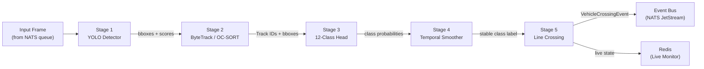
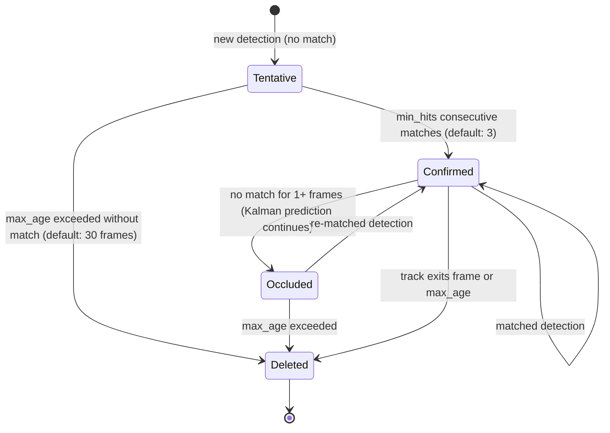
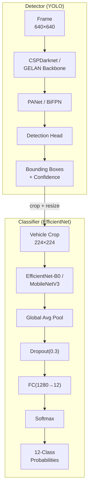
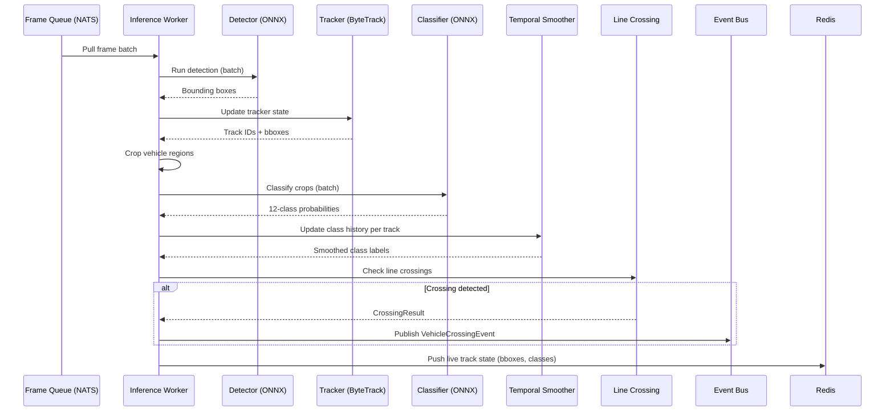
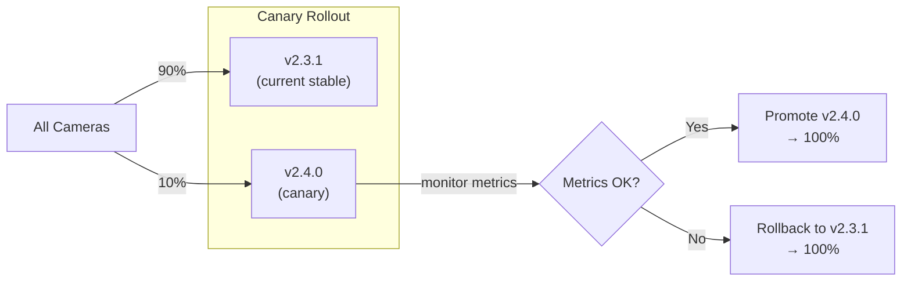
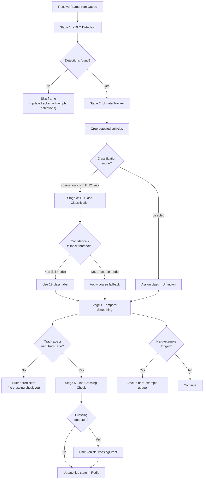

# GreyEye Traffic Analysis AI — AI/ML Pipeline

## 1 Introduction

This document specifies the AI/ML pipeline that powers GreyEye's vehicle detection, tracking, classification, and counting capabilities. It covers the five-stage inference pipeline, the 12-class vehicle taxonomy mapping, the dataset strategy (including AI Hub 091 ingestion), model architecture, training workflow, temporal smoothing, line-crossing logic, and the MLOps lifecycle for model versioning, drift monitoring, and hard-example collection.

The pipeline runs inside the **Inference Worker** service (`services/inference_worker/`) and is supported by the training and evaluation tooling in the `ml/` directory of the monorepo.

**Traceability:** FR-4.5, FR-4.6, FR-5.1, FR-5.2, FR-5.3, FR-5.4, FR-5.5, FR-5.6, FR-9.1, FR-9.2, FR-9.3, FR-9.4, NFR-2, NFR-3, NFR-11, DM-6

---

## 2 Pipeline Overview

The inference pipeline processes video frames in five sequential stages. Each frame enters the pipeline from the NATS JetStream frame queue and may produce zero or more `VehicleCrossingEvent` messages on the event bus.



### 2.1 Stage Summary

| Stage | Component | Input | Output | Traceability |
|:-----:|-----------|-------|--------|:------------:|
| 1 | YOLO Detector | Raw frame (1920×1080 JPEG) | Bounding boxes + confidence scores | FR-5.1 |
| 2 | Multi-Object Tracker | Bounding boxes + previous track state | Persistent Track IDs + updated bboxes | FR-5.2 |
| 3 | 12-Class Classifier | Cropped vehicle regions | Probability distribution over `VehicleClass12` | FR-5.3 |
| 4 | Temporal Smoother | Per-track class history (last N frames) | Stable class label + smoothed confidence | FR-5.4 |
| 5 | Line Crossing Detector | Track centroid trajectory + counting lines | `VehicleCrossingEvent` (if crossing detected) | FR-5.6 |

### 2.2 Performance Targets

| Metric | Target | Traceability |
|--------|--------|:------------:|
| End-to-end inference latency (frame → event) | ≤ 1.5 seconds | NFR-2 |
| Throughput per GPU worker | ≥ 10 FPS per camera | NFR-3 |
| Detection mAP@0.5 (validation set) | ≥ 0.85 | FR-5.1 |
| 12-class top-1 accuracy (validation set) | ≥ 0.80 | FR-5.3 |
| 12-class top-1 accuracy after temporal smoothing | ≥ 0.90 | FR-5.4 |
| Tracker MOTA (validation sequences) | ≥ 0.75 | FR-5.2 |

---

## 3 Stage 1 — Vehicle Detection (FR-5.1)

### 3.1 Architecture

The detector is a single-stage, anchor-free object detector based on the **YOLO** family (YOLOv8 or YOLOv9). It takes a full video frame as input and outputs a set of bounding boxes, each with an objectness confidence score and a coarse vehicle/non-vehicle class label.

| Aspect | Detail |
|--------|--------|
| **Backbone** | CSPDarknet (YOLOv8) or GELAN (YOLOv9) |
| **Neck** | PANet / BiFPN for multi-scale feature fusion |
| **Head** | Decoupled head with objectness + bbox regression branches |
| **Input resolution** | 640×640 (resized from 1920×1080 with letterboxing) |
| **Output** | List of `Detection(bbox, confidence, coarse_class)` |
| **NMS** | Non-Maximum Suppression with IoU threshold 0.45, confidence threshold 0.25 |
| **Coarse classes** | `vehicle` (single class for detection; fine-grained classification deferred to Stage 3) |

### 3.2 Detection Output Schema

```python
class Detection(BaseModel):
    bbox: BoundingBox          # normalized (x, y, w, h) relative to frame
    confidence: float          # objectness score [0.0, 1.0]
    coarse_class: str = "vehicle"
    frame_index: int
```

### 3.3 Design Decisions

- **Single-class detection:** The detector outputs only a `vehicle` class. Fine-grained 12-class discrimination is handled by the dedicated classification head (Stage 3), which operates on higher-resolution crops and benefits from temporal smoothing. This separation allows the detector to be trained on large, diverse vehicle datasets without requiring 12-class annotations.
- **Anchor-free design:** Anchor-free detectors (YOLOv8+) simplify hyperparameter tuning and generalize better across vehicle scales, from motorcycles to 6-axle semi-trailers.
- **Input resolution trade-off:** 640×640 balances detection accuracy with inference speed. For cameras with very distant vehicles, an optional 1280×1280 mode is available via the camera `settings.resolution` flag, at the cost of ~2× latency.

---

## 4 Stage 2 — Multi-Object Tracking (FR-5.2)

### 4.1 Tracker Selection

GreyEye supports two tracker implementations, selectable via configuration:

| Tracker | Approach | Strengths | Best For |
|---------|----------|-----------|----------|
| **ByteTrack** | Two-stage association (high + low confidence detections) | Robust to occlusion; recovers lost tracks via low-confidence matches | Dense urban traffic with frequent occlusion |
| **OC-SORT** | Observation-centric re-update with virtual trajectory | Better handling of non-linear motion; lower ID switches | Highway and high-speed scenarios |

The default tracker is **ByteTrack**. The tracker choice is a per-camera configuration parameter (`settings.tracker_type`).

### 4.2 Tracker State

The tracker maintains per-camera state in memory. Each active track holds:

```python
class TrackState(BaseModel):
    track_id: str                          # persistent ID (e.g., "trk_00042")
    bbox: BoundingBox                      # current bounding box
    centroid: Point2D                       # bbox center point
    centroid_history: list[Point2D]         # last M centroids (for trajectory + crossing)
    class_history: list[ClassPrediction]    # last N class predictions (for smoothing)
    first_seen_frame: int
    last_seen_frame: int
    age: int                               # frames since track creation
    hits: int                              # frames with matched detection
    time_since_update: int                 # frames since last matched detection
    is_confirmed: bool                     # True after min_hits consecutive matches
    speed_estimate_kmh: Optional[float]    # derived from centroid displacement + FPS
    occlusion_flag: bool                   # True if track is maintained without detection
```

### 4.3 Track Lifecycle



| Parameter | Default | Description |
|-----------|---------|-------------|
| `min_hits` | 3 | Consecutive matches required to confirm a track |
| `max_age` | 30 frames (3 s at 10 FPS) | Frames without match before deletion |
| `iou_threshold` | 0.3 | Minimum IoU for detection-to-track association |
| `centroid_history_length` | 50 | Number of past centroids retained for trajectory analysis |

### 4.4 Per-Track Attributes (FR-5.5)

The tracker computes additional attributes for each confirmed track:

| Attribute | Computation | Use |
|-----------|-------------|-----|
| **Dwell time** | `(last_seen_frame - first_seen_frame) / FPS` | Stopped-vehicle alerts (FR-7.1) |
| **Trajectory polyline** | `centroid_history` as a list of (x, y) points | Visualization, wrong-way detection |
| **Occlusion flag** | `True` when `time_since_update > 0` | Confidence adjustment in classification |
| **Speed estimate** | Pixel displacement per frame × calibration factor | Speed-drop alerts, KPI computation |

### 4.5 Track Events (FR-5.6)

The tracker emits supplementary events published to `events.tracks.{camera_id}`:

| Event | Trigger | Data |
|-------|---------|------|
| `TrackStarted` | Track reaches `Confirmed` state | `track_id`, `bbox`, `centroid`, `frame_index` |
| `TrackUpdated` | Each frame while track is active | `track_id`, `bbox`, `centroid`, `class12`, `confidence` |
| `TrackEnded` | Track reaches `Deleted` state | `track_id`, `last_bbox`, `dwell_time`, `trajectory` |

---

## 5 Stage 3 — 12-Class Vehicle Classification (FR-5.3)

### 5.1 Classification Architecture

The classifier is a lightweight CNN that takes a cropped and resized vehicle region as input and outputs a probability distribution over the 12 KICT/MOLIT vehicle classes.

| Aspect | Detail |
|--------|--------|
| **Backbone** | EfficientNet-B0 or MobileNetV3-Large (pre-trained on ImageNet) |
| **Input** | 224×224 RGB crop of the detected vehicle (resized from bbox region) |
| **Head** | Global Average Pooling → Dropout(0.3) → FC(1280 → 12) → Softmax |
| **Output** | `ClassPrediction(class12: VehicleClass12, probabilities: float[12], confidence: float)` |
| **Inference** | Batched — all detected vehicles in a frame are classified in a single forward pass |

### 5.2 Classification Output Schema

```python
class ClassPrediction(BaseModel):
    class12: VehicleClass12         # argmax class
    probabilities: list[float]      # length-12 probability vector
    confidence: float               # max probability (= probabilities[class12 - 1])
    crop_bbox: BoundingBox          # the bbox used for cropping
```

### 5.3 12-Class Taxonomy Mapping

The classifier's output indices map directly to the `VehicleClass12` enum defined in `libs/shared_contracts/vehicle_class.py`. The mapping is the KICT/MOLIT standard used across the entire system (see 00-overview.md, Section 4).

| Index | Enum Value | Korean | English | Visual Cues |
|:-----:|:-----------|:-------|:--------|:------------|
| 0 | `C01_PASSENGER_MINITRUCK` | 승용차/미니트럭 | Passenger car / Mini-truck | Small body, 2 axles, low profile |
| 1 | `C02_BUS` | 버스 | Bus | Long body, high roof, passenger windows |
| 2 | `C03_TRUCK_LT_2_5T` | 1~2.5톤 미만 | Truck (< 2.5 t) | Small cargo bed, 2 axles |
| 3 | `C04_TRUCK_2_5_TO_8_5T` | 2.5~8.5톤 미만 | Truck (2.5 t – 8.5 t) | Medium cargo bed, 2 axles, higher chassis |
| 4 | `C05_SINGLE_3_AXLE` | 1단위 3축 | Single unit, 3-axle | Large single body, 3 visible axle groups |
| 5 | `C06_SINGLE_4_AXLE` | 1단위 4축 | Single unit, 4-axle | Large single body, 4 visible axle groups |
| 6 | `C07_SINGLE_5_AXLE` | 1단위 5축 | Single unit, 5-axle | Very large single body, 5 visible axle groups |
| 7 | `C08_SEMI_4_AXLE` | 2단위 4축 세미 | Combination, 4-axle semi | Tractor + semi-trailer articulation, 4 axles |
| 8 | `C09_FULL_4_AXLE` | 2단위 4축 풀 | Combination, 4-axle full | Truck + full trailer with drawbar, 4 axles |
| 9 | `C10_SEMI_5_AXLE` | 2단위 5축 세미 | Combination, 5-axle semi | Tractor + semi-trailer, 5 axles |
| 10 | `C11_FULL_5_AXLE` | 2단위 5축 풀 | Combination, 5-axle full | Truck + full trailer, 5 axles |
| 11 | `C12_SEMI_6_AXLE` | 2단위 6축 세미 | Combination, 6-axle semi | Tractor + long semi-trailer, 6 axles |

### 5.4 Coarse Fallback Groups

When 12-class confidence is below threshold or classification is set to coarse-only mode (FR-4.5, FR-4.6), the system maps to four coarse groups:

| Coarse Group | 12-Class Members | Mapping Logic |
|:-------------|:-----------------|:--------------|
| **Car** | C01 | Classes 1 |
| **Bus** | C02 | Class 2 |
| **Truck** | C03, C04, C05, C06, C07 | Classes 3–7 (single-unit trucks) |
| **Trailer** | C08, C09, C10, C11, C12 | Classes 8–12 (combination vehicles) |

```python
COARSE_MAP: dict[str, list[VehicleClass12]] = {
    "car":     [VehicleClass12.C01_PASSENGER_MINITRUCK],
    "bus":     [VehicleClass12.C02_BUS],
    "truck":   [VehicleClass12.C03_TRUCK_LT_2_5T,
                VehicleClass12.C04_TRUCK_2_5_TO_8_5T,
                VehicleClass12.C05_SINGLE_3_AXLE,
                VehicleClass12.C06_SINGLE_4_AXLE,
                VehicleClass12.C07_SINGLE_5_AXLE],
    "trailer": [VehicleClass12.C08_SEMI_4_AXLE,
                VehicleClass12.C09_FULL_4_AXLE,
                VehicleClass12.C10_SEMI_5_AXLE,
                VehicleClass12.C11_FULL_5_AXLE,
                VehicleClass12.C12_SEMI_6_AXLE],
}

def apply_fallback(pred: ClassPrediction, threshold: float) -> ClassPrediction:
    """If fine-grained confidence is below threshold, collapse to coarse group."""
    if pred.confidence >= threshold:
        return pred
    coarse_probs = {
        group: sum(pred.probabilities[c.value - 1] for c in members)
        for group, members in COARSE_MAP.items()
    }
    best_group = max(coarse_probs, key=coarse_probs.get)
    return ClassPrediction(
        class12=COARSE_MAP[best_group][0],
        probabilities=pred.probabilities,
        confidence=coarse_probs[best_group],
        crop_bbox=pred.crop_bbox,
    )
```

### 5.5 Classification Mode Configuration (FR-4.5)

Each camera's `settings.classification_mode` controls classification behavior:

| Mode | Behavior | Use Case |
|------|----------|----------|
| `full_12class` | Full 12-class classification with temporal smoothing | Standard traffic surveys |
| `coarse_only` | Always output coarse groups (Car/Bus/Truck/Trailer) | Quick surveys, low-confidence environments |
| `disabled` | No classification; all vehicles counted as "Unknown" | Volume-only counting |

---

## 6 Stage 4 — Temporal Smoothing (FR-5.4)

### 6.1 Motivation

Single-frame classification is noisy — a vehicle may be classified differently across consecutive frames due to viewpoint changes, partial occlusion, or lighting variation. Temporal smoothing stabilizes the class label by aggregating predictions over a sliding window of recent frames.

### 6.2 Algorithm

The default smoothing strategy is **majority voting** over the last N frames of a track's class history. An alternative **exponential moving average (EMA)** strategy is available for scenarios requiring faster adaptation.

#### 6.2.1 Majority Voting (Default)

```python
from collections import Counter

SMOOTHING_WINDOW = 5  # configurable per camera

def smooth_majority(class_history: list[ClassPrediction]) -> ClassPrediction:
    """Return the most frequent class in the last N predictions."""
    window = class_history[-SMOOTHING_WINDOW:]
    votes = Counter(p.class12 for p in window)
    winner, count = votes.most_common(1)[0]
    smoothed_confidence = count / len(window)
    return ClassPrediction(
        class12=winner,
        probabilities=_average_probabilities(window),
        confidence=smoothed_confidence,
        crop_bbox=window[-1].crop_bbox,
    )
```

#### 6.2.2 Exponential Moving Average (Alternative)

```python
EMA_ALPHA = 0.3  # weight for newest observation

def smooth_ema(class_history: list[ClassPrediction]) -> ClassPrediction:
    """Compute EMA over probability vectors, then take argmax."""
    ema = [0.0] * 12
    for pred in class_history:
        for i in range(12):
            ema[i] = EMA_ALPHA * pred.probabilities[i] + (1 - EMA_ALPHA) * ema[i]
    best_idx = max(range(12), key=lambda i: ema[i])
    return ClassPrediction(
        class12=VehicleClass12(best_idx + 1),
        probabilities=ema,
        confidence=ema[best_idx],
        crop_bbox=class_history[-1].crop_bbox,
    )
```

### 6.3 Smoothing Parameters

| Parameter | Default | Range | Description |
|-----------|---------|-------|-------------|
| `smoothing_strategy` | `majority` | `majority`, `ema` | Smoothing algorithm |
| `smoothing_window` | 5 | 3–15 | Number of recent frames for majority voting |
| `ema_alpha` | 0.3 | 0.1–0.5 | EMA weight for newest observation |
| `min_track_age` | 3 | 1–10 | Minimum frames before emitting a smoothed label |

### 6.4 Confidence Adjustment

The smoothed confidence reflects classification stability. A track that has been consistently classified as the same class across all N frames receives confidence 1.0 (majority voting) or a high EMA value. Tracks with fluctuating predictions receive lower smoothed confidence, which may trigger the fallback policy (FR-4.6).

---

## 7 Stage 5 — Line Crossing Detection (FR-5.6)

### 7.1 Crossing Algorithm

The line crossing detector tests whether a track's centroid has crossed any of the configured counting lines between the current and previous frame. The algorithm uses a **segment intersection test** between the centroid displacement vector and each counting line.

```python
def check_line_crossing(
    prev_centroid: Point2D,
    curr_centroid: Point2D,
    counting_line: CountingLine,
) -> Optional[CrossingResult]:
    """Check if the centroid path crosses the counting line.

    Returns CrossingResult with direction if a crossing occurred, None otherwise.
    Uses the cross-product method for segment intersection.
    """
    p1, p2 = prev_centroid, curr_centroid
    q1 = counting_line.start_point
    q2 = counting_line.end_point

    d1 = cross_product(q2 - q1, p1 - q1)
    d2 = cross_product(q2 - q1, p2 - q1)
    d3 = cross_product(p2 - p1, q1 - p1)
    d4 = cross_product(p2 - p1, q2 - p1)

    if ((d1 > 0 and d2 < 0) or (d1 < 0 and d2 > 0)) and \
       ((d3 > 0 and d4 < 0) or (d3 < 0 and d4 > 0)):
        movement = Point2D(curr_centroid.x - prev_centroid.x,
                           curr_centroid.y - prev_centroid.y)
        dot = (movement.x * counting_line.direction_vector["dx"]
             + movement.y * counting_line.direction_vector["dy"])
        direction = "inbound" if dot > 0 else "outbound"

        if counting_line.direction == "bidirectional" or \
           counting_line.direction == direction:
            return CrossingResult(line_id=counting_line.id, direction=direction)

    return None
```

### 7.2 Deduplication

Each crossing is assigned a `crossing_seq` number per `(track_id, line_id)` pair. The dedup key `{camera_id}:{line_id}:{track_id}:{crossing_seq}` prevents double-counting in the following scenarios:

| Scenario | Handling |
|----------|----------|
| Track oscillates near a counting line | Only the first crossing increments `crossing_seq`; subsequent same-direction crossings within a cooldown window (default: 10 frames) are suppressed |
| Event bus retry delivers duplicate events | The `vehicle_crossings` table enforces `UNIQUE(camera_id, line_id, track_id, crossing_seq)` |
| Track crosses multiple lines | Each line generates an independent event with its own `crossing_seq` |

### 7.3 Event Emission

When a crossing is confirmed, the pipeline constructs and publishes a `VehicleCrossingEvent` to the event bus subject `events.crossings.{camera_id}`. The event schema is defined in `libs/shared_contracts/` (see 02-software-design.md, Section 4.1).

```python
event = VehicleCrossingEvent(
    timestamp_utc=frame_timestamp,
    camera_id=camera_id,
    line_id=crossing.line_id,
    track_id=track.track_id,
    crossing_seq=next_seq(track.track_id, crossing.line_id),
    class12=smoothed_prediction.class12,
    confidence=smoothed_prediction.confidence,
    direction=crossing.direction,
    model_version=current_model_version,
    frame_index=frame_index,
    speed_estimate_kmh=track.speed_estimate_kmh,
    bbox=track.bbox,
    org_id=camera_config.org_id,
    site_id=camera_config.site_id,
)
```

---

## 8 Dataset Strategy

### 8.1 Dataset Overview

GreyEye's training pipeline uses a multi-stage data strategy that combines public datasets for pre-training with domain-specific data for fine-tuning.

| Dataset | Purpose | Volume | Format | Source |
|---------|---------|--------|--------|--------|
| **AI Hub 091** | Vehicle appearance pre-training (detection + feature learning) | ~295K images | 1920×1080 JPG + JSON annotations | AI Hub (한국지능정보사회진흥원) |
| **COCO (vehicle subset)** | General object detection pre-training | ~12K vehicle images | COCO JSON | Microsoft COCO |
| **GreyEye Field Data** | Fine-tuning for 12-class classification and traffic-specific detection | Collected incrementally | 1920×1080 frames + manual annotations | Field deployments |
| **Hard Examples** | Active learning — low-confidence and misclassified samples | Collected automatically (FR-9.4) | Same as field data | Production inference |

### 8.2 AI Hub 091 Dataset

The **AI Hub 091 (차량 외관 영상 데이터)** dataset contains approximately 295,000 annotated vehicle exterior images with bounding-box labels for vehicle parts and components.

#### 8.2.1 Dataset Structure

```
091.차량 외관 영상 데이터/
├── 01.데이터/
│   ├── 1.Training/
│   │   ├── 원천데이터/         # Source images (TS1.zip – TS4.zip)
│   │   └── 라벨링데이터/       # Annotation JSON (TL1.zip – TL4.zip)
│   └── 2.Validation/
│       ├── 원천데이터/         # Source images (VS1.zip – VS4.zip)
│       └── 라벨링데이터/       # Annotation JSON (VL1.zip – VL4.zip)
```

#### 8.2.2 Annotation Schema

Each image has a corresponding JSON annotation file with the following structure:

```json
{
  "rawDataInfo": {
    "filename": "vehicle_001234.jpg",
    "resolution": "1920x1080",
    "date": "2024-06-15"
  },
  "sourceDataInfo": {
    "LargeCategoryId": "vehicle",
    "MediumCategoryId": "sedan",
    "SmallCategoryId": "front_view"
  },
  "learningDataInfo": {
    "objects": [
      {
        "class": "bumper",
        "bbox": { "x": 120, "y": 340, "w": 480, "h": 200 },
        "difficulty": "easy"
      },
      {
        "class": "headlight",
        "bbox": { "x": 150, "y": 380, "w": 80, "h": 60 },
        "difficulty": "easy"
      }
    ]
  }
}
```

#### 8.2.3 AI Hub 091 Usage Strategy

The AI Hub 091 dataset annotates **vehicle parts** (bumper, headlight, wheel, etc.), not whole vehicles or the 12 traffic classes. It cannot be directly mapped to the KICT/MOLIT 12-class taxonomy. Instead, it is used for:

| Use | Method | Benefit |
|-----|--------|---------|
| **Backbone pre-training** | Train the detector backbone on vehicle-part detection to learn vehicle visual features | Better feature representations for downstream vehicle detection |
| **Vehicle crop generation** | Use whole-image vehicle bounding boxes (derived from the union of part bboxes) as detection training data | Bootstraps the detector with Korean vehicle appearances |
| **Transfer learning** | Pre-train the classification backbone on AI Hub category distinctions (`LargeCategoryId`, `MediumCategoryId`) | Warm-start for fine-tuning on the 12-class taxonomy |

**Critical constraint:** Do **not** map `SmallCategoryId` directly to the 12 traffic classes. The AI Hub categories describe vehicle viewpoints and part types, not the axle-count-based KICT/MOLIT taxonomy. The 12-class classifier must be fine-tuned on properly annotated traffic data.

#### 8.2.4 AI Hub Ingestion Converter

The converter script `ml/data/aihub091_to_greyeye.py` transforms AI Hub 091 annotations into GreyEye's internal training format:

```python
class GreyEyeAnnotation(BaseModel):
    image_path: str
    image_width: int
    image_height: int
    detections: list[DetectionAnnotation]

class DetectionAnnotation(BaseModel):
    bbox: BoundingBox                     # normalized (x, y, w, h)
    class12: Optional[VehicleClass12]     # None for AI Hub (no 12-class label)
    coarse_class: str                     # "vehicle" for AI Hub data
    source: str                           # "aihub091" | "coco" | "field" | "hard_example"
```

The converter:

1. Reads AI Hub JSON annotations
2. Computes the union bounding box of all parts per image → whole-vehicle bbox
3. Normalizes coordinates to [0, 1] range
4. Outputs GreyEye annotation format (with `class12 = None` since AI Hub lacks 12-class labels)
5. Splits into train/val following the original AI Hub partition

### 8.3 Training Data for 12-Class Classification

The 12-class classifier requires training data with ground-truth KICT/MOLIT class labels. This data comes from three sources:

| Source | Annotation Method | Volume Target | Priority Classes |
|--------|-------------------|---------------|------------------|
| **KICT reference images** | Expert-labeled reference photos from the 12종 차종분류 사진표 | ~500 reference images | All 12 classes |
| **Field data collection** | Manual annotation of smartphone/CCTV frames from GreyEye deployments | 5,000+ images (growing) | Classes 5–12 (heavy/combination vehicles are rare and hard to distinguish) |
| **Hard-example mining** | Automatic collection of low-confidence predictions from production (FR-9.4) | Continuous | Underperforming classes |

### 8.4 Class Imbalance Strategy

Traffic class distribution is heavily skewed — Class 1 (passenger cars) dominates at 70–80% of real-world traffic, while Classes 7, 11, and 12 may represent < 0.5%. The training pipeline addresses this with:

| Technique | Description |
|-----------|-------------|
| **Weighted sampling** | Oversample rare classes (5–12) during training; sample weights inversely proportional to class frequency |
| **Focal loss** | Use focal loss (γ=2.0) instead of cross-entropy to down-weight easy examples and focus on hard, rare classes |
| **Synthetic augmentation** | Apply heavier augmentation (rotation, scale, color jitter) to rare-class samples |
| **Copy-paste augmentation** | Paste cropped rare-class vehicles onto diverse background scenes |
| **Per-class evaluation** | Track per-class precision, recall, and F1 separately; gate deployment on worst-class performance |

---

## 9 Model Architecture — Unified Pipeline

### 9.1 Combined Model

In production, the detector and classifier are deployed as a unified pipeline but remain architecturally separate models to allow independent training and versioning.



### 9.2 Model Variants

| Variant | Detector | Classifier | Target Hardware | Latency (per frame) |
|---------|----------|------------|-----------------|:-------------------:|
| **Standard** | YOLOv8-M | EfficientNet-B0 | NVIDIA T4 / RTX 3060 | ~80 ms |
| **Lightweight** | YOLOv8-S | MobileNetV3-Small | CPU / mobile (future) | ~250 ms |
| **High-accuracy** | YOLOv9-C | EfficientNet-B2 | NVIDIA A100 / RTX 4090 | ~120 ms |

### 9.3 Export Formats

Models are exported for inference using:

| Format | Use Case | Tool |
|--------|----------|------|
| **ONNX** | Primary inference runtime (ONNX Runtime with CUDA EP) | `torch.onnx.export()` |
| **TorchScript** | Fallback and debugging | `torch.jit.trace()` |
| **TensorRT** | Maximum GPU throughput (optional, hardware-specific) | `trtexec` |

Export scripts are located in `ml/export/` and produce versioned artifacts:

```
ml/export/
├── export_detector.py       # YOLO → ONNX/TorchScript
├── export_classifier.py     # EfficientNet → ONNX/TorchScript
└── validate_export.py       # Numerical equivalence check (PyTorch vs ONNX)
```

---

## 10 Training Pipeline

### 10.1 Monorepo Layout

```
ml/
├── training/
│   ├── train_detector.py          # YOLO detector training script
│   ├── train_classifier.py        # 12-class classifier training script
│   ├── config/
│   │   ├── detector_base.yaml     # Detector hyperparameters
│   │   └── classifier_base.yaml   # Classifier hyperparameters
│   ├── augmentations.py           # Augmentation pipeline (Albumentations)
│   └── losses.py                  # Focal loss, label smoothing
│
├── evaluation/
│   ├── evaluate_detector.py       # mAP, precision-recall curves
│   ├── evaluate_classifier.py     # Accuracy, confusion matrix, per-class F1
│   ├── evaluate_tracker.py        # MOTA, IDF1, ID switches
│   └── benchmark_latency.py       # End-to-end latency profiling
│
├── export/
│   ├── export_detector.py
│   ├── export_classifier.py
│   └── validate_export.py
│
└── data/
    ├── aihub091_to_greyeye.py     # AI Hub 091 converter
    ├── coco_to_greyeye.py         # COCO vehicle subset converter
    ├── dataset.py                 # PyTorch Dataset class
    ├── sampler.py                 # Weighted sampler for class imbalance
    └── splits.py                  # Train/val/test split management
```

### 10.2 Detector Training

| Aspect | Detail |
|--------|--------|
| **Framework** | Ultralytics YOLOv8 / YOLOv9 training API |
| **Pre-training** | COCO pre-trained weights → fine-tune on AI Hub 091 vehicle bboxes → fine-tune on GreyEye field data |
| **Augmentations** | Mosaic, MixUp, random affine, HSV jitter, horizontal flip |
| **Optimizer** | AdamW, lr=1e-3, weight_decay=5e-4, cosine annealing schedule |
| **Batch size** | 16 (per GPU) |
| **Epochs** | 100 (with early stopping, patience=15) |
| **Validation metric** | mAP@0.5 on held-out validation set |

### 10.3 Classifier Training

| Aspect | Detail |
|--------|--------|
| **Framework** | PyTorch + timm (for EfficientNet/MobileNet backbones) |
| **Pre-training** | ImageNet pre-trained backbone → fine-tune on GreyEye 12-class data |
| **Augmentations** | RandomResizedCrop, HorizontalFlip, ColorJitter, RandAugment, CutMix |
| **Loss** | Focal loss (γ=2.0, α per-class) with label smoothing (ε=0.1) |
| **Optimizer** | AdamW, lr=3e-4, weight_decay=1e-4, cosine annealing with warm restarts |
| **Batch size** | 64 (per GPU) |
| **Epochs** | 50 (with early stopping, patience=10) |
| **Validation metrics** | Top-1 accuracy, per-class F1, macro-averaged F1, confusion matrix |

### 10.4 Augmentation Pipeline

```python
import albumentations as A

detector_augmentation = A.Compose([
    A.RandomResizedCrop(640, 640, scale=(0.5, 1.0)),
    A.HorizontalFlip(p=0.5),
    A.ColorJitter(brightness=0.3, contrast=0.3, saturation=0.3, hue=0.1, p=0.8),
    A.GaussNoise(var_limit=(10, 50), p=0.3),
    A.MotionBlur(blur_limit=7, p=0.2),
    A.RandomBrightnessContrast(brightness_limit=0.3, contrast_limit=0.3, p=0.5),
    A.Normalize(mean=[0.485, 0.456, 0.406], std=[0.229, 0.224, 0.225]),
])

classifier_augmentation = A.Compose([
    A.RandomResizedCrop(224, 224, scale=(0.7, 1.0)),
    A.HorizontalFlip(p=0.5),
    A.ColorJitter(brightness=0.4, contrast=0.4, saturation=0.4, hue=0.15, p=0.8),
    A.GaussNoise(var_limit=(10, 30), p=0.2),
    A.CoarseDropout(max_holes=8, max_height=28, max_width=28, p=0.3),
    A.Normalize(mean=[0.485, 0.456, 0.406], std=[0.229, 0.224, 0.225]),
])
```

### 10.5 Training Infrastructure

| Resource | MVP | Scale |
|----------|-----|-------|
| **GPU** | 1× NVIDIA RTX 3060 (12 GB) | 4× NVIDIA A100 (40 GB) with DDP |
| **Storage** | Local SSD (500 GB) | S3-compatible object storage |
| **Experiment tracking** | MLflow or Weights & Biases | Same, with team workspace |
| **Training orchestration** | Manual scripts | Kubeflow Pipelines or similar |

---

## 11 Inference Worker Architecture

### 11.1 Worker Lifecycle

The Inference Worker is a Python process (not a FastAPI server) that pulls frames from the NATS JetStream queue and processes them through the pipeline. See 02-software-design.md, Section 2.5 for the service-level description.



### 11.2 Batching Strategy

To maximize GPU utilization, the worker batches operations at two levels:

| Level | Batching | Batch Size |
|-------|----------|------------|
| **Detection** | Multiple frames from the same camera processed in a mini-batch | 1–4 frames (limited by GPU memory) |
| **Classification** | All detected vehicles within a frame classified in a single forward pass | Dynamic (typically 5–30 crops per frame) |

### 11.3 Per-Camera State Management

Each camera stream maintains independent state:

```python
class CameraInferenceState:
    camera_id: str
    tracker: ByteTracker | OCSortTracker
    track_states: dict[str, TrackState]
    active_roi_preset: ROIPreset
    counting_lines: list[CountingLine]
    crossing_sequences: dict[tuple[str, str], int]  # (track_id, line_id) → seq
    last_frame_index: int
    model_version: str
```

State is held in memory and is not persisted. If a worker restarts, tracks are re-initialized from incoming frames (transient state loss is acceptable — at most a few seconds of tracking continuity are lost, with no impact on counting accuracy due to the dedup key).

### 11.4 Configuration Hot-Reload

The worker periodically polls the Config Service (or receives push notifications via NATS) for changes to:

- Active ROI preset and counting lines
- Camera settings (FPS, classification mode, tracker type)
- Model version (for canary rollout)
- Smoothing parameters

Configuration changes take effect on the next frame without worker restart.

---

## 12 MLOps — Model Versioning and Lifecycle (FR-9)

### 12.1 Model Version Tagging (FR-9.1)

Every inference result carries the `model_version` string, which is recorded in:

- `VehicleCrossingEvent.model_version` (event bus)
- `vehicle_crossings.model_version` (database)

The version string follows semantic versioning: `v{major}.{minor}.{patch}` (e.g., `v2.3.1`). A version bump indicates:

| Component | Meaning |
|-----------|---------|
| **Major** | Architecture change (new backbone, new tracker algorithm) |
| **Minor** | Retraining with new data or hyperparameter changes |
| **Patch** | Bug fix, export format change, no accuracy impact |

### 12.2 Model Registry

Trained models are stored in a versioned registry (S3 bucket or MLflow Model Registry):

```
models/
├── detector/
│   ├── v2.3.1/
│   │   ├── model.onnx
│   │   ├── model.torchscript
│   │   ├── metadata.json        # training config, metrics, dataset hash
│   │   └── evaluation_report.md
│   └── v2.4.0/
│       └── ...
└── classifier/
    ├── v1.2.0/
    │   ├── model.onnx
    │   ├── metadata.json
    │   └── evaluation_report.md
    └── v1.3.0/
        └── ...
```

### 12.3 Canary Deployment and Rollout (FR-9.2, NFR-11)

New model versions are rolled out gradually using feature flags:



**Rollout stages:**

| Stage | Traffic % | Duration | Gate |
|-------|:---------:|----------|------|
| Canary | 10% | 24 hours | No accuracy regression on canary cameras |
| Partial | 50% | 48 hours | Drift metrics within tolerance |
| Full | 100% | — | Admin approval (FR-9.2) |
| Rollback | 0% → 100% (previous) | Immediate | Admin-triggered (FR-9.2) |

Feature flags controlling rollout:

| Flag | Type | Scope |
|------|------|-------|
| `inference.model_version_canary` | String (version) | Global |
| `inference.canary_percentage` | Integer (0–100) | Global |
| `inference.model_version_override` | String (version) | Per camera |

### 12.4 Drift Monitoring (FR-9.3)

The system continuously monitors model performance in production by analyzing the `vehicle_crossings` table:

| Metric | Computation | Alert Threshold |
|--------|-------------|-----------------|
| **Mean confidence** | `AVG(confidence)` per model_version per hour | Drop > 10% from baseline |
| **Class distribution shift** | Jensen-Shannon divergence between current and baseline class distributions | JSD > 0.1 |
| **Low-confidence rate** | `COUNT(confidence < threshold) / COUNT(*)` per hour | Rate > 15% |
| **Unknown/fallback rate** | Percentage of crossings that triggered coarse fallback | Rate > 20% |

```sql
-- Hourly confidence monitoring query
SELECT
    model_version,
    date_trunc('hour', timestamp_utc) AS hour,
    COUNT(*) AS total_crossings,
    AVG(confidence) AS mean_confidence,
    COUNT(*) FILTER (WHERE confidence < 0.5) AS low_confidence_count,
    ARRAY_AGG(DISTINCT class12) AS classes_seen
FROM vehicle_crossings
WHERE timestamp_utc > now() - INTERVAL '24 hours'
GROUP BY model_version, date_trunc('hour', timestamp_utc)
ORDER BY hour DESC;
```

### 12.5 Hard-Example Collection (FR-9.4)

The inference worker automatically flags frames for human review when:

| Trigger | Condition | Action |
|---------|-----------|--------|
| Low confidence | `smoothed_confidence < hard_example_threshold` (default: 0.5) | Save frame + crop + prediction to hard-example queue |
| Class flip | Temporal smoother changes the class label for a track | Save the frame sequence around the flip |
| Rare class | Vehicle classified as Class 5–12 (heavy/combination) | Save frame for verification (these classes are underrepresented) |

Hard examples are stored in object storage under `hard_examples/{camera_id}/{date}/` and queued for annotation in the labeling pipeline. Once labeled, they are added to the training dataset for the next model iteration.

```python
class HardExample(BaseModel):
    frame_path: str                     # S3 path to the full frame
    crop_path: str                      # S3 path to the vehicle crop
    camera_id: str
    track_id: str
    frame_index: int
    timestamp_utc: datetime
    predicted_class12: VehicleClass12
    confidence: float
    probabilities: list[float]
    trigger_reason: str                 # "low_confidence" | "class_flip" | "rare_class"
    model_version: str
    annotated_class12: Optional[VehicleClass12] = None  # filled after human review
```

---

## 13 Inference Configuration Reference

All pipeline parameters are configurable per camera or globally via the Config Service. Defaults are tuned for the standard deployment scenario (smartphone camera, 10 FPS, urban traffic).

### 13.1 Detection Parameters

| Parameter | Default | Range | Description |
|-----------|---------|-------|-------------|
| `detector.input_size` | 640 | 320, 640, 1280 | Input resolution (square) |
| `detector.confidence_threshold` | 0.25 | 0.1–0.9 | Minimum objectness score |
| `detector.nms_iou_threshold` | 0.45 | 0.1–0.7 | NMS IoU overlap threshold |
| `detector.max_detections` | 100 | 10–300 | Maximum detections per frame |

### 13.2 Tracking Parameters

| Parameter | Default | Range | Description |
|-----------|---------|-------|-------------|
| `tracker.type` | `bytetrack` | `bytetrack`, `ocsort` | Tracker algorithm |
| `tracker.min_hits` | 3 | 1–10 | Consecutive matches to confirm |
| `tracker.max_age` | 30 | 10–120 | Frames before track deletion |
| `tracker.iou_threshold` | 0.3 | 0.1–0.7 | Association IoU threshold |

### 13.3 Classification Parameters

| Parameter | Default | Range | Description |
|-----------|---------|-------|-------------|
| `classifier.mode` | `full_12class` | `full_12class`, `coarse_only`, `disabled` | Classification mode |
| `classifier.fallback_threshold` | 0.4 | 0.2–0.8 | Confidence below which coarse fallback applies |
| `classifier.input_size` | 224 | 128, 224, 299 | Crop input resolution |

### 13.4 Smoothing Parameters

| Parameter | Default | Range | Description |
|-----------|---------|-------|-------------|
| `smoother.strategy` | `majority` | `majority`, `ema` | Smoothing algorithm |
| `smoother.window` | 5 | 3–15 | Majority voting window size |
| `smoother.ema_alpha` | 0.3 | 0.1–0.5 | EMA weight for newest frame |
| `smoother.min_track_age` | 3 | 1–10 | Minimum frames before smoothed output |

### 13.5 Line Crossing Parameters

| Parameter | Default | Range | Description |
|-----------|---------|-------|-------------|
| `crossing.cooldown_frames` | 10 | 5–30 | Frames to suppress re-crossing of same line by same track |
| `crossing.min_displacement` | 0.01 | 0.005–0.05 | Minimum centroid displacement (normalized) to consider movement |

### 13.6 Hard-Example Collection Parameters

| Parameter | Default | Range | Description |
|-----------|---------|-------|-------------|
| `hard_example.enabled` | `true` | `true`, `false` | Enable/disable collection |
| `hard_example.confidence_threshold` | 0.5 | 0.3–0.7 | Confidence below which frames are flagged |
| `hard_example.max_per_hour` | 100 | 10–1000 | Rate limit to prevent storage overload |
| `hard_example.rare_class_ids` | `[5,6,7,8,9,10,11,12]` | Any subset of 1–12 | Classes that trigger rare-class collection |

---

## 14 End-to-End Pipeline Flow

The following sequence diagram shows the complete data flow from a single video frame through all five pipeline stages, including the decision points for event emission and hard-example collection.



---

## 15 Traceability Matrix

| Req ID | Requirement | Section(s) |
|--------|-------------|------------|
| **FR-4.5** | Disable classification or force coarse-only mode | 5.5 |
| **FR-4.6** | Low-confidence fallback policy | 5.4 |
| **FR-5.1** | Vehicle detection with bounding boxes and confidence | 3 |
| **FR-5.2** | Multi-frame tracking with persistent Track IDs | 4 |
| **FR-5.3** | 12-class classification with probability scores | 5 |
| **FR-5.4** | Temporal smoothing for stable class labels | 6 |
| **FR-5.5** | Per-track attributes (dwell time, trajectory, occlusion) | 4.4 |
| **FR-5.6** | Event generation (track start/end, line crossing, stopped, wrong-way) | 4.5, 7 |
| **FR-9.1** | Model version tagging on inference results | 12.1 |
| **FR-9.2** | Model rollback (admin only) | 12.3 |
| **FR-9.3** | Confidence and class distribution drift monitoring | 12.4 |
| **FR-9.4** | Hard-example collection for labeling | 12.5 |
| **NFR-2** | End-to-end inference latency ≤ 1.5 seconds | 2.2, 9.2 |
| **NFR-3** | MVP: 10 cameras / 10 FPS; scale: 100+ cameras | 2.2, 11.2 |
| **NFR-11** | Feature flags for model rollout | 12.3 |
| **DM-6** | Event traceability (timestamps, camera_id, model_version) | 7.3, 12.1 |

---

## 16 Summary

The GreyEye AI/ML pipeline is designed around five principles:

1. **Separation of detection and classification** — A single-class detector finds vehicles; a dedicated 12-class head classifies them. This allows each model to be trained, evaluated, and versioned independently.
2. **Temporal stability** — Majority voting (or EMA) over a sliding window of per-track predictions produces stable class labels, raising effective accuracy from ~80% (single-frame) to ~90%+ (smoothed).
3. **Multi-stage data strategy** — AI Hub 091 provides pre-training signal for vehicle features; field data and hard-example mining provide the domain-specific 12-class annotations needed for production accuracy.
4. **Exactly-once counting** — Segment-intersection line crossing with dedup keys at the application and database layers ensures each vehicle is counted precisely once per counting line.
5. **Continuous improvement** — Model versioning, canary deployment, drift monitoring, and hard-example collection form a closed loop that improves accuracy over time without service disruption.
