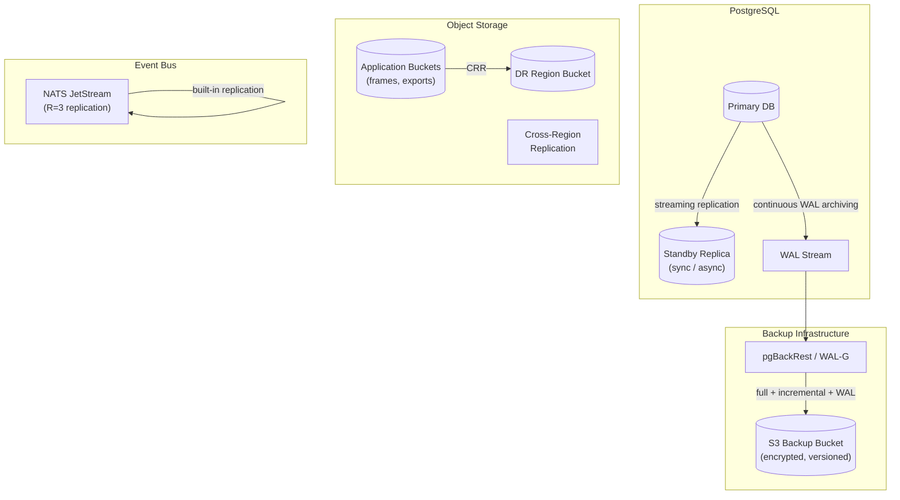
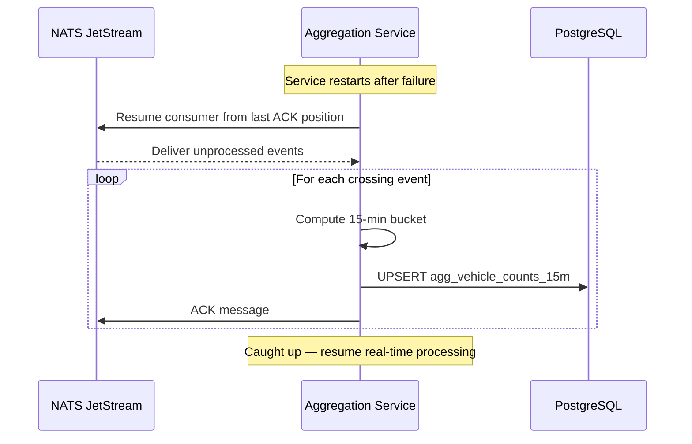
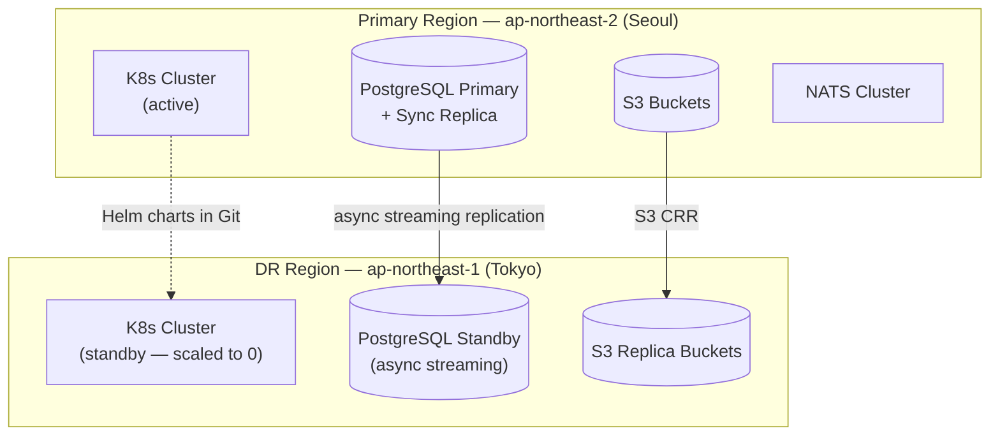
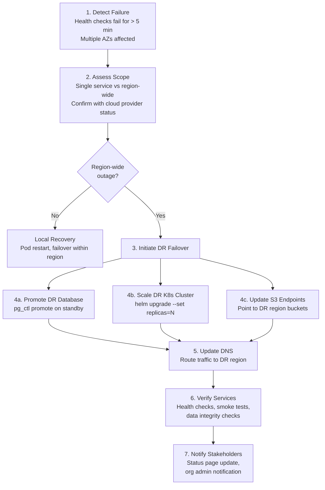
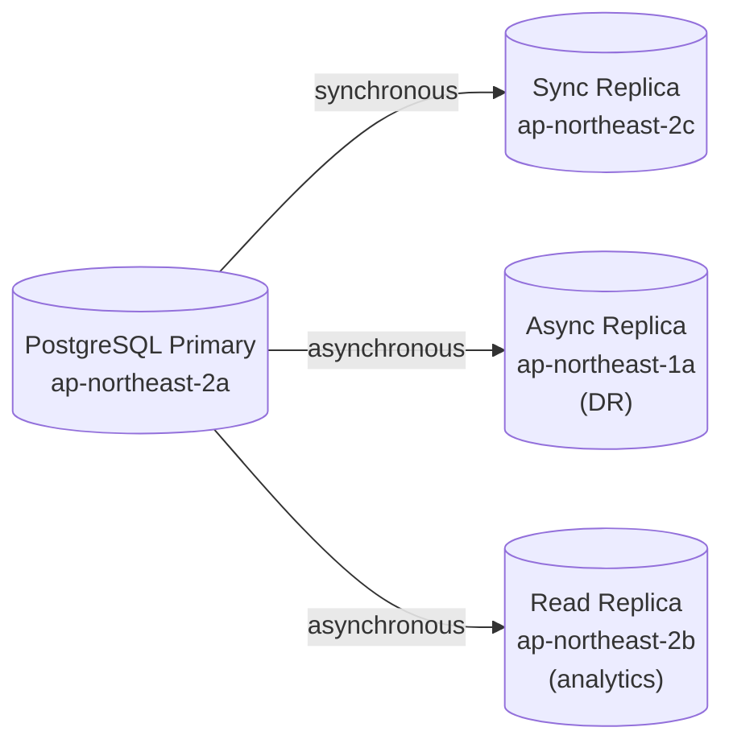
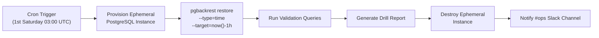

# GreyEye Traffic Analysis AI — Backup and Recovery

## 1 Introduction

This document defines the backup strategy, recovery objectives, disaster-recovery (DR) procedures, and restore-drill programme for GreyEye. It covers PostgreSQL database backups, object-storage replication, event-bus durability, configuration versioning, and the operational runbooks that ensure data can be recovered within the committed RPO/RTO targets.

**Traceability:** NFR-5, DM-1, DM-8, DM-9

---

## 2 Recovery Objectives

All backup and DR decisions are driven by two contractual targets that apply to the production environment.

| Metric | Target | Definition | Traceability |
|--------|:------:|------------|:------------:|
| **RPO** (Recovery Point Objective) | ≤ 15 minutes | Maximum acceptable data loss measured from the point of failure | DM-9 |
| **RTO** (Recovery Time Objective) | ≤ 2 hours | Maximum acceptable downtime from detection to full service restoration | DM-9 |
| **Availability SLA** | ≥ 99.5 % (monthly) | ≤ 3.6 hours total downtime per calendar month | NFR-5 |

### 2.1 RPO / RTO by Data Tier

Different data tiers have different criticality and recovery characteristics.

| Data Tier | RPO | RTO | Rationale |
|-----------|:---:|:---:|-----------|
| **PostgreSQL — config & aggregates** | ≤ 15 min | ≤ 2 h | Source of truth for sites, cameras, ROI, aggregates, audit logs |
| **PostgreSQL — vehicle_crossings** | ≤ 15 min | ≤ 2 h | Event-sourced crossing records; aggregates are recomputable from these (DM-7) |
| **Object Storage (S3)** | ≤ 1 h | ≤ 4 h | Frames, clips, exports — optional media; lower priority than DB |
| **Event Bus (NATS JetStream)** | ≤ 5 min | ≤ 30 min | In-flight crossing events; replayable from stream persistence |
| **Redis cache** | N/A (ephemeral) | ≤ 5 min | Rebuilt from Postgres on restart; no backup required |

---

## 3 Backup Strategy Overview



### 3.1 Backup Components

| Component | Method | Frequency | Retention | Traceability |
|-----------|--------|-----------|-----------|:------------:|
| PostgreSQL — full backup | pgBackRest / WAL-G full backup | Daily (02:00 UTC) | 30 days | DM-1, DM-8 |
| PostgreSQL — incremental | pgBackRest differential | Every 6 hours | 7 days | DM-8 |
| PostgreSQL — WAL archive | Continuous WAL shipping | Continuous (real-time) | 30 days | DM-8, DM-9 |
| Object Storage | S3 cross-region replication (CRR) | Continuous | Matches application retention | DM-1 |
| NATS JetStream | Built-in R=3 replication across nodes | Continuous | Per-stream retention (7 days) | — |
| Kubernetes manifests | Git (Helm charts, Terraform) | Every commit | Indefinite (version control) | — |
| Supabase (Option A) | Supabase PITR (Pro plan) | Continuous | 7 days (platform-managed) | DM-8 |

---

## 4 PostgreSQL Backup — Detailed Design

### 4.1 Option B — pgBackRest / WAL-G (Self-Hosted)

When running PostgreSQL + TimescaleDB (Option B from 04-database-design.md), backups are managed by **pgBackRest** (primary recommendation) or **WAL-G** as an alternative.

#### 4.1.1 pgBackRest Configuration

```ini
# /etc/pgbackrest/pgbackrest.conf

[global]
repo1-type=s3
repo1-s3-bucket=greyeye-backups
repo1-s3-region=ap-northeast-2
repo1-s3-endpoint=s3.ap-northeast-2.amazonaws.com
repo1-s3-key=<from-vault>
repo1-s3-key-secret=<from-vault>
repo1-cipher-type=aes-256-cbc
repo1-cipher-pass=<from-vault>
repo1-retention-full=30
repo1-retention-diff=7

[greyeye]
pg1-path=/var/lib/postgresql/data
pg1-port=5432
```

#### 4.1.2 Backup Schedule

| Type | Schedule (cron) | Command | Typical Duration | Storage Impact |
|------|----------------|---------|:----------------:|:--------------:|
| **Full** | `0 2 * * *` (daily 02:00 UTC) | `pgbackrest backup --stanza=greyeye --type=full` | 10–30 min (depends on DB size) | ~100% of DB size |
| **Differential** | `0 8,14,20 * * *` (every 6 h) | `pgbackrest backup --stanza=greyeye --type=diff` | 2–10 min | ~5–20% of DB size |
| **WAL archive** | Continuous | `archive_command` in `postgresql.conf` | Sub-second per segment | 16 MB per WAL segment |

#### 4.1.3 PostgreSQL WAL Configuration

```ini
# postgresql.conf — WAL archiving settings
wal_level = replica
archive_mode = on
archive_command = 'pgbackrest --stanza=greyeye archive-push %p'
archive_timeout = 300          # Force WAL switch every 5 min (guarantees RPO ≤ 15 min)
max_wal_senders = 5
wal_keep_size = 1GB
```

The `archive_timeout = 300` setting ensures that even during low-write periods, a WAL segment is archived at least every 5 minutes, keeping the effective RPO well within the 15-minute target.

### 4.2 Option A — Supabase Managed Backups

When using Supabase (Option A from 04-database-design.md), backups are managed by the platform.

| Feature | Supabase Free | Supabase Pro | Supabase Enterprise |
|---------|:------------:|:------------:|:-------------------:|
| Daily backups | ✅ (7-day retention) | ✅ (30-day retention) | ✅ (configurable) |
| Point-in-time recovery (PITR) | — | ✅ | ✅ |
| Cross-region backup | — | — | ✅ |
| Self-service restore | — | ✅ (dashboard) | ✅ (dashboard + API) |

**Recommendation:** Use Supabase **Pro plan or higher** for production to ensure PITR capability, which is required to meet the ≤ 15-minute RPO target.

### 4.3 Backup Encryption

All backups are encrypted at rest and in transit.

| Aspect | Detail |
|--------|--------|
| **Encryption algorithm** | AES-256-CBC (pgBackRest) or AES-256-GCM (WAL-G) |
| **Key management** | Encryption passphrase stored in HashiCorp Vault; rotated annually |
| **Transport** | TLS 1.2+ for all S3 uploads |
| **Bucket policy** | `greyeye-backups` bucket: versioning enabled, SSE-KMS, no public access, lifecycle rules for expiration |

### 4.4 Backup Verification

Backups are verified automatically after each run.

| Check | Frequency | Method |
|-------|-----------|--------|
| **Integrity check** | After every backup | `pgbackrest check --stanza=greyeye` |
| **WAL continuity** | Hourly | Verify no gaps in archived WAL timeline |
| **Backup size anomaly** | After every backup | Alert if size deviates > 50% from 7-day rolling average |
| **Restore test** | Monthly (automated) | Full restore to ephemeral instance (see Section 7) |

---

## 5 Object Storage Backup

### 5.1 S3 Bucket Configuration

All application buckets use versioning and cross-region replication for durability.

| Bucket | Purpose | Versioning | CRR | Lifecycle |
|--------|---------|:----------:|:---:|-----------|
| `greyeye-frames` | Raw video frames (when enabled) | ✅ | ✅ | Delete after org retention period |
| `greyeye-exports` | Report exports (CSV/JSON/PDF) | ✅ | — | Delete after 30 days |
| `greyeye-hard-examples` | Hard-example images for retraining | ✅ | ✅ | Indefinite (training data) |
| `greyeye-backups` | Database backups and WAL archives | ✅ | ✅ | Full: 30 days; diff: 7 days; WAL: 30 days |
| `greyeye-models` | Trained model artifacts | ✅ | ✅ | Indefinite (model registry) |

### 5.2 Cross-Region Replication

| Aspect | Detail |
|--------|--------|
| **Primary region** | `ap-northeast-2` (Seoul) |
| **DR region** | `ap-northeast-1` (Tokyo) or `ap-southeast-1` (Singapore) |
| **Replication mode** | Asynchronous (S3 CRR) |
| **Replication lag** | Typically < 15 minutes |
| **Scope** | `greyeye-backups`, `greyeye-frames`, `greyeye-hard-examples`, `greyeye-models` |

### 5.3 Object Versioning and Deletion Protection

- **Versioning** prevents accidental overwrites; previous versions are retained for 30 days.
- **MFA Delete** is enabled on the `greyeye-backups` bucket to prevent accidental or malicious deletion.
- **Object Lock** (compliance mode) is available for audit-related exports if required by regulation.

---

## 6 Event Bus Durability

### 6.1 NATS JetStream Persistence

NATS JetStream provides built-in persistence and replication for crossing events.

| Setting | Value | Rationale |
|---------|-------|-----------|
| **Replication factor** | R=3 | Tolerates loss of 1 node without data loss |
| **Storage type** | File-based (SSD) | Durable across pod restarts |
| **Max age** | 7 days | Sufficient for replay and recomputation (DM-7) |
| **Max bytes** | 50 GB per stream | Bounded to prevent unbounded growth |
| **Acknowledgment** | Explicit ACK per message | Guarantees at-least-once delivery |

### 6.2 Event Replay for Recovery (DM-7)

If the Aggregation Service goes down, it replays unprocessed events from the JetStream consumer's last acknowledged position. Aggregates are recomputable from raw crossing events:



---

## 7 Restore Procedures

### 7.1 Point-in-Time Recovery (PITR)

PITR restores the database to any point within the WAL retention window (30 days). This is the primary recovery method for data corruption or accidental deletion.

**Option B (pgBackRest):**

```bash
# Stop the PostgreSQL service
sudo systemctl stop postgresql

# Restore to a specific point in time
pgbackrest restore \
    --stanza=greyeye \
    --type=time \
    --target="2026-03-09 14:00:00+00" \
    --target-action=promote \
    --delta

# Start PostgreSQL (recovery will replay WAL to target time)
sudo systemctl start postgresql

# Verify recovery
psql -c "SELECT pg_is_in_recovery();"  -- Should return 'f' (false)
psql -c "SELECT max(created_at) FROM vehicle_crossings;"
```

**Option A (Supabase):**

1. Navigate to **Dashboard → Database → Backups → Point in Time Recovery**
2. Select the target timestamp
3. Click **Restore** — Supabase provisions a new database instance at the target state
4. Update connection strings in service configuration
5. Verify data integrity

### 7.2 Full Restore from Backup

Used when the entire database must be rebuilt (e.g., catastrophic storage failure).

```bash
# Create a fresh PostgreSQL data directory
sudo rm -rf /var/lib/postgresql/data/*

# Restore the latest full backup
pgbackrest restore \
    --stanza=greyeye \
    --type=default \
    --delta

# Start PostgreSQL
sudo systemctl start postgresql

# Verify backup integrity
pgbackrest check --stanza=greyeye
psql -c "SELECT count(*) FROM organizations;"
psql -c "SELECT count(*) FROM vehicle_crossings;"
psql -c "SELECT max(timestamp_utc) FROM vehicle_crossings;"
```

### 7.3 Selective Table Restore

For targeted recovery of specific tables (e.g., accidental `DELETE` on a single table) without restoring the entire database.

| Step | Action |
|------|--------|
| 1 | Restore backup to an **ephemeral instance** (separate host/container) |
| 2 | Export the target table from the ephemeral instance: `pg_dump -t <table> -Fc ephemeral_db > table.dump` |
| 3 | Import into production: `pg_restore -t <table> -d greyeye table.dump` |
| 4 | Verify row counts and data integrity |
| 5 | Destroy the ephemeral instance |

### 7.4 Object Storage Restore

| Scenario | Procedure |
|----------|-----------|
| **Accidental object deletion** | Restore previous version from S3 versioning |
| **Bucket corruption** | Restore from CRR replica in DR region |
| **Region outage** | Redirect application to DR region bucket; update bucket endpoints in ConfigMap |

### 7.5 Event Bus Recovery

| Scenario | Procedure |
|----------|-----------|
| **Single NATS node failure** | Automatic recovery via R=3 replication; no manual action |
| **Full NATS cluster loss** | Redeploy NATS cluster; consumers resume from last DB checkpoint; replay events from `vehicle_crossings` table if needed |
| **Consumer lag after outage** | Aggregation Service auto-replays from last ACK; monitor `nats_consumer_pending` metric until caught up |

---

## 8 Disaster Recovery

### 8.1 DR Architecture

GreyEye uses an **active-passive** DR strategy with the primary deployment in `ap-northeast-2` (Seoul) and a warm standby in a secondary region.



### 8.2 DR Tiers

| Tier | Components | DR Strategy | Failover Time |
|------|-----------|-------------|:-------------:|
| **Tier 1 — Database** | PostgreSQL primary + replicas | Async streaming replica in DR region; promote on failover | 15–30 min |
| **Tier 2 — Application** | K8s services (API, inference, aggregation) | Helm charts deployed to DR cluster; scaled to 0 in standby; scale up on failover | 15–30 min |
| **Tier 3 — Storage** | S3 buckets | Cross-region replication (CRR) | Immediate (redirect endpoints) |
| **Tier 4 — DNS** | API endpoint (`api.greyeye.io`) | Route 53 / Cloudflare health-check failover | 1–5 min (DNS TTL) |

### 8.3 Failover Procedure

The failover runbook is executed when the primary region is confirmed unavailable.



#### Failover Checklist

| Step | Action | Owner | Target Time |
|------|--------|-------|:-----------:|
| 1 | Confirm primary region outage (multi-AZ health checks failing > 5 min) | On-call SRE | 5 min |
| 2 | Page incident commander; open incident channel | On-call SRE | 2 min |
| 3 | Promote DR PostgreSQL standby to primary | DBA / SRE | 5 min |
| 4 | Scale DR Kubernetes cluster services to production replica counts | SRE | 10 min |
| 5 | Update S3 endpoint configuration in K8s ConfigMaps | SRE | 5 min |
| 6 | Update DNS to point `api.greyeye.io` to DR region load balancer | SRE | 2 min |
| 7 | Run smoke test suite against DR environment | QA / SRE | 10 min |
| 8 | Verify mobile app connectivity and live monitoring | QA | 5 min |
| 9 | Update status page; notify organization admins | Incident Commander | 5 min |
| **Total** | | | **≤ 49 min** |

### 8.4 Failback Procedure

After the primary region is restored, traffic is migrated back during a maintenance window.

| Step | Action |
|------|--------|
| 1 | Verify primary region infrastructure is healthy |
| 2 | Re-establish streaming replication from DR → Primary (reverse direction) |
| 3 | Wait for replication lag to reach 0 |
| 4 | Schedule maintenance window (low-traffic period, e.g., 02:00–04:00 KST) |
| 5 | Stop writes in DR region (set services to read-only mode) |
| 6 | Promote primary region database; verify data integrity |
| 7 | Scale primary K8s cluster to production replica counts |
| 8 | Update DNS to point back to primary region |
| 9 | Verify services and run smoke tests |
| 10 | Scale DR cluster back to standby (replicas = 0) |
| 11 | Re-establish DR streaming replication (Primary → DR) |
| 12 | Close maintenance window; update status page |

---

## 9 Streaming Replication

### 9.1 Replication Topology



### 9.2 Replication Configuration

| Parameter | Value | Rationale |
|-----------|-------|-----------|
| `synchronous_standby_names` | `'greyeye_sync'` | One sync replica in the same region for zero-data-loss local failover |
| `synchronous_commit` | `on` | Transactions commit only after sync replica confirms WAL write |
| `max_wal_senders` | 5 | Primary + sync + async DR + read replica + 1 spare |
| `wal_keep_size` | `1GB` | Buffer for temporary replication lag |
| `hot_standby` | `on` | Allow read queries on replicas |

### 9.3 Replication Monitoring

| Metric | Alert Threshold | Action |
|--------|:---------------:|--------|
| `pg_stat_replication.replay_lag` (sync) | > 1 s | Investigate network / disk I/O on replica |
| `pg_stat_replication.replay_lag` (async DR) | > 15 min | RPO at risk — investigate immediately |
| `pg_stat_replication.state` | Not `streaming` | Replication broken — reconnect or rebuild replica |
| WAL archive gap | Any gap detected | Investigate `archive_command` failures; RPO at risk |

---

## 10 Monthly Restore Drills (DM-8)

### 10.1 Purpose

Monthly restore drills verify that backups are recoverable, that the team is practiced in recovery procedures, and that RPO/RTO targets are achievable. Drill results are documented and reviewed.

### 10.2 Drill Schedule

| Drill Type | Frequency | Environment | Duration |
|------------|-----------|-------------|:--------:|
| **Automated PITR restore** | Monthly (1st Saturday, 03:00 UTC) | Ephemeral cloud instance | ~1 h |
| **Manual full restore** | Quarterly | Staging environment | ~2 h |
| **DR failover simulation** | Semi-annually | DR region (with synthetic traffic) | ~3 h |
| **Selective table restore** | Quarterly | Ephemeral cloud instance | ~30 min |

### 10.3 Automated Monthly Drill

The automated drill runs as a scheduled CI/CD pipeline job.



#### Validation Queries

```sql
-- 1. Verify table existence and row counts
SELECT schemaname, tablename, n_live_tup
FROM pg_stat_user_tables
ORDER BY n_live_tup DESC;

-- 2. Verify latest data timestamp (should be within RPO of target time)
SELECT max(timestamp_utc) AS latest_crossing,
       now() - max(timestamp_utc) AS data_age
FROM vehicle_crossings;

-- 3. Verify aggregate consistency
SELECT count(*) AS orphaned_aggregates
FROM agg_vehicle_counts_15m a
LEFT JOIN cameras c ON a.camera_id = c.id
WHERE c.id IS NULL;

-- 4. Verify RLS policies are intact
SELECT tablename, policyname, cmd, qual
FROM pg_policies
WHERE schemaname = 'public'
ORDER BY tablename;

-- 5. Verify audit log immutability trigger exists
SELECT tgname, tgrelid::regclass, tgenabled
FROM pg_trigger
WHERE tgname = 'trg_audit_logs_immutable';
```

### 10.4 Drill Report Template

Each drill produces a report with the following fields:

| Field | Description |
|-------|-------------|
| **Drill date** | Date and time of the drill |
| **Drill type** | Automated PITR / Manual full / DR failover / Selective table |
| **Target recovery point** | The timestamp the restore targeted |
| **Actual recovery point** | The timestamp of the latest data in the restored database |
| **Data loss (RPO actual)** | Difference between target and actual recovery point |
| **Restore duration (RTO actual)** | Wall-clock time from restore start to service-ready |
| **Validation result** | PASS / FAIL with details |
| **Issues found** | Any problems encountered during the drill |
| **Remediation actions** | Steps taken or planned to address issues |
| **Sign-off** | SRE lead and DBA sign-off |

### 10.5 Drill Failure Escalation

| Outcome | Action |
|---------|--------|
| **PASS** — All validations succeed, RPO/RTO within targets | Log report; no further action |
| **WARN** — Minor issues (e.g., RPO actual > 10 min but < 15 min) | Create ticket; investigate within 5 business days |
| **FAIL** — RPO or RTO exceeded, or validation queries fail | P2 incident; investigate immediately; root-cause and remediate before next drill |

---

## 11 Backup Monitoring and Alerting

### 11.1 Prometheus Metrics

All backup-related metrics are exposed to Prometheus and visualized in the **Backup & Recovery** Grafana dashboard.

| Metric | Type | Description | Alert Threshold |
|--------|------|-------------|:---------------:|
| `pgbackrest_backup_last_success_timestamp` | Gauge | Timestamp of last successful backup | > 26 h ago |
| `pgbackrest_backup_duration_seconds` | Histogram | Backup execution time | > 2× rolling average |
| `pgbackrest_wal_archive_last_success_timestamp` | Gauge | Timestamp of last archived WAL segment | > 10 min ago |
| `pgbackrest_backup_size_bytes` | Gauge | Size of last backup | Deviation > 50% from 7-day average |
| `pg_stat_replication_replay_lag_seconds` | Gauge | Replication lag per replica | Sync > 1 s; Async DR > 900 s (15 min) |
| `backup_drill_last_success_timestamp` | Gauge | Timestamp of last successful drill | > 35 days ago |
| `backup_drill_result` | Gauge | Last drill result (1=pass, 0=fail) | Value = 0 |

### 11.2 Alert Routing

| Severity | Condition | Channel | Response |
|----------|-----------|---------|----------|
| **Critical** | Backup missing for > 26 h | PagerDuty (on-call SRE) | Investigate immediately; manual backup if needed |
| **Critical** | DR replication lag > 15 min | PagerDuty (on-call SRE) | RPO at risk; investigate network/disk |
| **Warning** | WAL archive gap detected | Slack #ops | Investigate `archive_command`; verify WAL continuity |
| **Warning** | Backup size anomaly (> 50% deviation) | Slack #ops | Verify no unexpected data growth or corruption |
| **Warning** | Drill overdue (> 35 days) | Slack #ops + email to SRE lead | Schedule drill within 48 h |
| **Info** | Backup completed successfully | Slack #ops | No action (informational) |

---

## 12 Configuration and Infrastructure Backup

### 12.1 Infrastructure as Code

All infrastructure configuration is version-controlled in Git, providing an implicit backup with full history.

| Component | Location | Tool |
|-----------|----------|------|
| Kubernetes manifests | `infra/helm/` | Helm charts |
| Cloud infrastructure | `infra/terraform/` | Terraform state (remote backend with versioning) |
| Database migrations | `supabase/migrations/` or `libs/db_models/migrations/` | Supabase CLI / Alembic |
| CI/CD pipelines | `.github/workflows/` | GitHub Actions |
| Docker images | Container registry (ECR / GCR) | Tagged and immutable |

### 12.2 Terraform State Protection

| Aspect | Detail |
|--------|--------|
| **Backend** | S3 bucket with versioning + DynamoDB lock table |
| **Encryption** | SSE-KMS on state bucket |
| **Access** | IAM role restricted to CI/CD pipeline and SRE team |
| **Backup** | S3 versioning provides implicit backup; cross-region replication enabled |

### 12.3 Secrets Backup

Secrets stored in HashiCorp Vault are backed up separately from the database.

| Aspect | Detail |
|--------|--------|
| **Vault backend** | Integrated storage (Raft) or Consul |
| **Snapshot schedule** | Daily automated snapshot via `vault operator raft snapshot save` |
| **Snapshot storage** | Encrypted, uploaded to `greyeye-backups` S3 bucket |
| **Unseal keys** | Stored in a separate KMS-encrypted location; split across multiple key holders (Shamir's Secret Sharing) |

---

## 13 Data Retention Integration

Backup retention aligns with the data retention policies defined in 04-database-design.md, Section 8.

| Data Type | Application Retention | Backup Retention | Notes |
|-----------|:---------------------:|:----------------:|-------|
| `vehicle_crossings` | 90 days (default, configurable) | 30 days of backups | Backups may contain data older than app retention (pre-purge) |
| `agg_vehicle_counts_15m` | 2 years (default) | 30 days of backups | Aggregates survive longer than raw events |
| `audit_logs` | 3 years (minimum, non-configurable) | 30 days of backups | Audit logs are never deleted; backups provide additional safety |
| Media (frames/clips) | Per-org retention policy | CRR provides continuous replica | S3 lifecycle rules handle expiration |
| Exports | 30 days | Not separately backed up | Regenerable from source data |

**Important:** Backup retention (30 days) is independent of application data retention. Even if application retention is shorter (e.g., 90 days for crossings), backups contain the full database state at the time of backup, including data that has not yet been purged.

---

## 14 Security Considerations

### 14.1 Backup Access Control

| Principle | Implementation |
|-----------|---------------|
| **Least privilege** | Only the backup service account and SRE team have access to backup buckets |
| **Separate credentials** | Backup S3 credentials are distinct from application S3 credentials |
| **MFA Delete** | Enabled on `greyeye-backups` bucket to prevent accidental or malicious deletion |
| **Audit trail** | All backup bucket access is logged via S3 access logs and CloudTrail |
| **Network isolation** | Backup operations run within the data zone; no public internet access |

### 14.2 Backup Encryption Summary

| Layer | Encryption | Key Management |
|-------|------------|----------------|
| **pgBackRest archive** | AES-256-CBC | Passphrase in Vault; rotated annually |
| **S3 bucket (at rest)** | SSE-KMS (AES-256) | AWS KMS customer-managed key; auto-rotated annually |
| **S3 transport** | TLS 1.2+ | AWS-managed certificates |
| **Vault snapshots** | AES-256-GCM | Vault's internal encryption; unseal keys in KMS |

---

## 15 Traceability Matrix

| Req ID | Requirement Summary | Section(s) |
|--------|--------------------:|:----------:|
| **NFR-5** | Backend API availability ≥ 99.5% | 2, 8, 9 |
| **DM-1** | Configuration data in relational DB with backups | 3, 4 |
| **DM-7** | Aggregates recomputable from events | 6.2 |
| **DM-8** | Daily config DB backups with tested restore | 4.1.2, 10 |
| **DM-9** | DR runbooks with configurable RPO/RTO | 2, 8.3 |

---

## 16 Summary

GreyEye's backup and recovery strategy is built on five pillars:

1. **Continuous WAL archiving** — PostgreSQL WAL segments are archived in real-time to S3, ensuring an RPO of ≤ 15 minutes even during low-write periods (enforced by `archive_timeout = 300`).
2. **Layered backups** — Daily full backups, 6-hourly differentials, and continuous WAL archiving provide multiple recovery options from coarse (full restore) to precise (point-in-time recovery to any second).
3. **Cross-region DR** — An async streaming replica in a secondary region, combined with S3 cross-region replication, enables full regional failover within the 2-hour RTO target.
4. **Verified recoverability** — Monthly automated restore drills, quarterly manual drills, and semi-annual DR failover simulations ensure that backups are not just created but are proven recoverable.
5. **Defense in depth** — Backup encryption, MFA Delete, access-control isolation, and monitoring alerts protect backup integrity against both accidental loss and malicious tampering.
